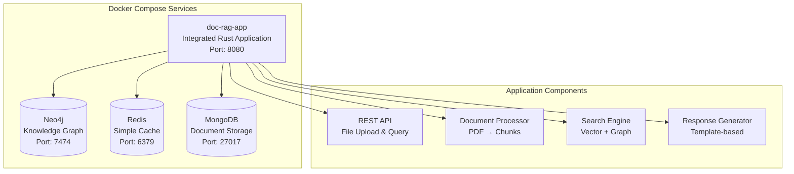
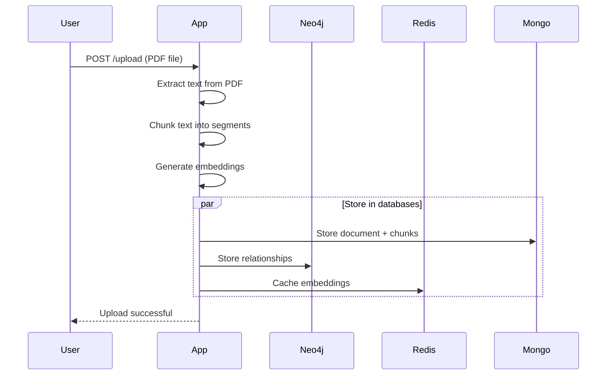
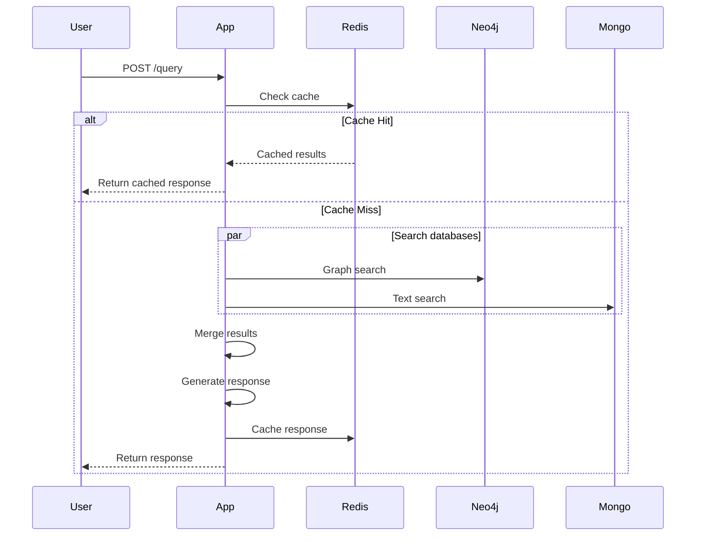

# SPARC-ARCHITECTURE: Simple Docker Compose MVP
## Document RAG System - Development-Friendly Architecture

**Version**: 1.0 MVP  
**Date**: September 2025  
**Focus**: Simple, integrated, fast iteration

---

## System Overview

This architecture prioritizes **simplicity and development speed** over production scalability. All components run in a single integrated application with minimal external dependencies.



## Architecture Principles

1. **Single Application**: Everything runs in one Rust binary
2. **Simple Services**: Neo4j, Redis, MongoDB - that's it
3. **Basic Networking**: Container-to-container communication
4. **Fast Iteration**: Hot reload, simple debugging
5. **No Microservices**: Integrated components, not distributed

---

## Docker Compose Configuration

### Simple docker-compose.yml

```yaml
version: '3.8'

services:
  # Main application - all components integrated
  app:
    build:
      context: .
      dockerfile: Dockerfile
    container_name: doc-rag-app
    ports:
      - "8080:8080"      # API
      - "8081:8081"      # Health check
    environment:
      - RUST_LOG=info
      - NEO4J_URL=bolt://neo4j:7687
      - NEO4J_USER=neo4j
      - NEO4J_PASSWORD=password
      - REDIS_URL=redis://redis:6379
      - MONGODB_URL=mongodb://mongo:27017/doc_rag
    volumes:
      - ./data/uploads:/app/uploads
      - ./data/models:/app/models:ro
    depends_on:
      - neo4j
      - redis
      - mongo
    restart: unless-stopped

  # Neo4j for knowledge graph
  neo4j:
    image: neo4j:5.15-community
    container_name: doc-rag-neo4j
    ports:
      - "7474:7474"      # Browser
      - "7687:7687"      # Bolt
    environment:
      - NEO4J_AUTH=neo4j/password
      - NEO4J_PLUGINS=["apoc"]
      - NEO4J_dbms_security_procedures_unrestricted=apoc.*
    volumes:
      - ./data/neo4j:/data
    restart: unless-stopped

  # Redis for simple caching
  redis:
    image: redis:7.2-alpine
    container_name: doc-rag-redis
    ports:
      - "6379:6379"
    volumes:
      - ./data/redis:/data
    restart: unless-stopped

  # MongoDB for document storage
  mongo:
    image: mongo:7.0
    container_name: doc-rag-mongo
    ports:
      - "27017:27017"
    environment:
      - MONGO_INITDB_DATABASE=doc_rag
    volumes:
      - ./data/mongo:/data/db
    restart: unless-stopped
```

---

## Application Architecture

### Single Rust Application Structure

```rust
// src/main.rs - Everything starts here
#[tokio::main]
async fn main() -> Result<()> {
    // Initialize all components in one place
    let app_state = AppState::new().await?;
    
    // Start web server with all routes
    let app = Router::new()
        .route("/upload", post(upload_document))
        .route("/query", post(query_documents))
        .route("/health", get(health_check))
        .with_state(app_state);
    
    axum::Server::bind(&"0.0.0.0:8080".parse()?)
        .serve(app.into_make_service())
        .await?;
        
    Ok(())
}

// Integrated application state
pub struct AppState {
    // Simple service clients
    neo4j: neo4j::Graph,
    redis: redis::Client,
    mongo: mongodb::Client,
    
    // Integrated components
    processor: DocumentProcessor,
    search: SearchEngine,
    response: ResponseGenerator,
}
```

### Component Integration

```rust
// All components in single application
pub struct DocumentProcessor {
    pub async fn process_pdf(&self, file_path: &Path) -> Result<ProcessedDoc> {
        // Simple PDF processing
        let text = extract_text_from_pdf(file_path)?;
        let chunks = chunk_text(&text)?;
        let embeddings = embed_chunks(&chunks)?;
        
        // Store directly in services
        self.store_in_mongo(&chunks).await?;
        self.store_in_neo4j(&chunks).await?;
        self.cache_in_redis(&embeddings).await?;
        
        Ok(ProcessedDoc::new(chunks, embeddings))
    }
}

pub struct SearchEngine {
    pub async fn search(&self, query: &str) -> Result<Vec<SearchResult>> {
        // Try Redis cache first
        if let Some(cached) = self.redis.get(query).await? {
            return Ok(cached);
        }
        
        // Search Neo4j for structured data
        let graph_results = self.neo4j.cypher(&format!(
            "MATCH (n:Document) WHERE n.content CONTAINS '{}' RETURN n",
            query
        )).await?;
        
        // Search MongoDB for full text
        let doc_results = self.mongo.find_text(query).await?;
        
        // Combine and cache results
        let results = merge_results(graph_results, doc_results);
        self.redis.set(query, &results, Duration::from_secs(300)).await?;
        
        Ok(results)
    }
}

pub struct ResponseGenerator {
    pub fn generate(&self, results: &[SearchResult]) -> String {
        // Simple template-based response
        let mut response = String::from("Based on the documents:\n\n");
        
        for result in results {
            response.push_str(&format!(
                "- {} (Score: {:.2})\n",
                result.content,
                result.score
            ));
        }
        
        response
    }
}
```

---

## Simple Data Flow

### Document Upload Flow



### Query Processing Flow



---

## Development Setup

### Quick Start

```bash
# Clone repository
git clone <repo-url>
cd doc-rag

# Start all services
docker-compose up -d

# Check services are running
curl http://localhost:8080/health
curl http://localhost:7474  # Neo4j browser
curl http://localhost:6379  # Redis (if you have redis-cli)

# Upload a document
curl -X POST -F "file=@sample.pdf" http://localhost:8080/upload

# Query documents
curl -X POST \
  -H "Content-Type: application/json" \
  -d '{"query":"What are the requirements?"}' \
  http://localhost:8080/query
```

### Development Environment

```bash
# For development with hot reload
cargo install cargo-watch

# Run with auto-restart on file changes
cargo watch -x run

# View logs from all services
docker-compose logs -f

# Access Neo4j browser
open http://localhost:7474

# Connect to databases for debugging
docker-compose exec mongo mongosh doc_rag
docker-compose exec redis redis-cli
docker-compose exec neo4j cypher-shell -u neo4j -p password
```

---

## Simple Configuration

### Environment Variables

```bash
# Application configuration
RUST_LOG=debug                           # Logging level
PORT=8080                               # API port

# Database connections
NEO4J_URL=bolt://localhost:7687
NEO4J_USER=neo4j
NEO4J_PASSWORD=password
REDIS_URL=redis://localhost:6379
MONGODB_URL=mongodb://localhost:27017/doc_rag

# Processing settings
MAX_FILE_SIZE=50MB                      # Upload limit
CHUNK_SIZE=512                          # Text chunk size
CACHE_TTL=300                           # Redis cache TTL (seconds)
```

### Application Configuration

```rust
// src/config.rs
#[derive(Debug, Clone)]
pub struct Config {
    pub port: u16,
    pub neo4j_url: String,
    pub neo4j_user: String,
    pub neo4j_password: String,
    pub redis_url: String,
    pub mongodb_url: String,
    pub max_file_size: usize,
    pub chunk_size: usize,
    pub cache_ttl: u64,
}

impl Config {
    pub fn from_env() -> Result<Self> {
        Ok(Config {
            port: env::var("PORT")?.parse()?,
            neo4j_url: env::var("NEO4J_URL")?,
            neo4j_user: env::var("NEO4J_USER")?,
            neo4j_password: env::var("NEO4J_PASSWORD")?,
            redis_url: env::var("REDIS_URL")?,
            mongodb_url: env::var("MONGODB_URL")?,
            max_file_size: 50 * 1024 * 1024, // 50MB
            chunk_size: 512,
            cache_ttl: 300,
        })
    }
}
```

---

## Basic Health Checks and Logging

### Health Check Endpoint

```rust
// src/handlers/health.rs
pub async fn health_check(State(app_state): State<AppState>) -> impl IntoResponse {
    let mut status = HashMap::new();
    
    // Check Neo4j
    status.insert("neo4j", match app_state.neo4j.ping().await {
        Ok(_) => "healthy",
        Err(_) => "unhealthy",
    });
    
    // Check Redis
    status.insert("redis", match app_state.redis.ping().await {
        Ok(_) => "healthy",
        Err(_) => "unhealthy",
    });
    
    // Check MongoDB
    status.insert("mongodb", match app_state.mongo.ping().await {
        Ok(_) => "healthy",
        Err(_) => "unhealthy",
    });
    
    Json(status)
}
```

### Simple Logging

```rust
// Use structured logging throughout
use tracing::{info, warn, error, debug};

pub async fn upload_document(/* params */) -> Result<impl IntoResponse> {
    info!("Starting document upload");
    
    match process_document(file).await {
        Ok(result) => {
            info!("Document processed successfully: {}", result.id);
            Ok(Json(result))
        }
        Err(e) => {
            error!("Document processing failed: {}", e);
            Err(AppError::ProcessingFailed(e.to_string()))
        }
    }
}
```

---

## Testing and Debugging

### Unit Tests

```rust
// src/tests/integration.rs
#[tokio::test]
async fn test_document_upload_and_query() {
    let app_state = AppState::new_test().await;
    
    // Upload test document
    let result = upload_test_document(&app_state, "test.pdf").await;
    assert!(result.is_ok());
    
    // Query for document
    let query_result = query_documents(&app_state, "test query").await;
    assert!(!query_result.is_empty());
}
```

### Docker Testing

```bash
# Run tests in Docker environment
docker-compose -f docker-compose.test.yml up --build --abort-on-container-exit

# Load test data
curl -X POST -F "file=@test-data/sample1.pdf" http://localhost:8080/upload
curl -X POST -F "file=@test-data/sample2.pdf" http://localhost:8080/upload

# Test queries
curl -X POST \
  -H "Content-Type: application/json" \
  -d '{"query":"requirements"}' \
  http://localhost:8080/query
```

---

## Data Management

### Database Initialization

```bash
# Neo4j initialization
docker-compose exec neo4j cypher-shell -u neo4j -p password <<EOF
CREATE CONSTRAINT doc_id IF NOT EXISTS FOR (d:Document) REQUIRE d.id IS UNIQUE;
CREATE INDEX doc_content IF NOT EXISTS FOR (d:Document) ON (d.content);
EOF

# MongoDB indexes
docker-compose exec mongo mongosh doc_rag <<EOF
db.documents.createIndex({ "content": "text" });
db.chunks.createIndex({ "document_id": 1 });
EOF
```

### Backup and Recovery

```bash
# Simple backup script
#!/bin/bash
DATE=$(date +%Y%m%d_%H%M%S)

# Backup Neo4j
docker-compose exec neo4j neo4j-admin database dump neo4j --to-path=/var/lib/neo4j/backup_${DATE}.dump

# Backup MongoDB
docker-compose exec mongo mongodump --db=doc_rag --out=/data/backup_${DATE}

# Backup Redis (if needed)
docker-compose exec redis redis-cli SAVE
cp ./data/redis/dump.rdb ./data/redis/backup_${DATE}.rdb
```

---

## Monitoring and Metrics

### Simple Prometheus Metrics

```rust
// src/metrics.rs
use prometheus::{Counter, Histogram, Registry};

pub struct Metrics {
    pub requests_total: Counter,
    pub query_duration: Histogram,
    pub upload_duration: Histogram,
}

impl Metrics {
    pub fn new() -> Self {
        Self {
            requests_total: Counter::new("requests_total", "Total requests").unwrap(),
            query_duration: Histogram::new("query_duration_seconds", "Query duration").unwrap(),
            upload_duration: Histogram::new("upload_duration_seconds", "Upload duration").unwrap(),
        }
    }
}

// Metrics endpoint
pub async fn metrics() -> impl IntoResponse {
    let encoder = prometheus::TextEncoder::new();
    let metric_families = prometheus::gather();
    let mut buffer = Vec::new();
    encoder.encode(&metric_families, &mut buffer).unwrap();
    String::from_utf8(buffer).unwrap()
}
```

### Simple Dashboard

```bash
# Add to docker-compose.yml if needed
  grafana:
    image: grafana/grafana:latest
    ports:
      - "3000:3000"
    environment:
      - GF_SECURITY_ADMIN_PASSWORD=admin
    volumes:
      - ./data/grafana:/var/lib/grafana
```

---

## Performance Optimization

### Simple Caching Strategy

```rust
// Cache at multiple levels
pub struct CacheStrategy {
    redis: redis::Client,
    local_cache: Arc<Mutex<HashMap<String, CachedResult>>>,
}

impl CacheStrategy {
    pub async fn get_or_compute<F, T>(&self, key: &str, compute: F) -> Result<T> 
    where
        F: Future<Output = Result<T>>,
        T: Clone + Serialize + DeserializeOwned,
    {
        // Try local cache first (fastest)
        if let Some(result) = self.local_cache.lock().await.get(key) {
            return Ok(result.data.clone());
        }
        
        // Try Redis cache (fast)
        if let Some(result) = self.redis.get::<_, String>(key).await? {
            let parsed: T = serde_json::from_str(&result)?;
            return Ok(parsed);
        }
        
        // Compute and cache (slow)
        let result = compute.await?;
        
        // Cache in both levels
        self.redis.set(key, serde_json::to_string(&result)?, Duration::from_secs(300)).await?;
        self.local_cache.lock().await.insert(key.to_string(), CachedResult {
            data: result.clone(),
            expires: Instant::now() + Duration::from_secs(60),
        });
        
        Ok(result)
    }
}
```

---

## Summary

This simplified architecture focuses on:

1. **Single Integrated Application**: Everything runs in one Rust binary
2. **Three Simple Services**: Neo4j, Redis, MongoDB - no complex infrastructure
3. **Container Communication**: Simple Docker networking, no service mesh
4. **Basic Monitoring**: Health checks and simple metrics
5. **Fast Development**: Easy debugging, testing, and iteration

Perfect for MVP development, proof of concepts, and getting started quickly without operational complexity.

## Quick Commands

```bash
# Start everything
docker-compose up -d

# Check status
docker-compose ps
curl http://localhost:8080/health

# Upload and query
curl -X POST -F "file=@document.pdf" http://localhost:8080/upload
curl -X POST -H "Content-Type: application/json" \
  -d '{"query":"your question"}' http://localhost:8080/query

# View logs
docker-compose logs -f app

# Stop everything
docker-compose down
```

This architecture prioritizes **simplicity and development velocity** over production scalability, making it perfect for rapid prototyping and MVP development.