# Neurosymbolic Response Generation Data Flow Architecture

## System Overview Diagram

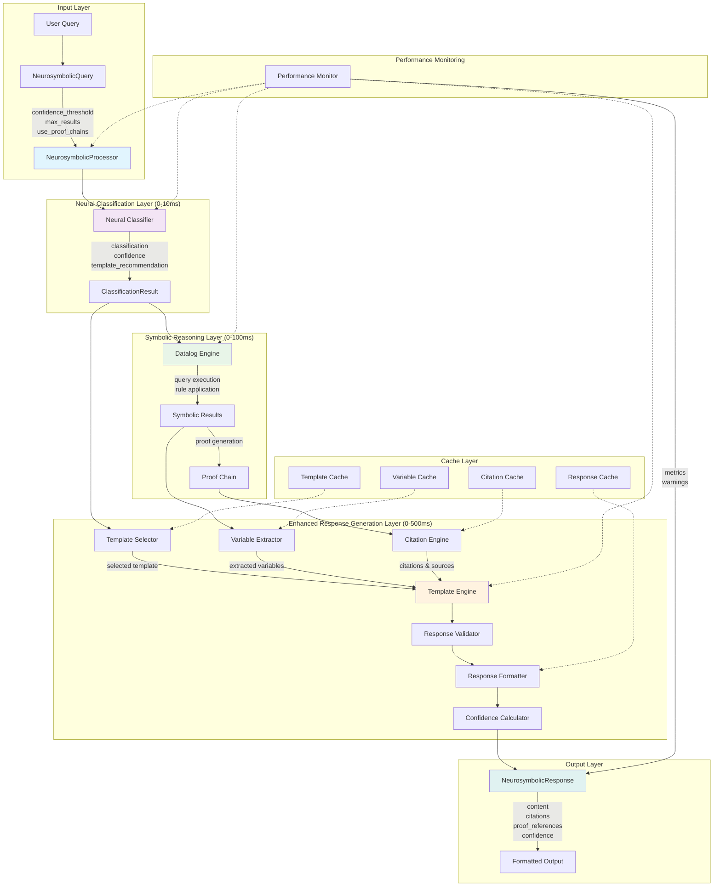

## Detailed Component Interactions

### 1. Neural Classification Flow

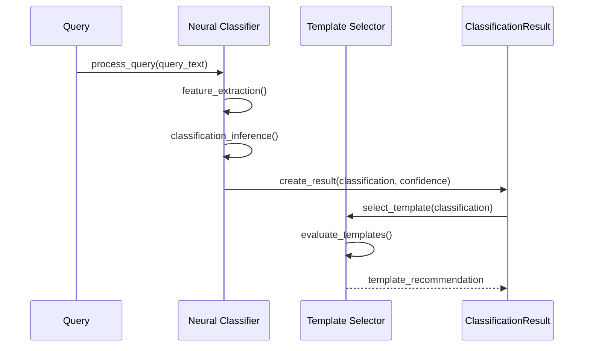

### 2. Symbolic Reasoning Integration

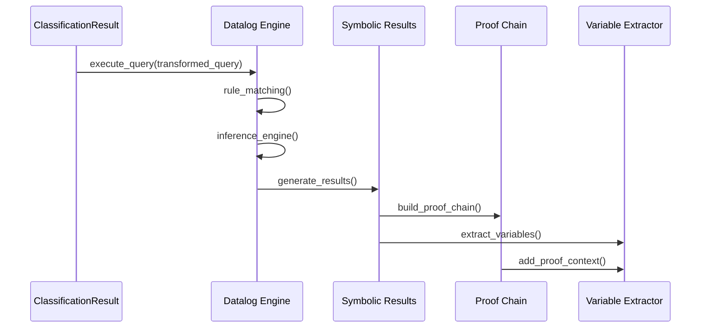

### 3. Response Generation Pipeline

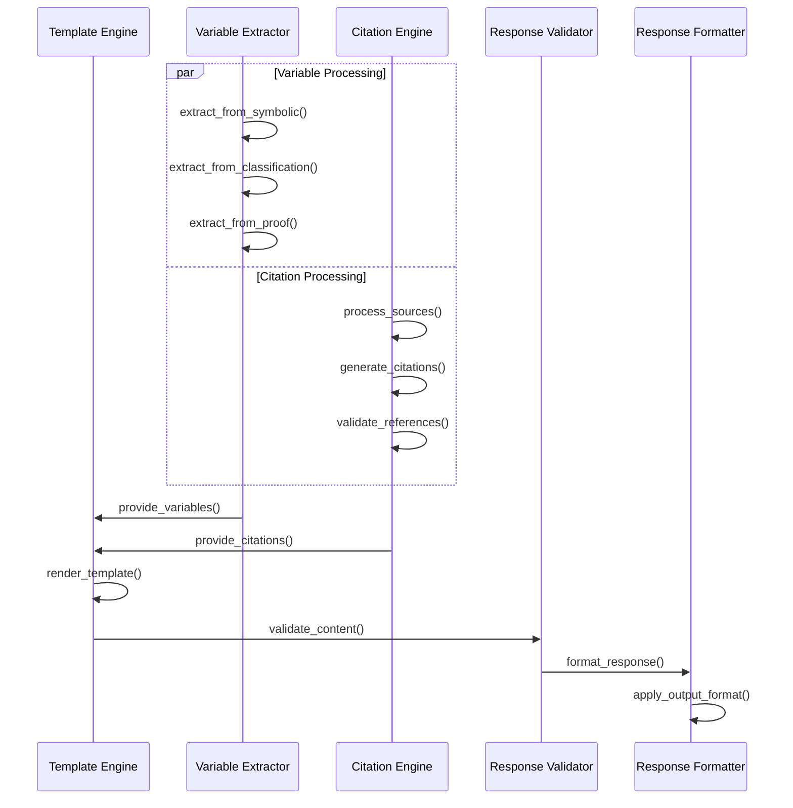

## Interface Interaction Patterns

### Template Engine Interface Flow

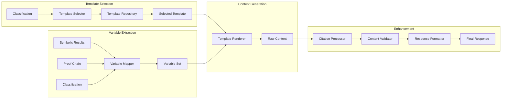

### Confidence Calculation Flow

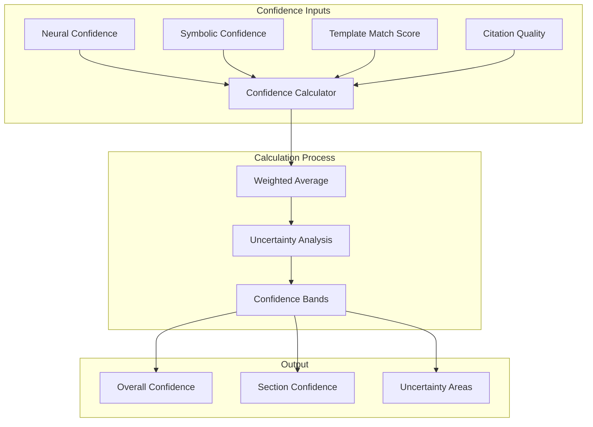

## Performance Optimization Flow

### Caching Strategy

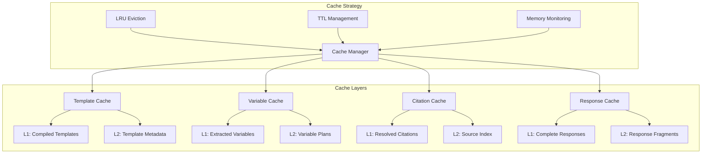

### Streaming Response Flow

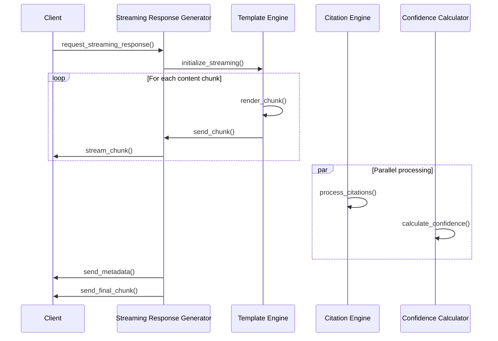

## Error Handling and Fallback Patterns

### Error Recovery Flow

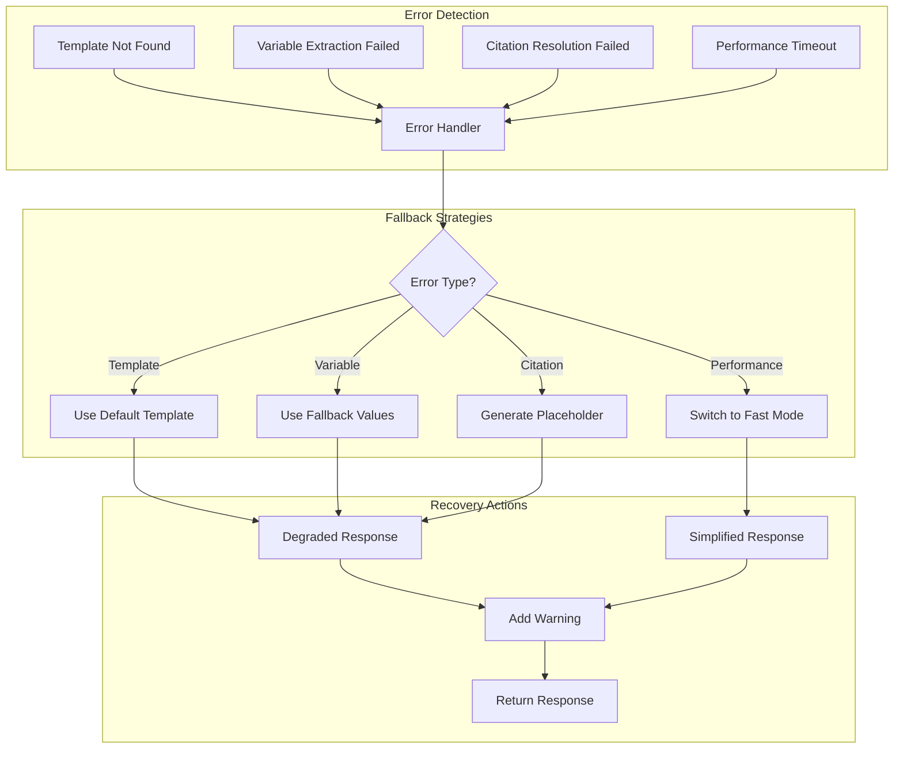

## Data Types and Serialization Flow

### Response Structure Flow

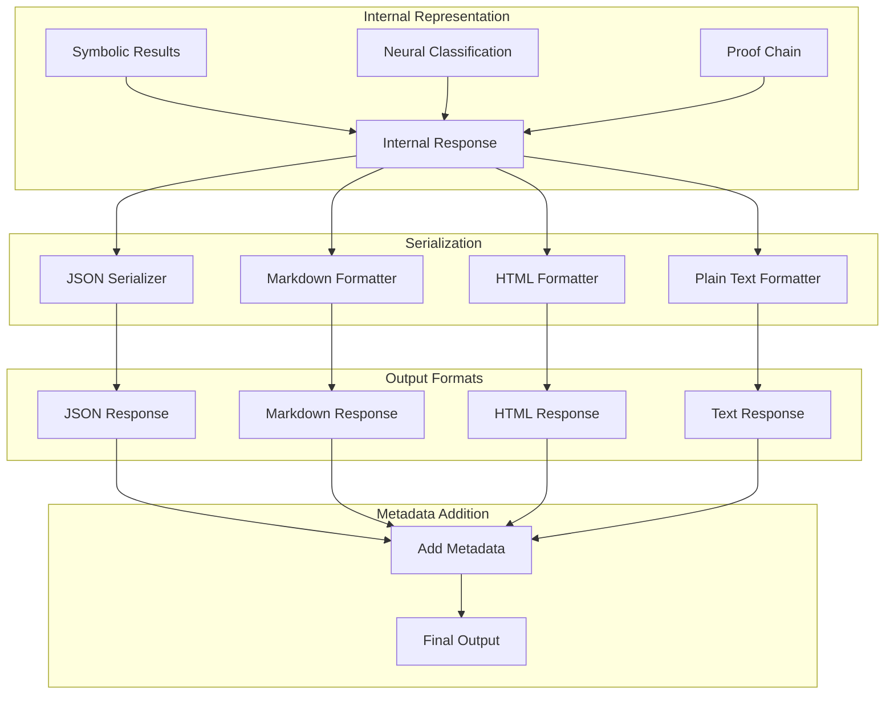

## Performance Constraint Validation

### Timing Validation Flow

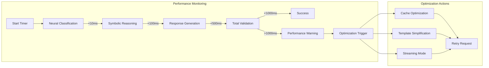

This data flow architecture ensures:

1. **Clear separation of concerns** between neural classification, symbolic reasoning, and response generation
2. **Performance optimization** through caching and streaming
3. **Robust error handling** with fallback strategies
4. **Constraint compliance** with timing and quality validation
5. **Scalable design** supporting multiple output formats and streaming responses

The architecture maintains the existing neurosymbolic processor patterns while adding sophisticated response generation capabilities that meet all specified constraints and performance requirements.