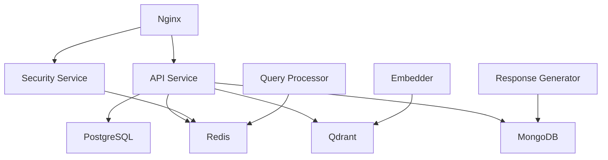

# Doc-RAG Production Operations Runbook

## Table of Contents
1. [System Overview](#system-overview)
2. [Emergency Response Procedures](#emergency-response-procedures)
3. [Common Operational Tasks](#common-operational-tasks)
4. [Monitoring and Alerting](#monitoring-and-alerting)
5. [Backup and Recovery](#backup-and-recovery)
6. [Security Incident Response](#security-incident-response)
7. [Performance Troubleshooting](#performance-troubleshooting)
8. [Contact Information](#contact-information)

## System Overview

### Architecture Components
- **API Gateway**: Nginx load balancer with SSL termination
- **Core Services**: 
  - API Service (Port 8080)
  - Security Service (Port 8087)
  - Query Processor (Port 8084)
  - Response Generator (Port 8085)
  - Embedder (Port 8082)
  - Storage Service (Port 8083)
- **Databases**:
  - PostgreSQL (Primary data)
  - Redis (Caching & rate limiting)
  - MongoDB (Document storage)
  - Qdrant (Vector database)
- **Monitoring**: Prometheus, Grafana, Jaeger
- **Message Queue**: RabbitMQ

### Service Dependencies


## Emergency Response Procedures

### Service Down (Critical)
**Severity**: Critical | **Response Time**: < 5 minutes

**Symptoms**:
- Health check failures
- HTTP 503 errors
- Service unavailable alerts

**Initial Response**:
1. Check service status: `docker ps` or `kubectl get pods`
2. Review logs: `docker logs <container>` or `kubectl logs <pod>`
3. Verify dependencies (database connections, external APIs)
4. Restart service if needed

**Docker Commands**:
```bash
# Check service status
docker-compose -f docker-compose.production.yml ps

# View service logs
docker logs doc-rag-api-prod --tail 100 -f

# Restart specific service
docker-compose -f docker-compose.production.yml restart api

# Full system restart (last resort)
docker-compose -f docker-compose.production.yml down
docker-compose -f docker-compose.production.yml up -d
```

**Kubernetes Commands**:
```bash
# Check pod status
kubectl get pods -n doc-rag-prod

# View pod logs
kubectl logs -f deployment/api-deployment -n doc-rag-prod

# Restart deployment
kubectl rollout restart deployment/api-deployment -n doc-rag-prod

# Scale deployment
kubectl scale deployment/api-deployment --replicas=5 -n doc-rag-prod
```

### High Error Rate (Critical)
**Severity**: Critical | **Response Time**: < 10 minutes

**Symptoms**:
- >10% HTTP 5xx error rate
- Increased response latencies
- User complaints

**Investigation Steps**:
1. Check error logs for patterns
2. Verify database connectivity
3. Check resource utilization (CPU, Memory)
4. Review recent deployments
5. Check external dependencies

**Mitigation**:
1. Roll back to previous version if recent deployment
2. Scale horizontally if resource constrained
3. Enable circuit breakers if external service issues
4. Implement temporary rate limiting

### Database Connection Issues (Critical)
**Severity**: Critical | **Response Time**: < 5 minutes

**PostgreSQL Issues**:
```bash
# Check PostgreSQL status
docker exec doc-rag-postgres-prod pg_isready -U docrag

# View PostgreSQL logs
docker logs doc-rag-postgres-prod --tail 50

# Connect to database
docker exec -it doc-rag-postgres-prod psql -U docrag -d docrag

# Check active connections
SELECT count(*) FROM pg_stat_activity;

# Check for blocking queries
SELECT * FROM pg_stat_activity WHERE state = 'active' AND wait_event IS NOT NULL;
```

**Redis Issues**:
```bash
# Check Redis status
docker exec doc-rag-redis-prod redis-cli -a $REDIS_PASSWORD ping

# View Redis info
docker exec doc-rag-redis-prod redis-cli -a $REDIS_PASSWORD info

# Check memory usage
docker exec doc-rag-redis-prod redis-cli -a $REDIS_PASSWORD info memory

# Clear cache if needed (use carefully)
docker exec doc-rag-redis-prod redis-cli -a $REDIS_PASSWORD flushdb
```

## Common Operational Tasks

### Deployment Procedures

**Production Deployment Checklist**:
- [ ] Code review approved
- [ ] All tests passing
- [ ] Security scan completed
- [ ] Backup databases
- [ ] Notify team of deployment
- [ ] Deploy to staging first
- [ ] Monitor metrics during deployment
- [ ] Verify functionality
- [ ] Update runbook if needed

**Rolling Deployment**:
```bash
# Update Docker images
docker-compose -f docker-compose.production.yml pull

# Rolling restart with minimal downtime
for service in api security-service query-processor; do
    docker-compose -f docker-compose.production.yml up -d --no-deps $service
    sleep 30  # Wait for health checks
done
```

**Kubernetes Deployment**:
```bash
# Update image
kubectl set image deployment/api-deployment api=doc-rag/api:v1.2.0 -n doc-rag-prod

# Monitor rollout
kubectl rollout status deployment/api-deployment -n doc-rag-prod

# Rollback if needed
kubectl rollout undo deployment/api-deployment -n doc-rag-prod
```

### Configuration Management

**Environment Variables**:
```bash
# View current configuration
docker exec doc-rag-api-prod env | grep -E "(DATABASE|REDIS|JWT)"

# Update configuration (requires restart)
# Edit docker-compose.production.yml or kubernetes configmap
# Then restart services
```

**Secrets Rotation**:
```bash
# Generate new JWT secret
JWT_SECRET=$(openssl rand -base64 64)

# Update secret in environment
# For Docker: update docker-compose.production.yml
# For Kubernetes: kubectl create secret
```

### Scaling Operations

**Horizontal Scaling**:
```bash
# Docker Compose (limited)
docker-compose -f docker-compose.production.yml up -d --scale api=3

# Kubernetes
kubectl scale deployment/api-deployment --replicas=5 -n doc-rag-prod
```

**Vertical Scaling**:
```bash
# Update resource limits in deployment manifests
kubectl patch deployment api-deployment -n doc-rag-prod -p '{"spec":{"template":{"spec":{"containers":[{"name":"api","resources":{"limits":{"cpu":"4","memory":"4Gi"},"requests":{"cpu":"2","memory":"2Gi"}}}]}}}}'
```

## Monitoring and Alerting

### Key Metrics to Monitor

**Application Metrics**:
- Request rate (RPS)
- Response time (p50, p95, p99)
- Error rate (%)
- Query accuracy score
- Document processing rate

**Infrastructure Metrics**:
- CPU utilization
- Memory usage
- Disk space
- Network I/O
- Database connections

**Business Metrics**:
- User queries per hour
- Document ingestion rate
- Average query response time
- User satisfaction score

### Dashboard Access

**Grafana Dashboards**:
- Main Dashboard: http://grafana.docrag.com:3000/d/main
- System Health: http://grafana.docrag.com:3000/d/system
- Security Dashboard: http://grafana.docrag.com:3000/d/security
- Business Metrics: http://grafana.docrag.com:3000/d/business

**Prometheus Queries**:
```promql
# Error rate
rate(http_requests_total{status=~"5.."}[5m]) / rate(http_requests_total[5m])

# 95th percentile latency
histogram_quantile(0.95, rate(http_request_duration_seconds_bucket[5m]))

# Memory usage
(node_memory_MemTotal_bytes - node_memory_MemAvailable_bytes) / node_memory_MemTotal_bytes * 100

# Database connections
pg_stat_activity_count / pg_settings_max_connections * 100
```

### Alert Response Procedures

**High Latency Alert**:
1. Check system load and resource usage
2. Review slow query logs
3. Check for blocking database queries
4. Verify external service dependencies
5. Consider scaling if persistent

**Security Alert Response**:
1. Identify source IP and user
2. Check for patterns in logs
3. Implement temporary IP blocking if needed
4. Escalate to security team
5. Document incident

## Backup and Recovery

### Database Backups

**PostgreSQL Backup**:
```bash
# Create backup
docker exec doc-rag-postgres-prod pg_dump -U docrag -d docrag -f /tmp/backup_$(date +%Y%m%d_%H%M%S).sql

# Copy backup to host
docker cp doc-rag-postgres-prod:/tmp/backup.sql ./backups/

# Automated daily backup script
#!/bin/bash
BACKUP_DATE=$(date +%Y%m%d_%H%M%S)
docker exec doc-rag-postgres-prod pg_dump -U docrag -d docrag > /backups/postgres_$BACKUP_DATE.sql
gzip /backups/postgres_$BACKUP_DATE.sql
aws s3 cp /backups/postgres_$BACKUP_DATE.sql.gz s3://docrag-backups/postgres/
```

**MongoDB Backup**:
```bash
# Create backup
docker exec doc-rag-mongodb mongodump --db docrag --out /tmp/mongodb_backup

# Copy to host
docker cp doc-rag-mongodb:/tmp/mongodb_backup ./backups/mongodb/
```

**Vector Database Backup**:
```bash
# Qdrant collection backup
curl -X POST "http://qdrant:6333/collections/documents/snapshots"
```

### Recovery Procedures

**PostgreSQL Recovery**:
```bash
# Stop application services
docker-compose -f docker-compose.production.yml stop api query-processor response-generator

# Restore database
docker exec -i doc-rag-postgres-prod psql -U docrag -d docrag < backup.sql

# Start services
docker-compose -f docker-compose.production.yml start api query-processor response-generator
```

**Full System Recovery**:
1. Restore database backups
2. Restore configuration files
3. Deploy application services
4. Verify data integrity
5. Run health checks
6. Gradually restore traffic

## Security Incident Response

### Security Alert Levels

**Level 1 - Low**: Monitoring alerts, automated responses
**Level 2 - Medium**: Manual investigation required
**Level 3 - High**: Immediate response, potential service impact
**Level 4 - Critical**: System compromise, full incident response

### Incident Response Workflow

1. **Detection**: Alert triggered or reported
2. **Assessment**: Determine severity and scope
3. **Containment**: Isolate affected systems
4. **Investigation**: Root cause analysis
5. **Remediation**: Fix vulnerabilities
6. **Recovery**: Restore normal operations
7. **Documentation**: Update runbooks and procedures

### Common Security Incidents

**DDoS Attack**:
```bash
# Enable rate limiting
# Block source IPs
iptables -A INPUT -s <malicious_ip> -j DROP

# Scale load balancer
kubectl scale deployment/nginx-deployment --replicas=5 -n doc-rag-prod
```

**SQL Injection Attempt**:
1. Check query logs for suspicious patterns
2. Verify input validation is working
3. Update WAF rules if needed
4. Monitor for data exfiltration

**Authentication Bypass**:
1. Rotate JWT secrets immediately
2. Invalidate all active sessions
3. Check audit logs for unauthorized access
4. Update authentication logic if needed

## Performance Troubleshooting

### Common Performance Issues

**Slow Query Performance**:
```sql
-- PostgreSQL slow queries
SELECT query, mean_time, calls
FROM pg_stat_statements
ORDER BY mean_time DESC
LIMIT 10;

-- Long running queries
SELECT pid, now() - pg_stat_activity.query_start AS duration, query
FROM pg_stat_activity
WHERE (now() - pg_stat_activity.query_start) > interval '5 minutes';
```

**Memory Issues**:
```bash
# Check memory usage
docker stats --no-stream

# Check for memory leaks
kubectl top pods -n doc-rag-prod

# Review JVM heap if applicable
# Check for connection pool leaks
```

**High CPU Usage**:
1. Identify CPU-intensive processes
2. Review application profiling data
3. Check for infinite loops or inefficient algorithms
4. Consider horizontal scaling

### Performance Optimization

**Database Optimization**:
- Add appropriate indexes
- Optimize query plans
- Configure connection pooling
- Implement read replicas for scaling

**Application Optimization**:
- Enable caching where appropriate
- Implement connection pooling
- Optimize serialization/deserialization
- Use async processing for heavy operations

**Infrastructure Optimization**:
- Right-size containers and pods
- Use appropriate instance types
- Implement auto-scaling
- Optimize network configurations

## Contact Information

### Escalation Matrix

**Level 1 - Operations Team**
- Slack: #doc-rag-ops
- Email: ops@docrag.com
- On-call: +1-555-0100

**Level 2 - Engineering Team**
- Slack: #doc-rag-engineering
- Email: engineering@docrag.com
- Lead Engineer: +1-555-0101

**Level 3 - Security Team**
- Slack: #security-incidents
- Email: security@docrag.com
- Security Lead: +1-555-0102

**Level 4 - Leadership**
- CTO: +1-555-0103
- VP Engineering: +1-555-0104

### External Contacts

**Cloud Provider Support**
- AWS Support: Case-based
- Infrastructure Provider: +1-555-0200

**Vendor Support**
- Database Support: Vendor-specific
- Monitoring Support: Vendor-specific

### Documentation and Resources

- **Architecture Documentation**: `/docs/architecture_overview.md`
- **API Documentation**: `/docs/api_documentation.md`
- **Deployment Guide**: `/docs/deployment_guide.md`
- **Troubleshooting Guide**: `/docs/troubleshooting.md`
- **Security Procedures**: `/docs/security_procedures.md`

---

**Document Maintenance**
- **Last Updated**: 2025-08-10
- **Next Review**: 2025-09-10
- **Owner**: Platform Team
- **Reviewers**: Security Team, Engineering Team