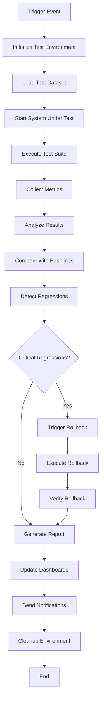

# Pipeline 1: Automated Regression Testing
## Phase 3 Design Document

---

### Executive Summary

Pipeline 1 implements a comprehensive automated regression testing system for the doc-rag RAG system. This pipeline ensures continuous validation of system functionality, performance, and accuracy through automated generation of test artifacts, execution of regression tests, and detection of performance degradation across all system components.

The pipeline builds upon the existing Phase 2 testing framework and extends it with automated test generation, containerized execution, and comprehensive reporting capabilities.

---

### 1. Test Artifact Generation

#### 1.1 Automated Document Generation

**PDF Test Documents**:
```rust
// Location: /src/testing/generators/document_generator.rs
pub struct AutomatedDocumentGenerator {
    templates: Vec<DocumentTemplate>,
    complexity_levels: Vec<ComplexityLevel>,
    content_types: Vec<ContentType>,
}

pub struct DocumentTemplate {
    pub name: String,
    pub structure: TemplateStructure,
    pub content_patterns: Vec<ContentPattern>,
    pub expected_chunks: usize,
    pub difficulty_score: f32,
}

impl AutomatedDocumentGenerator {
    pub async fn generate_test_documents(&self, count: usize) -> Result<Vec<TestDocument>> {
        // Generate diverse test documents with:
        // - Varying lengths (1KB to 50MB)
        // - Multiple formats (PDF, DOC, TXT, HTML, Markdown)
        // - Different structures (technical docs, legal, scientific)
        // - Embedded media and complex formatting
        // - Multiple languages and character sets
    }
    
    pub async fn generate_edge_case_documents(&self) -> Result<Vec<TestDocument>> {
        // Generate challenging edge cases:
        // - Corrupted/malformed files
        // - Empty documents
        // - Documents with unusual formatting
        // - Mixed language content
        // - Extremely long documents
    }
}
```

**Text Content Variations**:
- Technical documentation (API docs, specifications)
- Legal documents (contracts, compliance requirements)  
- Scientific papers (research, academic content)
- Business documents (reports, presentations)
- Multilingual content (English, Spanish, French, German, Japanese)

#### 1.2 Ground Truth Q&A Generation

**Automated Q&A Pair Creation**:
```rust
// Location: /src/testing/generators/qa_generator.rs
pub struct QAGenerator {
    llm_client: LLMClient,
    fact_extractor: FactExtractor,
    question_templates: Vec<QuestionTemplate>,
}

pub struct QAPair {
    pub id: Uuid,
    pub question: String,
    pub expected_answer: String,
    pub context_chunks: Vec<ChunkReference>,
    pub difficulty: DifficultyLevel,
    pub question_type: QuestionType,
    pub expected_citations: Vec<CitationReference>,
    pub performance_expectations: PerformanceExpectations,
}

impl QAGenerator {
    pub async fn generate_qa_pairs(&self, document: &TestDocument) -> Result<Vec<QAPair>> {
        // Generate comprehensive Q&A pairs:
        // - Factual questions (who, what, when, where)
        // - Analytical questions (why, how, implications)
        // - Comparative questions (differences, similarities)
        // - Summarization requests
        // - Multi-hop reasoning questions
    }
    
    pub async fn validate_answers(&self, qa_pairs: &mut Vec<QAPair>) -> Result<ValidationReport> {
        // Human-in-the-loop validation for critical answers
        // Automated consistency checking
        // Cross-reference verification
    }
}
```

**Question Categories**:
- **Factual**: Direct information retrieval
- **Analytical**: Requires reasoning and analysis
- **Comparative**: Cross-document comparisons
- **Summarization**: Content synthesis
- **Multi-hop**: Requires connecting multiple pieces of information

#### 1.3 Performance Baselines

**Baseline Configuration**:
```yaml
# /config/testing/baselines.yml
performance_baselines:
  accuracy_targets:
    semantic_similarity: 0.85      # 85% minimum similarity
    factual_accuracy: 0.90         # 90% factual correctness
    citation_accuracy: 0.95        # 95% citation precision
    boundary_detection: 0.95       # 95% chunk boundary accuracy
    
  performance_targets:
    query_processing_time_ms: 2000 # Max 2s response time
    cache_hit_time_ms: 50          # Max 50ms cache lookups
    throughput_qps: 100            # Min 100 queries per second
    memory_usage_mb: 2048          # Max 2GB memory usage
    
  resource_limits:
    max_cpu_usage_percent: 80      # Max 80% CPU utilization
    max_memory_growth_mb: 512      # Max 512MB memory growth
    max_disk_io_mbps: 100          # Max 100MB/s disk I/O
    
  reliability_targets:
    uptime_percentage: 99.9        # 99.9% uptime
    error_rate_percentage: 0.1     # Max 0.1% error rate
    recovery_time_seconds: 30      # Max 30s recovery time
```

#### 1.4 Version-Controlled Test Datasets

**Dataset Management Structure**:
```
/tests/datasets/
├── v1.0/
│   ├── documents/           # Test documents
│   ├── qa_pairs/           # Question-answer pairs
│   ├── baselines/          # Performance baselines
│   └── metadata.json      # Dataset metadata
├── v1.1/
│   ├── documents/
│   ├── qa_pairs/
│   ├── baselines/
│   └── metadata.json
└── current -> v1.1        # Symlink to current version
```

**Dataset Versioning**:
```rust
// Location: /src/testing/datasets/version_manager.rs
pub struct DatasetVersionManager {
    storage: Box<dyn DatasetStorage>,
    current_version: Version,
}

impl DatasetVersionManager {
    pub async fn create_version(&self, changes: VersionChanges) -> Result<Version> {
        // Create new dataset version with:
        // - Incremental document additions
        // - Updated Q&A pairs
        // - Revised performance baselines
        // - Migration scripts for schema changes
    }
    
    pub async fn compare_versions(&self, v1: Version, v2: Version) -> Result<VersionDiff> {
        // Generate comprehensive diff showing:
        // - Added/removed documents
        // - Modified Q&A pairs
        // - Baseline changes
        // - Performance impact analysis
    }
}
```

---

### 2. Regression Test Architecture

#### 2.1 Containerized Test Environment

**Docker Architecture**:
```dockerfile
# /docker/testing/Dockerfile.regression
FROM rust:1.75 as builder
WORKDIR /app
COPY . .
RUN cargo build --release --features regression-testing

FROM debian:bookworm-slim
RUN apt-get update && apt-get install -y \
    ca-certificates \
    mongodb-clients \
    redis-tools \
    curl \
    jq \
    && rm -rf /var/lib/apt/lists/*

COPY --from=builder /app/target/release/doc-rag /usr/local/bin/
COPY --from=builder /app/config /app/config
COPY --from=builder /app/tests/datasets /app/tests/datasets

ENV RUST_LOG=info
ENV REGRESSION_MODE=true
EXPOSE 8080
CMD ["doc-rag", "--mode", "regression-test"]
```

**Docker Compose for Test Environment**:
```yaml
# /docker/testing/docker-compose.regression.yml
version: '3.8'
services:
  doc-rag-test:
    build:
      context: ../..
      dockerfile: docker/testing/Dockerfile.regression
    environment:
      - DATABASE_URL=mongodb://mongodb:27017/docrag_test
      - REDIS_URL=redis://redis:6379
      - REGRESSION_TEST_SUITE=comprehensive
    depends_on:
      - mongodb
      - redis
      - prometheus
    volumes:
      - ./test_results:/app/test_results
      - ./test_data:/app/test_data
    networks:
      - test_network

  mongodb:
    image: mongo:7.0
    environment:
      MONGO_INITDB_DATABASE: docrag_test
    volumes:
      - mongodb_test_data:/data/db
    networks:
      - test_network

  redis:
    image: redis:7.2-alpine
    networks:
      - test_network

  prometheus:
    image: prom/prometheus:latest
    ports:
      - "9090:9090"
    volumes:
      - ./prometheus.yml:/etc/prometheus/prometheus.yml
    networks:
      - test_network

volumes:
  mongodb_test_data:

networks:
  test_network:
    driver: bridge
```

#### 2.2 Automated Baseline Comparison

**Comparison Engine**:
```rust
// Location: /src/testing/regression/comparison_engine.rs
pub struct BaselineComparison {
    current_results: TestResults,
    baseline_results: TestResults,
    thresholds: ComparisonThresholds,
}

pub struct ComparisonResult {
    pub category: TestCategory,
    pub metric: String,
    pub current_value: f64,
    pub baseline_value: f64,
    pub difference: f64,
    pub percentage_change: f64,
    pub status: ComparisonStatus,
    pub threshold_exceeded: bool,
}

impl BaselineComparison {
    pub fn analyze_regression(&self) -> RegressionAnalysis {
        let mut regressions = Vec::new();
        let mut improvements = Vec::new();
        
        // Compare accuracy metrics
        for metric in &self.current_results.accuracy_metrics {
            let baseline_metric = self.baseline_results.find_accuracy_metric(&metric.name)?;
            let comparison = self.compare_metric(metric, baseline_metric);
            
            match comparison.status {
                ComparisonStatus::Regression => regressions.push(comparison),
                ComparisonStatus::Improvement => improvements.push(comparison),
                _ => {}
            }
        }
        
        // Compare performance metrics
        for metric in &self.current_results.performance_metrics {
            let baseline_metric = self.baseline_results.find_performance_metric(&metric.name)?;
            let comparison = self.compare_metric(metric, baseline_metric);
            
            if comparison.threshold_exceeded {
                regressions.push(comparison);
            }
        }
        
        RegressionAnalysis {
            regressions,
            improvements,
            overall_status: self.determine_overall_status(&regressions),
        }
    }
}
```

#### 2.3 Performance Regression Detection

**Performance Monitor**:
```rust
// Location: /src/testing/regression/performance_monitor.rs
pub struct PerformanceRegressionDetector {
    metrics_collector: MetricsCollector,
    statistical_analyzer: StatisticalAnalyzer,
    alert_manager: AlertManager,
}

pub struct PerformanceRegression {
    pub metric_name: String,
    pub regression_type: RegressionType,
    pub severity: Severity,
    pub confidence: f64,
    pub current_value: f64,
    pub expected_range: (f64, f64),
    pub detected_at: DateTime<Utc>,
    pub potential_causes: Vec<String>,
}

impl PerformanceRegressionDetector {
    pub async fn detect_regressions(&self, test_results: &TestResults) -> Vec<PerformanceRegression> {
        let mut regressions = Vec::new();
        
        // Statistical analysis using multiple methods:
        // 1. Standard deviation analysis
        // 2. Moving average comparison
        // 3. Trend analysis
        // 4. Anomaly detection using isolation forest
        
        for metric in &test_results.metrics {
            // Check for statistical anomalies
            if let Some(anomaly) = self.statistical_analyzer.detect_anomaly(metric) {
                regressions.push(PerformanceRegression {
                    metric_name: metric.name.clone(),
                    regression_type: RegressionType::Performance,
                    severity: self.calculate_severity(&anomaly),
                    confidence: anomaly.confidence,
                    current_value: metric.value,
                    expected_range: anomaly.expected_range,
                    detected_at: Utc::now(),
                    potential_causes: self.analyze_potential_causes(&anomaly),
                });
            }
        }
        
        regressions
    }
}
```

#### 2.4 Accuracy Degradation Monitoring

**Accuracy Monitor**:
```rust
// Location: /src/testing/regression/accuracy_monitor.rs
pub struct AccuracyDegradationMonitor {
    similarity_calculator: SimilarityCalculator,
    fact_checker: FactChecker,
    citation_validator: CitationValidator,
}

pub struct AccuracyDegradation {
    pub test_case_id: Uuid,
    pub degradation_type: DegradationType,
    pub severity: Severity,
    pub current_score: f64,
    pub expected_score: f64,
    pub difference: f64,
    pub affected_components: Vec<Component>,
}

impl AccuracyDegradationMonitor {
    pub async fn monitor_accuracy(&self, test_results: &TestResults) -> AccuracyReport {
        let mut degradations = Vec::new();
        
        // Check semantic similarity degradation
        for qa_result in &test_results.qa_results {
            let similarity = self.similarity_calculator
                .calculate_similarity(&qa_result.generated_answer, &qa_result.expected_answer)
                .await?;
                
            if similarity < qa_result.minimum_similarity_threshold {
                degradations.push(AccuracyDegradation {
                    test_case_id: qa_result.id,
                    degradation_type: DegradationType::SemanticSimilarity,
                    severity: self.calculate_severity(similarity, qa_result.minimum_similarity_threshold),
                    current_score: similarity,
                    expected_score: qa_result.minimum_similarity_threshold,
                    difference: qa_result.minimum_similarity_threshold - similarity,
                    affected_components: vec![Component::ResponseGenerator],
                });
            }
        }
        
        // Check factual accuracy degradation
        for qa_result in &test_results.qa_results {
            let fact_check = self.fact_checker
                .check_facts(&qa_result.generated_answer, &qa_result.context_chunks)
                .await?;
                
            if fact_check.accuracy < qa_result.minimum_factual_accuracy {
                degradations.push(AccuracyDegradation {
                    test_case_id: qa_result.id,
                    degradation_type: DegradationType::FactualAccuracy,
                    severity: self.calculate_severity(fact_check.accuracy, qa_result.minimum_factual_accuracy),
                    current_score: fact_check.accuracy,
                    expected_score: qa_result.minimum_factual_accuracy,
                    difference: qa_result.minimum_factual_accuracy - fact_check.accuracy,
                    affected_components: vec![Component::ResponseGenerator, Component::FactCache],
                });
            }
        }
        
        AccuracyReport {
            degradations,
            overall_accuracy: self.calculate_overall_accuracy(&test_results.qa_results),
            trend_analysis: self.analyze_accuracy_trends(&test_results),
        }
    }
}
```

---

### 3. Integration Points

#### 3.1 Git Hooks for Automatic Testing

**Pre-commit Hook**:
```bash
#!/bin/bash
# .git/hooks/pre-commit

echo "🔍 Running regression tests before commit..."

# Run quick regression tests
cargo test --package regression-tests --test quick_regression -- --nocapture

if [ $? -ne 0 ]; then
    echo "❌ Quick regression tests failed. Commit aborted."
    exit 1
fi

echo "✅ Quick regression tests passed."
```

**Pre-push Hook**:
```bash
#!/bin/bash
# .git/hooks/pre-push

echo "🚀 Running comprehensive regression tests before push..."

# Run full regression test suite
docker-compose -f docker/testing/docker-compose.regression.yml up --build --abort-on-container-exit

if [ $? -ne 0 ]; then
    echo "❌ Comprehensive regression tests failed. Push aborted."
    exit 1
fi

echo "✅ Comprehensive regression tests passed."

# Clean up test containers
docker-compose -f docker/testing/docker-compose.regression.yml down -v
```

#### 3.2 CI/CD Pipeline Integration

**GitHub Actions Workflow**:
```yaml
# .github/workflows/regression-testing.yml
name: Automated Regression Testing

on:
  push:
    branches: [ main, develop ]
  pull_request:
    branches: [ main ]
  schedule:
    # Run regression tests daily at 2 AM UTC
    - cron: '0 2 * * *'

jobs:
  regression-tests:
    runs-on: ubuntu-latest
    strategy:
      matrix:
        test-suite: [quick, comprehensive, performance, accuracy]
    
    steps:
    - uses: actions/checkout@v4
      with:
        lfs: true
    
    - name: Set up Rust
      uses: actions-rs/toolchain@v1
      with:
        toolchain: stable
    
    - name: Cache dependencies
      uses: actions/cache@v3
      with:
        path: |
          ~/.cargo/registry
          ~/.cargo/git
          target/
        key: ${{ runner.os }}-cargo-${{ hashFiles('**/Cargo.lock') }}
    
    - name: Start test environment
      run: |
        docker-compose -f docker/testing/docker-compose.regression.yml up -d
        
    - name: Wait for services
      run: |
        sleep 30
        curl --retry 10 --retry-delay 5 --retry-connrefused http://localhost:8080/health
        
    - name: Run regression tests
      run: |
        cargo test --package regression-tests --test ${{ matrix.test-suite }}_regression -- --nocapture
        
    - name: Generate test report
      run: |
        cargo run --bin regression-report -- --suite ${{ matrix.test-suite }} --output-format json > test-report-${{ matrix.test-suite }}.json
        
    - name: Upload test results
      uses: actions/upload-artifact@v3
      with:
        name: regression-test-results-${{ matrix.test-suite }}
        path: |
          test-report-${{ matrix.test-suite }}.json
          test_results/
          
    - name: Comment on PR
      if: github.event_name == 'pull_request'
      uses: actions/github-script@v6
      with:
        script: |
          const fs = require('fs');
          const report = JSON.parse(fs.readFileSync('test-report-${{ matrix.test-suite }}.json', 'utf8'));
          
          const comment = `## Regression Test Results (${{ matrix.test-suite }})
          
          **Overall Status:** ${report.status === 'passed' ? '✅ PASSED' : '❌ FAILED'}
          
          **Accuracy Metrics:**
          - Semantic Similarity: ${report.accuracy.semantic_similarity}%
          - Factual Accuracy: ${report.accuracy.factual_accuracy}%
          - Citation Accuracy: ${report.accuracy.citation_accuracy}%
          
          **Performance Metrics:**
          - Avg Response Time: ${report.performance.avg_response_time}ms
          - Cache Hit Rate: ${report.performance.cache_hit_rate}%
          - Throughput: ${report.performance.throughput} QPS
          
          ${report.regressions.length > 0 ? '⚠️ **Regressions Detected:**\n' + report.regressions.map(r => `- ${r.metric}: ${r.description}`).join('\n') : ''}
          `;
          
          github.rest.issues.createComment({
            issue_number: context.issue.number,
            owner: context.repo.owner,
            repo: context.repo.repo,
            body: comment
          });

    - name: Cleanup
      if: always()
      run: |
        docker-compose -f docker/testing/docker-compose.regression.yml down -v
```

#### 3.3 Test Result Dashboards

**Dashboard Configuration**:
```yaml
# /config/dashboards/regression_dashboard.yml
dashboard:
  title: "Doc-RAG Regression Testing Dashboard"
  refresh: "30s"
  
  panels:
    - title: "Test Execution Status"
      type: "stat"
      targets:
        - query: "regression_test_status{job='doc-rag-test'}"
      thresholds:
        - color: "green"
          value: 1  # All tests passing
        - color: "red"
          value: 0  # Tests failing
    
    - title: "Accuracy Trends"
      type: "graph"
      targets:
        - query: "accuracy_metrics{job='doc-rag-test'}"
        - legend: "{{metric}}"
      y_axis:
        min: 0
        max: 1
        unit: "percentunit"
    
    - title: "Performance Regression Detection"
      type: "graph"
      targets:
        - query: "performance_regression_score{job='doc-rag-test'}"
      thresholds:
        - value: 0.8
          color: "yellow"
        - value: 0.9
          color: "red"
    
    - title: "Recent Regressions"
      type: "table"
      targets:
        - query: "regression_events{job='doc-rag-test'}"
      columns:
        - "Timestamp"
        - "Component"
        - "Metric"
        - "Severity"
        - "Status"
```

**Grafana Dashboard JSON**:
```json
{
  "dashboard": {
    "title": "Doc-RAG Regression Testing",
    "panels": [
      {
        "id": 1,
        "title": "Test Success Rate",
        "type": "stat",
        "targets": [
          {
            "expr": "rate(regression_tests_total{status=\"success\"}[5m]) / rate(regression_tests_total[5m])",
            "legendFormat": "Success Rate"
          }
        ],
        "fieldConfig": {
          "defaults": {
            "thresholds": {
              "steps": [
                {"color": "red", "value": 0},
                {"color": "yellow", "value": 0.95},
                {"color": "green", "value": 0.99}
              ]
            }
          }
        }
      }
    ]
  }
}
```

#### 3.4 Automated Rollback Integration

**Rollback Decision Engine**:
```rust
// Location: /src/testing/regression/rollback_engine.rs
pub struct RollbackDecisionEngine {
    severity_thresholds: SeverityThresholds,
    rollback_policies: Vec<RollbackPolicy>,
    deployment_client: DeploymentClient,
}

pub struct RollbackDecision {
    pub should_rollback: bool,
    pub rollback_type: RollbackType,
    pub target_version: String,
    pub reason: String,
    pub affected_components: Vec<Component>,
    pub estimated_impact: ImpactAssessment,
}

impl RollbackDecisionEngine {
    pub async fn evaluate_rollback(&self, regressions: &[PerformanceRegression]) -> RollbackDecision {
        let critical_regressions = regressions.iter()
            .filter(|r| r.severity == Severity::Critical)
            .count();
            
        let high_regressions = regressions.iter()
            .filter(|r| r.severity == Severity::High)
            .count();
        
        // Automatic rollback triggers:
        // 1. Any critical regression
        // 2. More than 3 high-severity regressions
        // 3. Accuracy drop below 80%
        // 4. Response time increase > 300%
        
        let should_rollback = critical_regressions > 0 
            || high_regressions > 3 
            || self.check_accuracy_threshold(regressions)
            || self.check_performance_threshold(regressions);
        
        if should_rollback {
            RollbackDecision {
                should_rollback: true,
                rollback_type: self.determine_rollback_type(regressions),
                target_version: self.get_last_stable_version().await,
                reason: self.generate_rollback_reason(regressions),
                affected_components: self.identify_affected_components(regressions),
                estimated_impact: self.assess_rollback_impact(regressions).await,
            }
        } else {
            RollbackDecision {
                should_rollback: false,
                rollback_type: RollbackType::None,
                target_version: String::new(),
                reason: "No critical regressions detected".to_string(),
                affected_components: Vec::new(),
                estimated_impact: ImpactAssessment::minimal(),
            }
        }
    }
    
    pub async fn execute_rollback(&self, decision: &RollbackDecision) -> Result<RollbackResult> {
        match decision.rollback_type {
            RollbackType::FullSystem => {
                self.deployment_client.rollback_full_system(&decision.target_version).await
            }
            RollbackType::ComponentSpecific => {
                self.deployment_client.rollback_components(
                    &decision.affected_components, 
                    &decision.target_version
                ).await
            }
            RollbackType::ConfigOnly => {
                self.deployment_client.rollback_configuration(&decision.target_version).await
            }
            RollbackType::None => Ok(RollbackResult::skipped()),
        }
    }
}
```

---

### 4. Test Data Formats

#### 4.1 Test Document Format

```json
{
  "document": {
    "id": "uuid-v4",
    "version": "1.0.0",
    "metadata": {
      "filename": "pci_dss_requirements.pdf",
      "file_size_bytes": 2547893,
      "content_type": "application/pdf",
      "language": "en-US",
      "complexity_score": 0.75,
      "generated_at": "2024-01-15T10:30:00Z",
      "generator_version": "1.2.0"
    },
    "content": {
      "raw_text": "Full document content...",
      "structured_content": {
        "sections": [
          {
            "title": "Payment Card Industry Data Security Standard",
            "level": 1,
            "content": "The PCI DSS is a set of security standards...",
            "subsections": []
          }
        ],
        "tables": [],
        "figures": [],
        "references": []
      }
    },
    "ground_truth": {
      "expected_chunks": [
        {
          "start_position": 0,
          "end_position": 256,
          "chunk_type": "header",
          "content": "Payment Card Industry Data Security Standard\n\nRequirements and Security Assessment Procedures\nVersion 4.0\nMarch 2022",
          "semantic_label": "document_header"
        }
      ],
      "key_entities": [
        {
          "text": "PCI DSS",
          "type": "standard",
          "positions": [45, 234, 567]
        }
      ],
      "quality_metrics": {
        "readability_score": 0.65,
        "technical_density": 0.80,
        "structural_complexity": 0.75
      }
    }
  }
}
```

#### 4.2 Q&A Test Case Format

```json
{
  "qa_pair": {
    "id": "uuid-v4",
    "version": "1.0.0",
    "metadata": {
      "document_id": "uuid-v4",
      "category": "factual",
      "difficulty": "medium",
      "question_type": "specific_fact",
      "created_at": "2024-01-15T10:30:00Z",
      "validated_by": "human_reviewer_001"
    },
    "question": {
      "text": "What are the key requirements for encrypting stored payment card data according to PCI DSS?",
      "context_needed": true,
      "reasoning_required": false,
      "multi_hop": false
    },
    "expected_answer": {
      "text": "According to PCI DSS Requirement 3, stored payment card data must be encrypted using strong cryptography. Key requirements include: (1) Use of strong encryption algorithms (minimum AES-256), (2) Proper key management procedures, (3) Encryption of data at rest in databases, files, and backups, (4) Secure key storage separate from encrypted data, and (5) Regular key rotation according to industry standards.",
      "key_points": [
        "Strong encryption algorithms (AES-256 minimum)",
        "Proper key management procedures",
        "Encryption of data at rest",
        "Secure key storage",
        "Regular key rotation"
      ],
      "factual_claims": [
        {
          "claim": "PCI DSS Requirement 3 covers encryption",
          "source_section": "3.4",
          "verifiable": true
        }
      ]
    },
    "context_requirements": {
      "required_chunks": [
        {
          "document_section": "3.4",
          "relevance_score": 0.95,
          "content_snippet": "Stored payment card data must be encrypted..."
        }
      ],
      "minimum_context_chunks": 2,
      "maximum_context_chunks": 5
    },
    "expected_citations": [
      {
        "source": "PCI DSS v4.0",
        "section": "Requirement 3.4",
        "page": 42,
        "relevance": 0.95
      }
    ],
    "performance_expectations": {
      "max_response_time_ms": 2000,
      "min_similarity_threshold": 0.85,
      "min_factual_accuracy": 0.90,
      "min_citation_precision": 0.95
    },
    "validation_criteria": {
      "semantic_similarity_weight": 0.4,
      "factual_accuracy_weight": 0.4,
      "citation_accuracy_weight": 0.2,
      "response_completeness_weight": 0.3
    }
  }
}
```

#### 4.3 Test Results Format

```json
{
  "test_execution": {
    "id": "uuid-v4",
    "suite_name": "comprehensive_regression",
    "version": "1.0.0",
    "started_at": "2024-01-15T10:00:00Z",
    "completed_at": "2024-01-15T10:45:30Z",
    "duration_seconds": 2730,
    "environment": {
      "platform": "docker",
      "rust_version": "1.75.0",
      "system_resources": {
        "cpu_cores": 8,
        "memory_gb": 16,
        "disk_type": "SSD"
      }
    },
    "test_results": {
      "summary": {
        "total_tests": 2500,
        "passed": 2487,
        "failed": 8,
        "skipped": 5,
        "success_rate": 0.9948
      },
      "accuracy_results": {
        "semantic_similarity": {
          "average": 0.887,
          "median": 0.892,
          "std_dev": 0.045,
          "p95": 0.934,
          "p99": 0.958,
          "below_threshold_count": 23
        },
        "factual_accuracy": {
          "average": 0.923,
          "median": 0.928,
          "std_dev": 0.038,
          "p95": 0.967,
          "p99": 0.985,
          "below_threshold_count": 12
        },
        "citation_precision": {
          "average": 0.956,
          "median": 0.961,
          "std_dev": 0.028,
          "p95": 0.987,
          "p99": 0.995,
          "below_threshold_count": 3
        }
      },
      "performance_results": {
        "response_times": {
          "average_ms": 1247,
          "median_ms": 1180,
          "p95_ms": 1890,
          "p99_ms": 2340,
          "max_ms": 2867,
          "timeout_count": 2
        },
        "cache_performance": {
          "hit_rate": 0.743,
          "average_hit_time_ms": 23,
          "average_miss_time_ms": 187,
          "cache_efficiency": 0.892
        },
        "resource_usage": {
          "peak_memory_mb": 1834,
          "average_cpu_percent": 67,
          "peak_cpu_percent": 89,
          "disk_io_mb": 2341
        }
      },
      "regression_analysis": {
        "regressions_detected": [
          {
            "metric": "semantic_similarity",
            "component": "response_generator",
            "severity": "medium",
            "current_value": 0.887,
            "baseline_value": 0.892,
            "difference": -0.005,
            "threshold_exceeded": false,
            "confidence": 0.87
          }
        ],
        "improvements_detected": [
          {
            "metric": "cache_hit_rate",
            "component": "fact_cache",
            "current_value": 0.743,
            "baseline_value": 0.721,
            "improvement": 0.022,
            "confidence": 0.94
          }
        ]
      }
    }
  }
}
```

---

### 5. Execution Flow

#### 5.1 Automated Test Execution Flow



#### 5.2 Test Execution Engine

```rust
// Location: /src/testing/execution/test_runner.rs
pub struct RegressionTestRunner {
    test_suite_loader: TestSuiteLoader,
    test_executor: TestExecutor,
    metrics_collector: MetricsCollector,
    results_analyzer: ResultsAnalyzer,
    report_generator: ReportGenerator,
}

impl RegressionTestRunner {
    pub async fn execute_regression_suite(&self, suite_config: SuiteConfig) -> Result<TestExecutionResult> {
        let execution_id = Uuid::new_v4();
        let start_time = Utc::now();
        
        // Phase 1: Environment Setup
        let environment = self.setup_test_environment(&suite_config).await?;
        
        // Phase 2: Load Test Data
        let test_suite = self.test_suite_loader.load_suite(&suite_config.suite_name).await?;
        
        // Phase 3: Execute Tests
        let mut test_results = Vec::new();
        let semaphore = Arc::new(Semaphore::new(suite_config.max_concurrency));
        
        for test_batch in test_suite.batches {
            let batch_results = self.execute_test_batch(
                &test_batch,
                &environment,
                semaphore.clone()
            ).await?;
            test_results.extend(batch_results);
        }
        
        // Phase 4: Collect System Metrics
        let system_metrics = self.metrics_collector.collect_system_metrics(&environment).await?;
        
        // Phase 5: Analyze Results
        let analysis = self.results_analyzer.analyze_results(&test_results, &system_metrics).await?;
        
        // Phase 6: Generate Report
        let report = self.report_generator.generate_comprehensive_report(
            execution_id,
            &test_results,
            &analysis,
            start_time,
            Utc::now()
        ).await?;
        
        // Phase 7: Cleanup
        self.cleanup_test_environment(environment).await?;
        
        Ok(TestExecutionResult {
            execution_id,
            report,
            analysis,
            duration: Utc::now().signed_duration_since(start_time),
        })
    }
}
```

---

### 6. Success Criteria

#### 6.1 Accuracy Targets

- **Semantic Similarity**: ≥85% average similarity between generated and expected answers
- **Factual Accuracy**: ≥90% factual correctness across all test cases  
- **Citation Precision**: ≥95% accurate citation generation and formatting
- **Boundary Detection**: ≥95% accuracy in neural chunk boundary detection
- **Entity Recognition**: ≥92% precision and recall for key entity extraction

#### 6.2 Performance Targets

- **Response Time**: ≤2000ms average response time for 95% of queries
- **Cache Performance**: ≤50ms average cache hit time
- **Throughput**: ≥100 queries per second under normal load
- **Resource Utilization**: ≤80% CPU, ≤2GB RAM under normal conditions
- **Regression Detection**: ≤5% false positive rate in regression detection

#### 6.3 Reliability Targets

- **Test Success Rate**: ≥99% of regression tests should pass
- **Uptime During Testing**: ≥99.9% system availability during test execution
- **Recovery Time**: ≤30 seconds to detect and begin rollback procedures
- **Data Integrity**: 100% preservation of test data and results
- **Environment Consistency**: 100% reproducible test environments

#### 6.4 Coverage Targets

- **Test Case Coverage**: ≥95% coverage of documented Q&A scenarios
- **Component Coverage**: 100% coverage of all system components
- **Edge Case Coverage**: ≥80% coverage of identified edge cases
- **Performance Scenario Coverage**: 100% coverage of performance edge cases
- **Regression History Coverage**: 100% coverage of previously identified regressions

---

### 7. Implementation Timeline

#### Phase 1: Foundation (Weeks 1-2)
- [ ] Implement automated document generation
- [ ] Create Q&A pair generation system  
- [ ] Set up containerized test environment
- [ ] Implement basic baseline comparison

#### Phase 2: Core Testing (Weeks 3-4)
- [ ] Develop performance regression detection
- [ ] Implement accuracy degradation monitoring
- [ ] Create test result persistence and versioning
- [ ] Build initial dashboard and reporting

#### Phase 3: Integration (Weeks 5-6)
- [ ] Integrate with Git hooks and CI/CD
- [ ] Implement automated rollback system
- [ ] Create comprehensive test suites
- [ ] Set up monitoring and alerting

#### Phase 4: Validation (Weeks 7-8)
- [ ] Validate regression detection accuracy
- [ ] Performance tune test execution
- [ ] Complete documentation and runbooks
- [ ] Conduct end-to-end testing

---

### 8. Risk Mitigation

#### 8.1 Technical Risks

**Risk**: Test environment drift from production
**Mitigation**: Infrastructure-as-code for test environments, regular validation against production

**Risk**: False positive regressions causing unnecessary rollbacks  
**Mitigation**: Statistical validation, confidence thresholds, manual override capabilities

**Risk**: Test data becoming stale or unrepresentative
**Mitigation**: Automated test data refresh, production data sampling, continuous validation

#### 8.2 Operational Risks

**Risk**: Test execution impacting production systems
**Mitigation**: Isolated test environments, resource limits, network segmentation

**Risk**: Rollback procedures causing additional outages
**Mitigation**: Staged rollback procedures, validation checkpoints, manual approval for critical changes

**Risk**: Test result storage and retention challenges
**Mitigation**: Automated cleanup policies, compression strategies, distributed storage

---

### 9. Monitoring and Observability

#### 9.1 Key Metrics

**Test Execution Metrics**:
- Test suite execution time and success rate
- Resource utilization during test execution  
- Test data generation and validation rates
- Environment setup and teardown times

**Quality Metrics**:
- Regression detection accuracy and false positive rates
- Test coverage across components and scenarios
- Baseline drift and update frequencies
- Historical trend analysis accuracy

**Operational Metrics**:
- CI/CD pipeline integration success rates
- Automated rollback trigger accuracy
- Dashboard and alerting effectiveness
- Team response times to regression alerts

#### 9.2 Alerting Strategy

**Critical Alerts**:
- System-wide performance regression >20%
- Accuracy degradation below critical thresholds
- Test environment failures preventing execution
- Rollback procedure failures

**Warning Alerts**:
- Minor performance regressions 5-20%
- Test success rate below 95%
- Baseline comparison anomalies
- Resource utilization approaching limits

**Informational Alerts**:
- Test suite completion notifications
- New regression patterns detected
- Baseline update recommendations
- Performance improvement detections

---

This comprehensive design document for Pipeline 1: Automated Regression Testing provides a robust foundation for ensuring the continued quality and performance of the doc-rag system through automated validation, regression detection, and rollback capabilities.