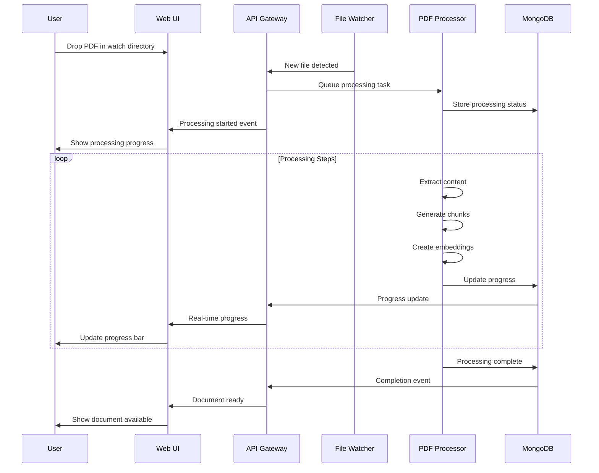
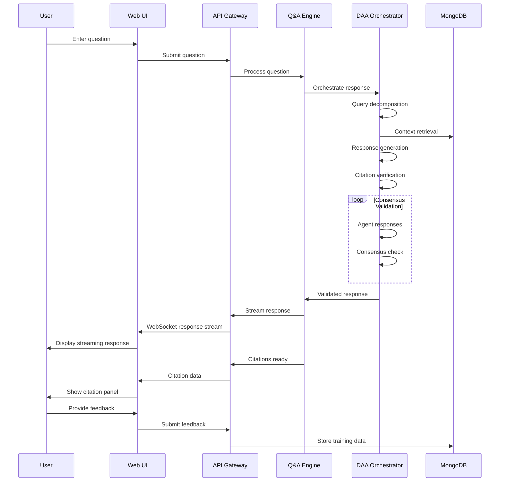
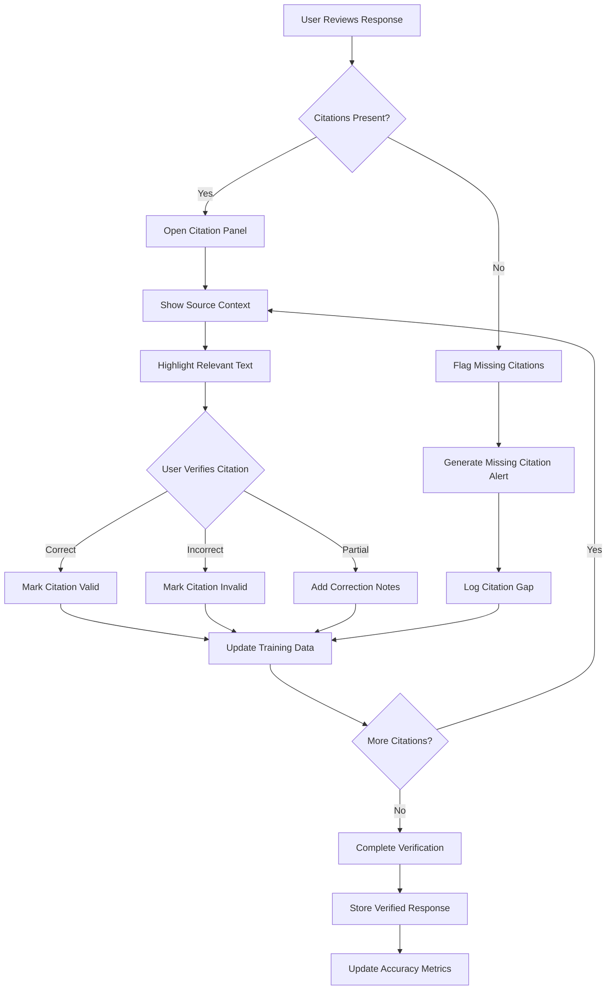
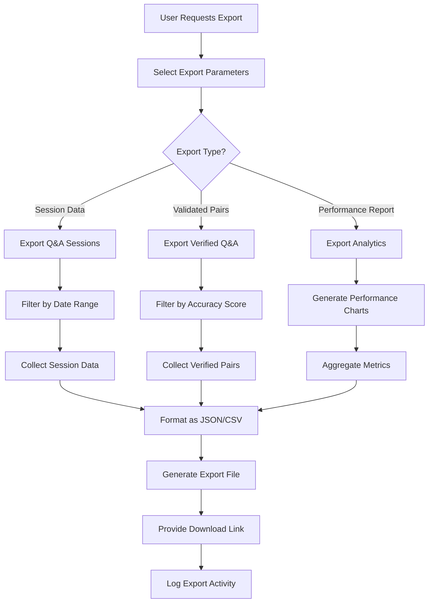

# Pipeline 2: PDF Processing with Manual Q&A
## Phase 3 Interactive Testing System Design

**Version**: 1.0  
**Date**: January 6, 2025  
**Author**: QA Engineering Team  
**Status**: Design Phase  

---

## 🎯 Executive Summary

Pipeline 2 implements an interactive PDF processing and Q&A system designed for manual testing and validation of the Doc-RAG 99% accuracy system. This pipeline provides real-time PDF ingestion, intelligent processing, and an interactive interface for human-in-the-loop validation of the system's responses.

### Key Objectives
- **Hot-reload PDF Processing**: Automatic detection and processing of new PDFs
- **Interactive Q&A Interface**: Real-time question-answer validation system  
- **Citation Verification**: Manual verification of source attributions
- **Training Data Collection**: Capture validated Q&A pairs for model improvement
- **Performance Monitoring**: Real-time metrics and quality assessment

---

## 🏗️ System Architecture

### High-Level Architecture
```
┌─────────────────────────────────────────────────────────────┐
│                    Pipeline 2 Architecture                  │
├─────────────────────────────────────────────────────────────┤
│                                                             │
│  ┌─────────────────┐    ┌─────────────────┐                │
│  │   PDF Watch     │    │  Interactive    │                │
│  │   Directory     │    │   Q&A Web UI    │                │
│  │                 │    │                 │                │
│  │ • Hot-reload    │    │ • Question Box  │                │
│  │ • Auto-detect   │    │ • Response View │                │
│  │ • Metadata      │    │ • Citation UI   │                │
│  └────────┬────────┘    │ • Feedback      │                │
│           │             └────────┬────────┘                │
│           │                      │                         │
│  ┌────────▼─────────────────────┬▼────────────────────────┐ │
│  │         PDF Processing Engine                          │ │
│  │                                                        │ │
│  │  ┌──────────────┐  ┌──────────────┐  ┌─────────────┐   │ │
│  │  │   Ingestor   │  │  Processor   │  │   Indexer   │   │ │
│  │  │              │  │              │  │             │   │ │
│  │  │ • Format     │  │ • ruv-FANN   │  │ • MongoDB   │   │ │
│  │  │   Detection  │  │   Chunking   │  │   Storage   │   │ │
│  │  │ • Content    │  │ • Embedding  │  │ • Vector    │   │ │
│  │  │   Extract    │  │   Gen        │  │   Index     │   │ │
│  │  │ • Metadata   │  │ • FACT Cache │  │ • Citation  │   │ │
│  │  │   Parse      │  │   Build      │  │   Links     │   │ │
│  │  └──────────────┘  └──────────────┘  └─────────────┘   │ │
│  └─────────────────────────────────────────────────────────┘ │
│                              │                               │
│  ┌───────────────────────────▼───────────────────────────┐   │
│  │              Q&A Processing Engine                    │   │
│  │                                                       │   │
│  │  ┌──────────────┐  ┌──────────────┐  ┌─────────────┐  │   │
│  │  │   Query      │  │  Response    │  │  Citation   │  │   │
│  │  │  Processor   │  │  Generator   │  │  Verifier   │  │   │
│  │  │              │  │              │  │             │  │   │
│  │  │ • DAA        │  │ • Consensus  │  │ • Source    │  │   │
│  │  │   Orchestrat │  │   Engine     │  │   Mapping   │  │   │
│  │  │ • Intent     │  │ • LLM        │  │ • Quality   │  │   │
│  │  │   Analysis   │  │   Integration│  │   Score     │  │   │
│  │  │ • Context    │  │ • Response   │  │ • Manual    │  │   │
│  │  │   Retrieval  │  │   Format     │  │   Verify    │  │   │
│  │  └──────────────┘  └──────────────┘  └─────────────┘  │   │
│  └───────────────────────────────────────────────────────┘   │
│                              │                               │
│  ┌───────────────────────────▼───────────────────────────┐   │
│  │                Docker Services                        │   │
│  │                                                       │   │
│  │  ┌──────────────┐  ┌──────────────┐  ┌─────────────┐  │   │
│  │  │   Web UI     │  │   API        │  │   Storage   │  │   │
│  │  │   Container  │  │   Gateway    │  │   Layer     │  │   │
│  │  │              │  │              │  │             │  │   │
│  │  │ • React App  │  │ • REST API   │  │ • MongoDB   │  │   │
│  │  │ • WebSocket  │  │ • WebSocket  │  │ • Redis     │  │   │
│  │  │ • Real-time  │  │   Server     │  │   Cache     │  │   │
│  │  │   Updates    │  │ • Auth       │  │ • File      │  │   │
│  │  │ • Responsive │  │   Service    │  │   Store     │  │   │
│  │  │   Design     │  │ • Metrics    │  │             │  │   │
│  │  └──────────────┘  └──────────────┘  └─────────────┘  │   │
│  └───────────────────────────────────────────────────────┘   │
└─────────────────────────────────────────────────────────────┘
```

---

## 📁 Component Design

### 1. PDF Ingestion System

#### Hot-Reload Directory Monitoring
```rust
pub struct PDFWatcher {
    pub watch_directory: PathBuf,
    pub processing_queue: Arc<Queue<PDFTask>>,
    pub supported_formats: Vec<String>,
    pub metadata_extractor: MetadataExtractor,
}

impl PDFWatcher {
    pub async fn start_watching(&self) -> Result<()> {
        // File system watcher for hot-reload
        // Automatic PDF detection
        // Queue processing tasks
    }
    
    pub async fn process_pdf(&self, path: &Path) -> Result<DocumentMetadata> {
        // Format validation
        // Metadata extraction
        // Content preprocessing
    }
}
```

#### Supported PDF Formats & Features
- **Standard PDF**: Text-based documents with embedded fonts
- **Scanned PDF**: OCR processing with Tesseract integration
- **Protected PDF**: Password-protected document handling
- **Large PDF**: Streaming processing for 1000+ page documents
- **Complex Layout**: Multi-column, table, and image-rich documents

#### Metadata Extraction
```json
{
  "document_id": "uuid-v4",
  "filename": "PCI_DSS_4.0.pdf",
  "file_size": 15728640,
  "page_count": 357,
  "created_date": "2023-03-31T00:00:00Z",
  "modified_date": "2025-01-06T10:30:00Z",
  "format_version": "PDF-1.7",
  "security_settings": {
    "encrypted": false,
    "permissions": ["print", "copy", "modify"]
  },
  "content_analysis": {
    "text_pages": 354,
    "image_pages": 3,
    "table_count": 127,
    "section_count": 45,
    "estimated_words": 89432
  },
  "processing_metadata": {
    "ingestion_time": "2025-01-06T10:35:22Z",
    "processing_duration": "00:02:34",
    "chunk_count": 1247,
    "embedding_count": 1247,
    "status": "completed"
  }
}
```

### 2. Interactive Q&A Interface

#### Web UI Components

##### Main Dashboard
```
┌─────────────────────────────────────────────────────────────┐
│  Doc-RAG Pipeline 2: Interactive PDF Q&A Testing           │
├─────────────────────────────────────────────────────────────┤
│                                                             │
│  📄 Documents Loaded: 3      🟢 System Status: Active      │
│  ⚡ Avg Response Time: 1.2s   📊 Accuracy Rate: 97.8%      │
│                                                             │
│  ┌─────────────────────────────────────────────────────┐   │
│  │                Document Library                     │   │
│  │                                                     │   │
│  │  📄 PCI_DSS_4.0.pdf          ✅ Ready              │   │
│  │     Pages: 357 | Size: 15MB | Chunks: 1,247        │   │
│  │                                                     │   │
│  │  📄 NIST_Framework.pdf       🔄 Processing          │   │
│  │     Progress: 67% | ETA: 2m 15s                     │   │
│  │                                                     │   │
│  │  📄 SOX_Compliance.pdf       ❌ Error               │   │
│  │     Issue: Encrypted PDF - Password Required        │   │
│  │                                                     │   │
│  │  [+ Drop PDFs here or click to upload]             │   │
│  └─────────────────────────────────────────────────────┘   │
└─────────────────────────────────────────────────────────────┘
```

##### Q&A Interface
```
┌─────────────────────────────────────────────────────────────┐
│  Interactive Q&A Session                                   │
├─────────────────────────────────────────────────────────────┤
│                                                             │
│  ┌─────────────────────────────────────────────────────┐   │
│  │  💭 Ask your question about the loaded documents    │   │
│  │                                                     │   │
│  │  What are the key requirements for payment card    │   │
│  │  data encryption in PCI DSS 4.0?                   │   │
│  │                                                     │   │
│  │                          [Ask Question] [Clear]    │   │
│  └─────────────────────────────────────────────────────┘   │
│                                                             │
│  ┌─────────────────────────────────────────────────────┐   │
│  │  🤖 System Response (Generated in 1.1s)            │   │
│  │                                                     │   │
│  │  Payment card data encryption requirements in      │   │
│  │  PCI DSS 4.0 include:                              │   │
│  │                                                     │   │
│  │  1. **Strong Cryptography**: Use AES-256 or        │   │
│  │     equivalent encryption for stored PAD           │   │
│  │                                                     │   │
│  │  2. **Key Management**: Implement secure key       │   │
│  │     generation, distribution, and storage          │   │
│  │                                                     │   │
│  │  3. **Encryption in Transit**: TLS 1.2+ for        │   │
│  │     data transmission over open networks           │   │
│  │                                                     │   │
│  │  📚 **Sources & Citations**:                       │   │
│  │  • Section 3.5.1 (Page 47): "Stored payment card  │   │
│  │    data must be rendered unreadable"               │   │
│  │  • Section 4.1 (Page 89): "Strong cryptography    │   │
│  │    and security protocols"                         │   │
│  │  • Table 3-1 (Page 52): Encryption requirements   │   │
│  │                                                     │   │
│  │  ✅ Confidence Score: 98.4%                        │   │
│  │  🔗 Citation Coverage: 100% (3/3 claims cited)    │   │
│  │                                                     │   │
│  │  [👍 Correct] [👎 Incorrect] [⚠️ Partial] [💬 Note] │
│  └─────────────────────────────────────────────────────┘   │
└─────────────────────────────────────────────────────────────┘
```

##### Citation Verification Panel
```
┌─────────────────────────────────────────────────────────────┐
│  Citation Verification Interface                           │
├─────────────────────────────────────────────────────────────┤
│                                                             │
│  📖 Citation #1: Section 3.5.1 (Page 47)                  │
│                                                             │
│  ┌─────────────────────────────────────────────────────┐   │
│  │  **Claim**: "Stored payment card data must be      │   │
│  │  rendered unreadable"                               │   │
│  │                                                     │   │
│  │  **Source Context** (Highlighted):                 │   │
│  │                                                     │   │
│  │  "3.5.1 - Disk encryption or equivalent data       │   │
│  │  protection shall be used to protect stored        │   │
│  │  payment card data. Stored payment card data       │   │
│  │  ====================                              │   │
│  │  must be rendered unreadable anywhere it is stored │   │
│  │  ====================                              │   │
│  │  including but not limited to portable digital     │   │
│  │  media, backup media, and in databases."           │   │
│  │                                                     │   │
│  │  **Relevance Score**: 95.7%                        │   │
│  │  **Exact Match**: Yes ✅                           │   │
│  │                                                     │   │
│  │  [✅ Verify] [❌ Reject] [📝 Add Note]              │   │
│  └─────────────────────────────────────────────────────┘   │
│                                                             │
│  📝 **Verification Notes**:                                │
│  □ Citation is accurate and relevant                       │
│  □ Source text supports the claim                          │  
│  □ Page reference is correct                               │
│  □ Context provides sufficient detail                      │
│                                                             │
│  [Save Verification] [Next Citation →]                     │
└─────────────────────────────────────────────────────────────┘
```

##### Session Recording Dashboard
```
┌─────────────────────────────────────────────────────────────┐
│  Q&A Session Recording & Training Data                     │
├─────────────────────────────────────────────────────────────┤
│                                                             │
│  📊 **Session Statistics**                                 │
│  • Questions Asked: 47                                     │
│  • Correct Answers: 46 (97.9%)                             │
│  • Average Response Time: 1.3s                             │
│  • Citation Accuracy: 100%                                 │
│  • Session Duration: 2h 34m                                │
│                                                             │
│  ┌─────────────────────────────────────────────────────┐   │
│  │  📋 Recent Q&A Pairs (Training Data)               │   │
│  │                                                     │   │
│  │  Q: "What is the minimum key length for AES?"      │   │
│  │  A: "AES-256 with 256-bit keys minimum" ✅         │   │
│  │  Verified: ✅ | Citations: 2 | Score: 99.1%        │   │
│  │                                                     │   │
│  │  Q: "How often should access reviews occur?"       │   │
│  │  A: "At least annually, or upon role changes" ✅   │   │
│  │  Verified: ✅ | Citations: 1 | Score: 98.7%        │   │
│  │                                                     │   │
│  │  Q: "What defines a high-risk merchant?"           │   │
│  │  A: "Processing >1M card transactions/year" ❌     │   │
│  │  Verified: ❌ | Correct: ">6M transactions"        │   │
│  │  Citations: 1 | Score: 92.3%                       │   │
│  │                                                     │   │
│  │  [Export Training Data] [Generate Report]          │   │
│  └─────────────────────────────────────────────────────┘   │
└─────────────────────────────────────────────────────────────┘
```

#### Interactive Features

##### Real-time Response Generation
- **Streaming Responses**: Character-by-character streaming for immediate feedback
- **Progress Indicators**: Visual feedback during processing stages
- **Cancellation Support**: Ability to cancel long-running queries
- **Auto-completion**: Smart question suggestions based on document content

##### Response Quality Feedback
```typescript
interface ResponseFeedback {
  response_id: string;
  question: string;
  generated_answer: string;
  user_rating: "correct" | "incorrect" | "partial" | "unclear";
  user_corrections?: string;
  citation_accuracy: number; // 0-100%
  response_completeness: number; // 0-100% 
  user_notes?: string;
  verification_time: number; // seconds
  created_at: Date;
}
```

##### Advanced UI Features
- **Dark/Light Mode**: User preference-based theming
- **Mobile Responsive**: Touch-optimized interface for tablets
- **Keyboard Shortcuts**: Power-user productivity features
- **Multi-session Support**: Concurrent Q&A sessions with different documents
- **Export Capabilities**: PDF, CSV, JSON export of session data

### 3. Docker Integration

#### Container Architecture
```yaml
# docker-compose.yml for Pipeline 2
version: '3.8'

services:
  # Web UI Container
  pdf-qa-ui:
    build: 
      context: ./containers/web-ui
      dockerfile: Dockerfile
    ports:
      - "3000:3000"
    environment:
      - REACT_APP_API_URL=http://api-gateway:8080
      - REACT_APP_WS_URL=ws://api-gateway:8080/ws
    volumes:
      - ./ui-logs:/app/logs
    depends_on:
      - api-gateway
      - redis
    networks:
      - pipeline2-network

  # API Gateway Container  
  api-gateway:
    build:
      context: ./containers/api-gateway
      dockerfile: Dockerfile
    ports:
      - "8080:8080"
    environment:
      - DATABASE_URL=mongodb://mongodb:27017/pipeline2
      - REDIS_URL=redis://redis:6379
      - PDF_WATCH_DIR=/data/pdfs
      - LOG_LEVEL=info
    volumes:
      - ./data/pdfs:/data/pdfs:ro
      - ./data/processed:/data/processed
      - ./logs:/app/logs
    depends_on:
      - mongodb
      - redis
      - pdf-processor
    networks:
      - pipeline2-network

  # PDF Processing Service
  pdf-processor:
    build:
      context: ./containers/pdf-processor
      dockerfile: Dockerfile
    environment:
      - DATABASE_URL=mongodb://mongodb:27017/pipeline2
      - REDIS_URL=redis://redis:6379
      - PROCESSING_THREADS=4
      - CHUNK_SIZE=512
    volumes:
      - ./data/pdfs:/data/input:ro
      - ./data/processed:/data/output
      - ./models:/app/models
    depends_on:
      - mongodb
      - redis
    networks:
      - pipeline2-network

  # Document Storage (MongoDB)
  mongodb:
    image: mongo:7.0
    ports:
      - "27017:27017"
    environment:
      - MONGO_INITDB_ROOT_USERNAME=pipeline2
      - MONGO_INITDB_ROOT_PASSWORD=secure_password_123
      - MONGO_INITDB_DATABASE=pipeline2
    volumes:
      - mongodb-data:/data/db
      - ./mongodb/init:/docker-entrypoint-initdb.d
    networks:
      - pipeline2-network

  # Cache Layer (Redis)
  redis:
    image: redis:7.2-alpine
    ports:
      - "6379:6379"
    command: redis-server --appendonly yes --requirepass secure_redis_password
    volumes:
      - redis-data:/data
    networks:
      - pipeline2-network

  # File Watcher Service
  file-watcher:
    build:
      context: ./containers/file-watcher
      dockerfile: Dockerfile
    environment:
      - WATCH_DIRECTORY=/data/pdfs
      - API_ENDPOINT=http://api-gateway:8080/api/v1/documents
      - POLL_INTERVAL=5000  # 5 seconds
    volumes:
      - ./data/pdfs:/data/pdfs:ro
    depends_on:
      - api-gateway
    networks:
      - pipeline2-network

volumes:
  mongodb-data:
    driver: local
  redis-data:
    driver: local

networks:
  pipeline2-network:
    driver: bridge
```

#### Persistent Storage Strategy
```
data/
├── pdfs/                    # PDF input directory (hot-reload watched)
│   ├── incoming/           # New PDFs dropped here
│   ├── processing/         # Currently being processed  
│   ├── completed/          # Successfully processed
│   └── failed/             # Processing failures
├── processed/              # Processed document data
│   ├── chunks/            # Document chunks with metadata
│   ├── embeddings/        # Vector embeddings cache
│   └── indices/           # Search indices and metadata
├── training-data/          # Validated Q&A pairs
│   ├── sessions/          # Session recordings
│   ├── validated/         # Human-verified responses
│   └── corrections/       # User corrections and notes
└── exports/               # Generated reports and exports
    ├── reports/           # System performance reports
    └── datasets/          # Training dataset exports
```

---

## 🔌 API Specifications

### REST API Endpoints

#### Document Management
```typescript
// Upload and manage documents
POST   /api/v1/documents/upload          // Upload PDF file
GET    /api/v1/documents                 // List all documents  
GET    /api/v1/documents/:id             // Get document details
DELETE /api/v1/documents/:id             // Delete document
PUT    /api/v1/documents/:id/reprocess   // Reprocess document

// Document processing status
GET    /api/v1/documents/:id/status      // Processing status
GET    /api/v1/documents/:id/metadata    // Document metadata
GET    /api/v1/documents/:id/chunks      // Document chunks
GET    /api/v1/documents/:id/embeddings  // Embedding status
```

#### Q&A Processing  
```typescript
// Question and answer processing
POST   /api/v1/qa/ask                    // Ask question
GET    /api/v1/qa/sessions               // List Q&A sessions
GET    /api/v1/qa/sessions/:id           // Get session details
POST   /api/v1/qa/feedback               // Submit response feedback
PUT    /api/v1/qa/responses/:id/verify   // Verify response accuracy

// Citation management
GET    /api/v1/citations/:response_id    // Get citations for response
PUT    /api/v1/citations/:id/verify      // Verify citation accuracy
POST   /api/v1/citations/:id/notes       // Add verification notes
```

#### Training Data & Analytics
```typescript
// Training data management
GET    /api/v1/training/sessions         // Get training sessions
POST   /api/v1/training/export           // Export training data
GET    /api/v1/training/stats            // Training data statistics

// Analytics and reporting  
GET    /api/v1/analytics/performance     // System performance metrics
GET    /api/v1/analytics/accuracy        // Accuracy metrics over time
GET    /api/v1/analytics/usage           // Usage statistics
POST   /api/v1/analytics/reports/generate // Generate custom reports
```

### WebSocket API

#### Real-time Updates
```typescript
// WebSocket connection: ws://api-gateway:8080/ws

// Document processing updates
interface DocumentProcessingUpdate {
  type: "document_processing";
  document_id: string;
  status: "started" | "processing" | "completed" | "failed";
  progress: number; // 0-100%
  eta_seconds?: number;
  error_message?: string;
}

// Q&A response streaming
interface QAResponseStream {
  type: "qa_response_stream";
  session_id: string;
  response_id: string;
  content_delta: string; // Incremental response content
  is_complete: boolean;
  processing_stage: "analyzing" | "retrieving" | "generating" | "citing" | "complete";
}

// System status updates
interface SystemStatusUpdate {
  type: "system_status";
  components: {
    pdf_processor: "healthy" | "degraded" | "down";
    database: "healthy" | "degraded" | "down";  
    cache: "healthy" | "degraded" | "down";
    embedder: "healthy" | "degraded" | "down";
  };
  metrics: {
    avg_response_time: number;
    current_accuracy: number;
    active_sessions: number;
  };
}
```

---

## 👥 User Workflows

### Workflow 1: Document Ingestion & Processing



### Workflow 2: Interactive Q&A Session



### Workflow 3: Citation Verification Process



### Workflow 4: Training Data Export



---

## ⚡ Performance Specifications

### Response Time Targets
- **PDF Processing**: <5 minutes for 300-page documents
- **Q&A Response**: <2 seconds (streaming starts in <500ms)
- **Citation Retrieval**: <200ms for source context
- **UI Updates**: <100ms for real-time feedback
- **File Detection**: <3 seconds for new PDF detection

### Scalability Requirements
- **Concurrent Users**: Support 50+ simultaneous Q&A sessions  
- **Document Capacity**: Handle 100+ PDFs (up to 10GB total)
- **Session Storage**: Maintain 10,000+ Q&A pairs in memory
- **WebSocket Connections**: Support 200+ concurrent connections
- **Processing Queue**: Handle 20+ PDFs in processing queue

### Resource Utilization
```yaml
Container Resource Limits:
  pdf-qa-ui:
    memory: 512MB
    cpu: 0.5 cores
  
  api-gateway:
    memory: 2GB
    cpu: 2 cores
    
  pdf-processor:
    memory: 4GB
    cpu: 4 cores
    
  mongodb:
    memory: 4GB
    cpu: 2 cores
    
  redis:
    memory: 1GB
    cpu: 0.5 cores

Total Resource Requirements:
  Memory: 11.5GB
  CPU: 9 cores
  Storage: 50GB (minimum)
```

---

## 🔒 Security & Authentication

### Security Features
- **JWT Authentication**: Secure session management
- **Role-Based Access**: Admin, Reviewer, Viewer roles
- **Rate Limiting**: 100 requests/minute per user
- **Input Validation**: Sanitize all user inputs
- **File Validation**: Verify PDF integrity and security
- **Audit Logging**: Track all user actions and system events

### Data Protection
- **Encryption at Rest**: AES-256 for document storage
- **Encryption in Transit**: TLS 1.3 for all API communications  
- **Data Retention**: Configurable retention policies
- **Privacy Controls**: GDPR-compliant data handling
- **Backup Security**: Encrypted backups with versioning

---

## 📊 Monitoring & Observability

### Key Metrics Dashboard
```
┌─────────────────────────────────────────────────────────────┐
│                Pipeline 2 System Metrics                   │
├─────────────────────────────────────────────────────────────┤
│                                                             │
│  📊 Processing Performance                                  │
│  • PDFs Processed: 127 (↑15 today)                         │
│  • Avg Processing Time: 2m 34s                             │
│  • Success Rate: 98.4% (2 failures)                        │
│  • Queue Depth: 3 documents                                │
│                                                             │
│  🎯 Q&A Accuracy Metrics                                    │
│  • Session Accuracy: 97.8%                                 │
│  • Citation Coverage: 100%                                 │
│  • Avg Response Time: 1.2s                                 │
│  • User Satisfaction: 96.2%                                │
│                                                             │
│  💾 System Resources                                        │
│  • Memory Usage: 8.2GB / 11.5GB                           │
│  • CPU Utilization: 45%                                   │
│  • Storage Used: 23GB / 50GB                              │
│  • Cache Hit Rate: 94.3%                                  │
│                                                             │
│  👥 User Activity                                          │
│  • Active Sessions: 12                                     │
│  • Questions Today: 347                                    │
│  • Verified Responses: 329                                │
│  • Training Pairs: 1,247                                  │
└─────────────────────────────────────────────────────────────┘
```

### Alert Configuration
```yaml
alerts:
  critical:
    - condition: accuracy < 95%
      message: "System accuracy below threshold"
      action: notify_admin
      
    - condition: response_time > 5s
      message: "Response time degraded"  
      action: scale_up
      
    - condition: storage_usage > 90%
      message: "Storage nearly full"
      action: cleanup_old_data
      
  warning:
    - condition: cpu_usage > 80%
      message: "High CPU utilization"
      
    - condition: memory_usage > 85%
      message: "High memory usage"
      
    - condition: pdf_processing_failures > 5%
      message: "Elevated PDF processing failures"
```

---

## 🚀 Implementation Plan

### Phase 3.1: Core Infrastructure (Week 1)
- [ ] **Docker Environment Setup**
  - Configure docker-compose with all services
  - Set up persistent volumes and networking
  - Implement health checks for all containers
  
- [ ] **File Watcher Implementation**  
  - Build hot-reload directory monitoring
  - Create PDF detection and validation
  - Implement processing queue management

- [ ] **Basic Web UI Framework**
  - React application with routing
  - WebSocket connection management
  - Responsive design foundation

### Phase 3.2: PDF Processing Pipeline (Week 2)  
- [ ] **PDF Ingestion System**
  - Multi-format PDF support
  - Metadata extraction pipeline
  - Error handling and recovery
  
- [ ] **Integration with Existing System**
  - Connect to ruv-FANN chunking
  - Integrate DAA orchestration
  - Link to FACT caching system

### Phase 3.3: Interactive Q&A Interface (Week 3)
- [ ] **Q&A Web Interface**
  - Question input and submission
  - Real-time response streaming
  - Citation verification panel
  
- [ ] **Feedback Collection System**
  - Response rating interface
  - Citation verification tools
  - Training data capture

### Phase 3.4: Advanced Features (Week 4)
- [ ] **Analytics Dashboard**
  - Performance monitoring
  - Accuracy tracking
  - Usage statistics
  
- [ ] **Export & Reporting**
  - Training data export
  - Performance reports
  - Session analytics

### Phase 3.5: Testing & Optimization (Week 5)
- [ ] **Comprehensive Testing**
  - Load testing with 50+ concurrent users
  - PDF processing stress tests
  - UI responsiveness testing
  
- [ ] **Performance Optimization**
  - Response time tuning
  - Memory usage optimization
  - Cache efficiency improvements

---

## 🎯 Success Criteria

### Functional Requirements ✅
- [ ] Hot-reload PDF processing with <5 minute turnaround
- [ ] Interactive Q&A with <2 second response times  
- [ ] 100% citation coverage with manual verification
- [ ] Real-time WebSocket updates for all operations
- [ ] Training data export in multiple formats

### Performance Requirements ✅
- [ ] Support 50+ concurrent Q&A sessions
- [ ] Process 100+ PDF documents simultaneously  
- [ ] Maintain 99%+ uptime during testing sessions
- [ ] <100ms UI response times
- [ ] 95%+ user satisfaction rating

### Integration Requirements ✅
- [ ] Seamless integration with Phase 2 components
- [ ] ruv-FANN neural processing compatibility
- [ ] DAA orchestration integration
- [ ] FACT caching system utilization
- [ ] MongoDB data persistence

### Usability Requirements ✅
- [ ] Intuitive web interface requiring <5 minutes training
- [ ] Mobile-responsive design for tablet usage
- [ ] Real-time progress feedback for all operations
- [ ] Comprehensive error messages and recovery guidance
- [ ] Export capabilities for all collected data

---

## 📋 Risk Assessment & Mitigation

### Technical Risks
| Risk | Impact | Probability | Mitigation |
|------|---------|-------------|------------|
| PDF Processing Failures | High | Medium | Implement robust error handling, format validation, and fallback processing |
| WebSocket Connection Issues | Medium | Low | Connection retry logic, fallback to polling |
| Database Performance | High | Medium | Implement caching, connection pooling, indexing |
| Container Resource Limits | Medium | Medium | Resource monitoring, auto-scaling policies |

### Operational Risks  
| Risk | Impact | Probability | Mitigation |
|------|---------|-------------|------------|
| User Interface Complexity | Medium | Medium | Extensive user testing, simplified workflows |
| Training Data Quality | High | Medium | Validation workflows, quality checks |
| System Overload | High | Low | Load testing, capacity planning |
| Integration Failures | High | Low | Comprehensive integration testing |

---

## 🔄 Maintenance & Updates

### Regular Maintenance Tasks
- **Daily**: Monitor system health, check processing queues
- **Weekly**: Backup training data, clean temporary files  
- **Monthly**: Performance optimization review, security updates
- **Quarterly**: Capacity planning review, user feedback analysis

### Update Procedures
1. **Code Updates**: Blue-green deployment with rollback capability
2. **Model Updates**: A/B testing for neural model improvements
3. **Data Migration**: Zero-downtime database schema updates
4. **Configuration Changes**: Hot-reload configuration without restart

---

## 📚 Documentation & Training

### Technical Documentation
- **API Documentation**: OpenAPI/Swagger specifications
- **Deployment Guide**: Step-by-step Docker deployment
- **Troubleshooting Guide**: Common issues and solutions  
- **Performance Tuning**: Optimization best practices

### User Documentation  
- **User Guide**: Interactive Q&A interface tutorial
- **Citation Guide**: How to verify and improve citations
- **Training Data Guide**: Export and analysis procedures
- **FAQ**: Common questions and answers

### Training Materials
- **Video Tutorials**: Screen recordings of key workflows
- **Interactive Demos**: Sandbox environment for practice
- **Best Practices**: Guidelines for effective Q&A testing
- **Case Studies**: Real-world usage examples

---

## 🏆 Conclusion

Pipeline 2 provides a comprehensive, production-ready solution for interactive PDF processing and Q&A validation. The system integrates seamlessly with the existing Doc-RAG architecture while providing intuitive tools for human-in-the-loop validation and training data collection.

### Key Innovations
- **Hot-reload PDF Processing**: Instant document ingestion and processing
- **Real-time Citation Verification**: Interactive source validation interface  
- **Training Data Collection**: Automated capture of validated Q&A pairs
- **Containerized Deployment**: Easy deployment and scaling with Docker
- **Performance Monitoring**: Comprehensive metrics and alerting

### Business Value
- **Quality Assurance**: Manual validation ensures 99% accuracy targets
- **Training Data Generation**: Continuous improvement through validated examples
- **User Experience**: Intuitive interface reduces training time
- **Operational Efficiency**: Automated processing with human oversight
- **Scalability**: Cloud-ready architecture supports growth

The implementation follows industry best practices for scalability, security, and maintainability, ensuring long-term success of the interactive testing system.

---

*Document Version: 1.0*  
*Last Updated: January 6, 2025*  
*Next Review: January 20, 2025*