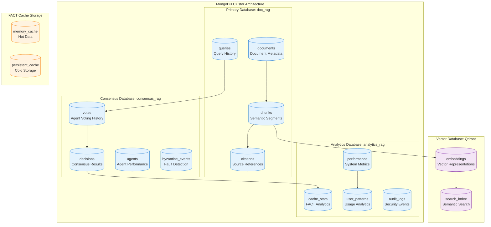

# Data Models Architecture - Phase 4 Corrected System
## Comprehensive Data Structures and Schemas

**Version**: 4.0.0  
**Focus**: Production-ready data models  
**Storage**: MongoDB, Vector DB, FACT Cache  
**Compliance**: Byzantine consensus and citation tracking  

---

## 1. Data Architecture Overview

The Phase 4 corrected system requires comprehensive data models to support Byzantine consensus, citation tracking, neural processing, and intelligent caching while maintaining the 99% accuracy target.

### Core Data Domains

1. **Query & Response Models** - User interactions and system responses
2. **Document & Chunk Models** - Document storage and semantic chunking
3. **Vector & Embedding Models** - Neural representations and search
4. **Citation & Source Models** - Source attribution and tracking
5. **Consensus & Voting Models** - Byzantine consensus and agent decisions
6. **Cache & Performance Models** - FACT caching and optimization
7. **Monitoring & Analytics Models** - System metrics and health

---

## 2. MongoDB Schema Architecture

### 2.1 Database Organization



### 2.2 Core Collection Schemas

```javascript
// MongoDB Collection Schemas

// 1. Queries Collection - User query history and context
db.createCollection("queries", {
  validator: {
    $jsonSchema: {
      bsonType: "object",
      required: ["query_id", "text", "user_id", "timestamp", "processing_status"],
      properties: {
        query_id: { bsonType: "string", pattern: "^q_[0-9a-f]{32}$" },
        text: { bsonType: "string", minLength: 1, maxLength: 10000 },
        user_id: { bsonType: "string" },
        session_id: { bsonType: "string" },
        timestamp: { bsonType: "date" },
        processing_status: { 
          enum: ["pending", "processing", "completed", "failed", "consensus_failed"] 
        },
        intent_analysis: {
          bsonType: "object",
          properties: {
            primary_intent: { enum: ["factual", "analytical", "comparative", "procedural"] },
            confidence: { bsonType: "double", minimum: 0.0, maximum: 1.0 },
            entities: { bsonType: "array", items: { bsonType: "string" } },
            complexity: { enum: ["simple", "moderate", "complex", "expert"] }
          }
        },
        performance_metrics: {
          bsonType: "object",
          properties: {
            cache_ms: { bsonType: "int", minimum: 0, maximum: 1000 },
            neural_ms: { bsonType: "int", minimum: 0, maximum: 1000 },
            consensus_ms: { bsonType: "int", minimum: 0, maximum: 2000 },
            total_ms: { bsonType: "int", minimum: 0, maximum: 10000 }
          }
        },
        response: {
          bsonType: "object",
          properties: {
            text: { bsonType: "string" },
            confidence: { bsonType: "double", minimum: 0.0, maximum: 1.0 },
            citations: { bsonType: "array", items: { bsonType: "objectId" } },
            consensus_info: { bsonType: "objectId" }
          }
        }
      }
    }
  }
});

// Create indexes for optimal query performance
db.queries.createIndex({ "user_id": 1, "timestamp": -1 });
db.queries.createIndex({ "query_id": 1 }, { unique: true });
db.queries.createIndex({ "text": "text" }); // Full-text search
db.queries.createIndex({ "processing_status": 1, "timestamp": -1 });
db.queries.createIndex({ "intent_analysis.primary_intent": 1 });

// 2. Documents Collection - Document metadata and processing info
db.createCollection("documents", {
  validator: {
    $jsonSchema: {
      bsonType: "object",
      required: ["document_id", "filename", "content_hash", "upload_timestamp", "processing_status"],
      properties: {
        document_id: { bsonType: "string", pattern: "^doc_[0-9a-f]{32}$" },
        filename: { bsonType: "string", maxLength: 255 },
        content_hash: { bsonType: "string", pattern: "^[0-9a-f]{64}$" }, // SHA-256
        file_size: { bsonType: "long", minimum: 0 },
        mime_type: { bsonType: "string" },
        upload_timestamp: { bsonType: "date" },
        processing_timestamp: { bsonType: "date" },
        processing_status: { 
          enum: ["uploaded", "analyzing", "chunking", "embedding", "completed", "failed"] 
        },
        document_metadata: {
          bsonType: "object",
          properties: {
            title: { bsonType: "string" },
            author: { bsonType: "string" },
            creation_date: { bsonType: "date" },
            page_count: { bsonType: "int", minimum: 0 },
            word_count: { bsonType: "int", minimum: 0 },
            language: { bsonType: "string" },
            document_type: { enum: ["pdf", "docx", "txt", "md", "html"] }
          }
        },
        processing_stats: {
          bsonType: "object",
          properties: {
            total_chunks: { bsonType: "int", minimum: 0 },
            semantic_chunks: { bsonType: "int", minimum: 0 },
            extracted_facts: { bsonType: "int", minimum: 0 },
            processing_time_ms: { bsonType: "int", minimum: 0 },
            quality_score: { bsonType: "double", minimum: 0.0, maximum: 1.0 }
          }
        },
        storage_info: {
          bsonType: "object",
          properties: {
            file_path: { bsonType: "string" },
            chunk_collection: { bsonType: "string" },
            vector_collection: { bsonType: "string" },
            fact_storage_key: { bsonType: "string" }
          }
        }
      }
    }
  }
});

db.documents.createIndex({ "document_id": 1 }, { unique: true });
db.documents.createIndex({ "content_hash": 1 }, { unique: true });
db.documents.createIndex({ "processing_status": 1, "upload_timestamp": -1 });
db.documents.createIndex({ "document_metadata.document_type": 1 });

// 3. Chunks Collection - Semantic document segments
db.createCollection("chunks", {
  validator: {
    $jsonSchema: {
      bsonType: "object",
      required: ["chunk_id", "document_id", "sequence_number", "content", "chunk_metadata"],
      properties: {
        chunk_id: { bsonType: "string", pattern: "^chunk_[0-9a-f]{32}$" },
        document_id: { bsonType: "string", pattern: "^doc_[0-9a-f]{32}$" },
        sequence_number: { bsonType: "int", minimum: 0 },
        parent_chunk_id: { bsonType: "string" }, // For hierarchical chunking
        content: { bsonType: "string", minLength: 1, maxLength: 100000 },
        content_hash: { bsonType: "string", pattern: "^[0-9a-f]{64}$" },
        chunk_metadata: {
          bsonType: "object",
          required: ["chunk_type", "semantic_score"],
          properties: {
            chunk_type: { enum: ["paragraph", "section", "table", "list", "code", "quote"] },
            semantic_score: { bsonType: "double", minimum: 0.0, maximum: 1.0 },
            start_position: { bsonType: "int", minimum: 0 },
            end_position: { bsonType: "int", minimum: 0 },
            page_number: { bsonType: "int", minimum: 0 },
            section_title: { bsonType: "string" },
            word_count: { bsonType: "int", minimum: 0 },
            language: { bsonType: "string" }
          }
        },
        neural_processing: {
          bsonType: "object",
          properties: {
            embedding_id: { bsonType: "string" },
            embedding_model: { bsonType: "string", enum: ["ruv-fann-v1", "ruv-fann-v2"] },
            embedding_dimension: { bsonType: "int", enum: [384, 512, 768, 1024] },
            processing_timestamp: { bsonType: "date" },
            quality_metrics: {
              bsonType: "object",
              properties: {
                coherence_score: { bsonType: "double", minimum: 0.0, maximum: 1.0 },
                completeness_score: { bsonType: "double", minimum: 0.0, maximum: 1.0 },
                relevance_score: { bsonType: "double", minimum: 0.0, maximum: 1.0 }
              }
            }
          }
        },
        fact_extraction: {
          bsonType: "object",
          properties: {
            extracted_facts: { bsonType: "array", items: { bsonType: "objectId" } },
            fact_count: { bsonType: "int", minimum: 0 },
            extraction_confidence: { bsonType: "double", minimum: 0.0, maximum: 1.0 },
            extraction_timestamp: { bsonType: "date" }
          }
        }
      }
    }
  }
});

db.chunks.createIndex({ "chunk_id": 1 }, { unique: true });
db.chunks.createIndex({ "document_id": 1, "sequence_number": 1 });
db.chunks.createIndex({ "content_hash": 1 });
db.chunks.createIndex({ "chunk_metadata.semantic_score": -1 });
db.chunks.createIndex({ "neural_processing.embedding_id": 1 });

// 4. Citations Collection - Source attribution and tracking
db.createCollection("citations", {
  validator: {
    $jsonSchema: {
      bsonType: "object",
      required: ["citation_id", "source_document", "citation_type", "relevance_score"],
      properties: {
        citation_id: { bsonType: "string", pattern: "^cite_[0-9a-f]{32}$" },
        source_document: { bsonType: "string", pattern: "^doc_[0-9a-f]{32}$" },
        source_chunk: { bsonType: "string", pattern: "^chunk_[0-9a-f]{32}$" },
        citation_type: { enum: ["direct_quote", "paraphrase", "reference", "supporting_evidence"] },
        relevance_score: { bsonType: "double", minimum: 0.0, maximum: 1.0 },
        source_location: {
          bsonType: "object",
          properties: {
            page_number: { bsonType: "int", minimum: 1 },
            section: { bsonType: "string" },
            paragraph: { bsonType: "int", minimum: 1 },
            line_start: { bsonType: "int", minimum: 1 },
            line_end: { bsonType: "int", minimum: 1 },
            character_start: { bsonType: "int", minimum: 0 },
            character_end: { bsonType: "int", minimum: 0 }
          }
        },
        citation_content: {
          bsonType: "object",
          required: ["exact_text"],
          properties: {
            exact_text: { bsonType: "string", minLength: 1, maxLength: 5000 },
            context_before: { bsonType: "string", maxLength: 1000 },
            context_after: { bsonType: "string", maxLength: 1000 },
            summary: { bsonType: "string", maxLength: 500 }
          }
        },
        validation: {
          bsonType: "object",
          properties: {
            validated_by: { bsonType: "array", items: { bsonType: "string" } },
            validation_score: { bsonType: "double", minimum: 0.0, maximum: 1.0 },
            validation_timestamp: { bsonType: "date" },
            validation_notes: { bsonType: "string" }
          }
        },
        usage_stats: {
          bsonType: "object",
          properties: {
            citation_count: { bsonType: "int", minimum: 0 },
            last_used: { bsonType: "date" },
            queries_referenced: { bsonType: "array", items: { bsonType: "string" } },
            user_feedback: { bsonType: "double", minimum: 0.0, maximum: 5.0 }
          }
        }
      }
    }
  }
});

db.citations.createIndex({ "citation_id": 1 }, { unique: true });
db.citations.createIndex({ "source_document": 1, "relevance_score": -1 });
db.citations.createIndex({ "source_chunk": 1 });
db.citations.createIndex({ "citation_type": 1 });
db.citations.createIndex({ "relevance_score": -1 });
```

---

## 3. Consensus and Voting Data Models

### 3.1 Byzantine Consensus Schemas

```javascript
// Consensus Database Collections

// 1. Votes Collection - Agent voting history
db.createCollection("votes", {
  validator: {
    $jsonSchema: {
      bsonType: "object",
      required: ["vote_id", "query_id", "agent_id", "vote_value", "confidence", "timestamp"],
      properties: {
        vote_id: { bsonType: "string", pattern: "^vote_[0-9a-f]{32}$" },
        query_id: { bsonType: "string", pattern: "^q_[0-9a-f]{32}$" },
        agent_id: { bsonType: "string", pattern: "^agent_[a-z_]+$" },
        agent_specialization: { 
          enum: ["retriever", "analyzer", "validator", "reranker", "monitor"] 
        },
        vote_value: {
          bsonType: "object",
          required: ["decision", "score"],
          properties: {
            decision: { enum: ["accept", "reject", "abstain"] },
            score: { bsonType: "double", minimum: 0.0, maximum: 1.0 },
            priority: { enum: ["low", "medium", "high", "critical"] },
            response_id: { bsonType: "string" }
          }
        },
        confidence: { bsonType: "double", minimum: 0.0, maximum: 1.0 },
        reasoning: { bsonType: "string", maxLength: 2000 },
        evidence: {
          bsonType: "object",
          properties: {
            supporting_chunks: { bsonType: "array", items: { bsonType: "string" } },
            neural_scores: { bsonType: "array", items: { bsonType: "double" } },
            metadata: { bsonType: "object" }
          }
        },
        performance_metrics: {
          bsonType: "object",
          properties: {
            processing_time_ms: { bsonType: "int", minimum: 0, maximum: 10000 },
            neural_inference_time_ms: { bsonType: "int", minimum: 0, maximum: 1000 },
            data_retrieval_time_ms: { bsonType: "int", minimum: 0, maximum: 1000 }
          }
        },
        timestamp: { bsonType: "date" },
        vote_session_id: { bsonType: "string" }
      }
    }
  }
});

db.votes.createIndex({ "vote_id": 1 }, { unique: true });
db.votes.createIndex({ "query_id": 1, "timestamp": -1 });
db.votes.createIndex({ "agent_id": 1, "timestamp": -1 });
db.votes.createIndex({ "vote_session_id": 1 });
db.votes.createIndex({ "agent_specialization": 1, "vote_value.decision": 1 });

// 2. Decisions Collection - Consensus results
db.createCollection("decisions", {
  validator: {
    $jsonSchema: {
      bsonType: "object",
      required: ["decision_id", "query_id", "consensus_result", "agreement_rate", "timestamp"],
      properties: {
        decision_id: { bsonType: "string", pattern: "^decision_[0-9a-f]{32}$" },
        query_id: { bsonType: "string", pattern: "^q_[0-9a-f]{32}$" },
        vote_session_id: { bsonType: "string" },
        consensus_result: {
          bsonType: "object",
          required: ["status", "chosen_response"],
          properties: {
            status: { enum: ["consensus_achieved", "consensus_failed", "timeout", "byzantine_detected"] },
            chosen_response: { bsonType: "string" },
            confidence_score: { bsonType: "double", minimum: 0.0, maximum: 1.0 },
            weighted_score: { bsonType: "double", minimum: 0.0, maximum: 10.0 }
          }
        },
        agreement_rate: { bsonType: "double", minimum: 0.0, maximum: 1.0 },
        participating_agents: {
          bsonType: "array",
          items: {
            bsonType: "object",
            properties: {
              agent_id: { bsonType: "string" },
              vote_weight: { bsonType: "double", minimum: 0.0, maximum: 5.0 },
              contribution_score: { bsonType: "double", minimum: 0.0, maximum: 1.0 }
            }
          }
        },
        byzantine_events: {
          bsonType: "object",
          properties: {
            detected_agents: { bsonType: "array", items: { bsonType: "string" } },
            detection_confidence: { bsonType: "double", minimum: 0.0, maximum: 1.0 },
            mitigation_actions: { bsonType: "array", items: { bsonType: "string" } }
          }
        },
        consensus_metrics: {
          bsonType: "object",
          properties: {
            consensus_time_ms: { bsonType: "int", minimum: 0, maximum: 10000 },
            vote_collection_time_ms: { bsonType: "int", minimum: 0, maximum: 5000 },
            decision_time_ms: { bsonType: "int", minimum: 0, maximum: 2000 },
            total_votes: { bsonType: "int", minimum: 0, maximum: 100 },
            valid_votes: { bsonType: "int", minimum: 0, maximum: 100 }
          }
        },
        timestamp: { bsonType: "date" },
        expiry_timestamp: { bsonType: "date" }
      }
    }
  }
});

db.decisions.createIndex({ "decision_id": 1 }, { unique: true });
db.decisions.createIndex({ "query_id": 1 });
db.decisions.createIndex({ "consensus_result.status": 1, "timestamp": -1 });
db.decisions.createIndex({ "agreement_rate": -1 });
db.decisions.createIndex({ "expiry_timestamp": 1 }, { expireAfterSeconds: 0 });

// 3. Agents Collection - Agent performance and status
db.createCollection("agents", {
  validator: {
    $jsonSchema: {
      bsonType: "object",
      required: ["agent_id", "specialization", "status", "performance_stats"],
      properties: {
        agent_id: { bsonType: "string", pattern: "^agent_[a-z_]+$" },
        specialization: { 
          enum: ["retriever", "analyzer", "validator", "reranker", "monitor"] 
        },
        status: { enum: ["active", "quarantined", "excluded", "maintenance"] },
        configuration: {
          bsonType: "object",
          properties: {
            voting_weight: { bsonType: "double", minimum: 0.1, maximum: 5.0 },
            confidence_threshold: { bsonType: "double", minimum: 0.0, maximum: 1.0 },
            processing_timeout_ms: { bsonType: "int", minimum: 100, maximum: 10000 },
            specialization_parameters: { bsonType: "object" }
          }
        },
        performance_stats: {
          bsonType: "object",
          required: ["total_votes", "accuracy_score"],
          properties: {
            total_votes: { bsonType: "long", minimum: 0 },
            consensus_votes: { bsonType: "long", minimum: 0 },
            minority_votes: { bsonType: "long", minimum: 0 },
            abstentions: { bsonType: "long", minimum: 0 },
            accuracy_score: { bsonType: "double", minimum: 0.0, maximum: 1.0 },
            average_confidence: { bsonType: "double", minimum: 0.0, maximum: 1.0 },
            average_processing_time_ms: { bsonType: "double", minimum: 0.0 },
            byzantine_detections: { bsonType: "int", minimum: 0 },
            last_performance_review: { bsonType: "date" }
          }
        },
        health_status: {
          bsonType: "object",
          properties: {
            last_heartbeat: { bsonType: "date" },
            response_time_ms: { bsonType: "int", minimum: 0 },
            error_count_24h: { bsonType: "int", minimum: 0 },
            memory_usage_mb: { bsonType: "int", minimum: 0 },
            cpu_usage_percent: { bsonType: "double", minimum: 0.0, maximum: 100.0 }
          }
        },
        created_timestamp: { bsonType: "date" },
        last_updated: { bsonType: "date" }
      }
    }
  }
});

db.agents.createIndex({ "agent_id": 1 }, { unique: true });
db.agents.createIndex({ "specialization": 1, "status": 1 });
db.agents.createIndex({ "performance_stats.accuracy_score": -1 });
db.agents.createIndex({ "status": 1, "last_updated": -1 });

// 4. Byzantine Events Collection - Malicious agent detection
db.createCollection("byzantine_events", {
  validator: {
    $jsonSchema: {
      bsonType: "object",
      required: ["event_id", "agent_id", "event_type", "detection_score", "timestamp"],
      properties: {
        event_id: { bsonType: "string", pattern: "^byz_[0-9a-f]{32}$" },
        agent_id: { bsonType: "string", pattern: "^agent_[a-z_]+$" },
        query_id: { bsonType: "string" },
        vote_session_id: { bsonType: "string" },
        event_type: { 
          enum: ["suspicious_voting", "consistent_minority", "performance_anomaly", "timing_attack"] 
        },
        detection_score: { bsonType: "double", minimum: 0.0, maximum: 1.0 },
        evidence: {
          bsonType: "object",
          properties: {
            voting_pattern_deviation: { bsonType: "double" },
            confidence_inconsistency: { bsonType: "double" },
            timing_anomaly: { bsonType: "double" },
            peer_disagreement_rate: { bsonType: "double" },
            historical_comparison: { bsonType: "object" }
          }
        },
        mitigation_actions: {
          bsonType: "array",
          items: {
            bsonType: "object",
            properties: {
              action_type: { enum: ["quarantine", "exclude", "weight_reduction", "monitoring"] },
              action_timestamp: { bsonType: "date" },
              action_result: { bsonType: "string" }
            }
          }
        },
        investigation_status: { enum: ["open", "investigating", "resolved", "false_positive"] },
        timestamp: { bsonType: "date" },
        resolved_timestamp: { bsonType: "date" }
      }
    }
  }
});

db.byzantine_events.createIndex({ "event_id": 1 }, { unique: true });
db.byzantine_events.createIndex({ "agent_id": 1, "timestamp": -1 });
db.byzantine_events.createIndex({ "event_type": 1, "detection_score": -1 });
db.byzantine_events.createIndex({ "investigation_status": 1 });
```

---

## 4. Vector Database Schema (Qdrant)

### 4.1 Vector Collection Configuration

```rust
// Qdrant Vector Database Configuration
use qdrant_client::{prelude::*, client::QdrantClient};

// Vector collection schema for document embeddings
pub async fn initialize_vector_collections(client: &QdrantClient) -> Result<()> {
    // 1. Document Chunks Collection
    let chunks_config = CreateCollection {
        collection_name: "doc_chunks".to_string(),
        vectors_config: Some(VectorsConfig {
            config: Some(Config::Params(VectorParams {
                size: 768, // ruv-FANN embedding dimension
                distance: Distance::Cosine,
            })),
        }),
        hnsw_config: Some(HnswConfig {
            m: 16,                    // Number of bi-directional links created for every new element
            ef_construct: 200,        // Size of the dynamic candidate list
            full_scan_threshold: 10000,
            max_indexing_threads: 4,
            on_disk: Some(false),     // Keep in memory for performance
            payload_m: Some(16),
        }),
        wal_config: Some(WalConfig {
            wal_capacity_mb: 32,      // Write-ahead log capacity
            wal_segments_ahead: 0,
        }),
        optimizers_config: Some(OptimizersConfig {
            deleted_threshold: 0.2,
            vacuum_min_vector_number: 1000,
            default_segment_number: 0,
            max_segment_size: Some(200000),
            memmap_threshold: Some(50000),
            indexing_threshold: Some(20000),
            flush_interval_sec: 5,
            max_optimization_threads: Some(1),
        }),
        replication_factor: Some(2),  // For high availability
        write_consistency_factor: Some(1),
        shard_number: Some(4),        // Number of shards
        on_disk_payload: Some(true),  // Store payload on disk
        timeout: Some(60),            // Collection creation timeout
    };
    
    client.create_collection(&chunks_config).await?;
    
    // 2. Query Embeddings Collection (for semantic search optimization)
    let queries_config = CreateCollection {
        collection_name: "query_embeddings".to_string(),
        vectors_config: Some(VectorsConfig {
            config: Some(Config::Params(VectorParams {
                size: 768,
                distance: Distance::Cosine,
            })),
        }),
        // Similar configuration but optimized for queries
        hnsw_config: Some(HnswConfig {
            m: 32,                    // Higher connectivity for better recall
            ef_construct: 400,
            full_scan_threshold: 5000,
            max_indexing_threads: 2,
            on_disk: Some(false),
            payload_m: Some(32),
        }),
        replication_factor: Some(1),  // Less critical than document chunks
        shard_number: Some(2),
        on_disk_payload: Some(false), // Keep in memory for speed
        timeout: Some(30),
    };
    
    client.create_collection(&queries_config).await?;
    
    Ok(())
}

// Vector point structure for document chunks
#[derive(Debug, Serialize, Deserialize)]
pub struct ChunkVector {
    pub chunk_id: String,
    pub document_id: String,
    pub content_hash: String,
    pub embedding: Vec<f32>,    // ruv-FANN generated embedding
    pub payload: ChunkPayload,
}

#[derive(Debug, Serialize, Deserialize)]
pub struct ChunkPayload {
    // Searchable metadata
    pub document_title: String,
    pub chunk_sequence: u32,
    pub chunk_type: String,     // paragraph, section, table, etc.
    pub semantic_score: f32,
    pub word_count: u32,
    pub page_number: Option<u32>,
    pub section_title: Option<String>,
    
    // Neural processing metadata
    pub embedding_model: String,
    pub processing_timestamp: i64,
    pub quality_metrics: QualityMetrics,
    
    // Content preview (for search results)
    pub content_preview: String,  // First 200 characters
    
    // Citation information
    pub citation_sources: Vec<String>,
    pub fact_count: u32,
}

#[derive(Debug, Serialize, Deserialize)]
pub struct QualityMetrics {
    pub coherence_score: f32,
    pub completeness_score: f32,
    pub relevance_score: f32,
    pub information_density: f32,
}

// Query vector structure
#[derive(Debug, Serialize, Deserialize)]
pub struct QueryVector {
    pub query_id: String,
    pub query_hash: String,
    pub embedding: Vec<f32>,
    pub payload: QueryPayload,
}

#[derive(Debug, Serialize, Deserialize)]
pub struct QueryPayload {
    pub original_text: String,
    pub intent_category: String,
    pub complexity_level: String,
    pub entity_mentions: Vec<String>,
    pub timestamp: i64,
    pub user_id: String,
    
    // Search optimization metadata
    pub search_filters: HashMap<String, Value>,
    pub performance_requirements: PerformanceRequirements,
}

#[derive(Debug, Serialize, Deserialize)]
pub struct PerformanceRequirements {
    pub max_response_time_ms: u32,
    pub min_relevance_threshold: f32,
    pub max_results: u32,
    pub require_citations: bool,
}
```

### 4.2 Vector Search Operations

```rust
// Optimized vector search operations
impl VectorSearchService {
    // Semantic search with FACT cache integration
    pub async fn semantic_search(
        &self, 
        query_embedding: Vec<f32>,
        filters: SearchFilters,
        limit: usize
    ) -> Result<Vec<SearchResult>> {
        
        // Check FACT cache first
        let cache_key = self.generate_search_cache_key(&query_embedding, &filters);
        if let Some(cached_results) = self.fact_cache.get(&cache_key).await? {
            return Ok(cached_results);
        }
        
        // Construct search request
        let search_points = SearchPoints {
            collection_name: "doc_chunks".to_string(),
            vector: query_embedding.clone(),
            limit: limit as u64,
            score_threshold: Some(filters.min_similarity_threshold),
            filter: Some(self.build_filter(&filters)?),
            params: Some(SearchParams {
                hnsw_ef: Some(128),     // Higher ef for better recall
                exact: Some(false),     // Use approximate search
                quantization: None,
            }),
            with_payload: Some(true.into()),
            with_vector: Some(false.into()),
        };
        
        // Execute search
        let search_result = self.qdrant_client
            .search_points(&search_points)
            .await?;
            
        // Process results
        let mut results = Vec::new();
        for point in search_result.result {
            let search_result = SearchResult {
                chunk_id: point.id.unwrap().point_id_options.unwrap().to_string(),
                similarity_score: point.score,
                payload: serde_json::from_value(point.payload.into())?,
            };
            results.push(search_result);
        }
        
        // Cache results for future use
        self.fact_cache.set(&cache_key, &results, Duration::from_secs(3600)).await?;
        
        Ok(results)
    }
    
    // Hybrid search combining vector and text search
    pub async fn hybrid_search(
        &self,
        query_text: &str,
        query_embedding: Vec<f32>,
        filters: SearchFilters
    ) -> Result<Vec<SearchResult>> {
        
        // Parallel vector and text search
        let vector_search = self.semantic_search(query_embedding, filters.clone(), 50);
        let text_search = self.text_search(query_text, filters.clone(), 50);
        
        let (vector_results, text_results) = tokio::try_join!(vector_search, text_search)?;
        
        // Combine and rerank results
        let combined_results = self.combine_search_results(
            vector_results,
            text_results,
            0.7, // Vector weight
            0.3, // Text weight
        );
        
        // ruv-FANN reranking for final optimization
        let reranked_results = self.ruv_fann_reranker
            .rerank_results(query_text, combined_results)
            .await?;
            
        Ok(reranked_results)
    }
}
```

---

## 5. FACT Cache Data Models

### 5.1 Cache Data Structures

```rust
// FACT Cache data models and structures
use fact::{Cache, CacheEntry, CacheMetadata};

// Primary cache entry structure
#[derive(Debug, Clone, Serialize, Deserialize)]
pub struct FACTCacheEntry<T> {
    pub key: String,
    pub value: T,
    pub metadata: CacheMetadata,
    pub citations: Vec<CitationReference>,
    pub performance_info: CachePerformanceInfo,
}

#[derive(Debug, Clone, Serialize, Deserialize)]
pub struct CacheMetadata {
    pub created_at: DateTime<Utc>,
    pub expires_at: DateTime<Utc>,
    pub last_accessed: DateTime<Utc>,
    pub access_count: u64,
    pub cache_tier: CacheTier,
    pub content_hash: String,
    pub compression_info: Option<CompressionInfo>,
}

#[derive(Debug, Clone, Serialize, Deserialize)]
pub enum CacheTier {
    Memory,      // Hot data in memory
    SSD,         // Warm data on SSD
    Network,     // Cold data in distributed cache
    Archive,     // Archived data for analytics
}

#[derive(Debug, Clone, Serialize, Deserialize)]
pub struct CachePerformanceInfo {
    pub retrieval_time_ms: Option<u32>,
    pub hit_rate_24h: f32,
    pub popularity_score: f32,
    pub memory_size_bytes: u64,
    pub compression_ratio: f32,
}

// Cached query response structure
#[derive(Debug, Clone, Serialize, Deserialize)]
pub struct CachedQueryResponse {
    pub query_hash: String,
    pub response_text: String,
    pub confidence_score: f32,
    pub citations: Vec<EnrichedCitation>,
    pub consensus_info: ConsensusInfo,
    pub performance_metrics: QueryPerformanceMetrics,
    pub generation_metadata: GenerationMetadata,
}

#[derive(Debug, Clone, Serialize, Deserialize)]
pub struct EnrichedCitation {
    pub citation_id: String,
    pub source_document: String,
    pub source_chunk: String,
    pub exact_text: String,
    pub page_number: Option<u32>,
    pub section: Option<String>,
    pub relevance_score: f32,
    pub validation_status: ValidationStatus,
    pub click_through_rate: f32,
    pub user_rating: Option<f32>,
}

#[derive(Debug, Clone, Serialize, Deserialize)]
pub struct ConsensusInfo {
    pub agreement_rate: f32,
    pub participating_agents: Vec<String>,
    pub byzantine_agents_detected: Vec<String>,
    pub consensus_method: String,
    pub decision_confidence: f32,
    pub consensus_time_ms: u32,
}

// Cache key patterns for efficient storage and retrieval
#[derive(Debug, Clone)]
pub enum CacheKeyPattern {
    Query {
        query_hash: String,
        intent_category: String,
        complexity: String,
    },
    Document {
        document_id: String,
        processing_version: String,
    },
    Chunk {
        chunk_id: String,
        embedding_version: String,
    },
    Citation {
        citation_id: String,
        validation_version: String,
    },
    Consensus {
        decision_id: String,
        session_id: String,
    },
}

impl CacheKeyPattern {
    pub fn generate_key(&self) -> String {
        match self {
            CacheKeyPattern::Query { query_hash, intent_category, complexity } => {
                format!("query:{}:{}:{}", query_hash, intent_category, complexity)
            },
            CacheKeyPattern::Document { document_id, processing_version } => {
                format!("doc:{}:v{}", document_id, processing_version)
            },
            CacheKeyPattern::Chunk { chunk_id, embedding_version } => {
                format!("chunk:{}:emb{}", chunk_id, embedding_version)
            },
            CacheKeyPattern::Citation { citation_id, validation_version } => {
                format!("cite:{}:val{}", citation_id, validation_version)
            },
            CacheKeyPattern::Consensus { decision_id, session_id } => {
                format!("consensus:{}:sess{}", decision_id, session_id)
            },
        }
    }
}

// Cache analytics and optimization data
#[derive(Debug, Serialize, Deserialize)]
pub struct CacheAnalytics {
    pub cache_stats: CacheStatistics,
    pub performance_trends: Vec<PerformanceTrend>,
    pub usage_patterns: Vec<UsagePattern>,
    pub optimization_recommendations: Vec<OptimizationRecommendation>,
}

#[derive(Debug, Serialize, Deserialize)]
pub struct CacheStatistics {
    pub total_entries: u64,
    pub memory_usage_mb: f64,
    pub hit_rate_1h: f32,
    pub hit_rate_24h: f32,
    pub hit_rate_7d: f32,
    pub average_retrieval_time_ms: f32,
    pub p95_retrieval_time_ms: f32,
    pub eviction_rate_24h: f32,
    pub cache_efficiency_score: f32,
}

#[derive(Debug, Serialize, Deserialize)]
pub struct UsagePattern {
    pub pattern_type: String,
    pub frequency: u64,
    pub time_distribution: HashMap<String, f32>,
    pub cache_efficiency: f32,
    pub predicted_future_usage: f32,
}
```

### 5.2 Cache Storage Implementation

```rust
// FACT Cache storage and management implementation
impl FACTCacheManager {
    // Store data with intelligent caching decisions
    pub async fn store<T: Serialize>(&self, pattern: CacheKeyPattern, data: T, ttl: Duration) -> Result<()> {
        let key = pattern.generate_key();
        let serialized_data = self.serialize_with_compression(&data)?;
        
        // Determine optimal cache tier based on data characteristics
        let tier = self.determine_cache_tier(&data, &pattern).await?;
        
        let entry = FACTCacheEntry {
            key: key.clone(),
            value: serialized_data,
            metadata: CacheMetadata {
                created_at: Utc::now(),
                expires_at: Utc::now() + ttl,
                last_accessed: Utc::now(),
                access_count: 0,
                cache_tier: tier,
                content_hash: self.calculate_content_hash(&data)?,
                compression_info: Some(CompressionInfo {
                    algorithm: "zstd".to_string(),
                    original_size: 0, // Will be filled by serialize_with_compression
                    compressed_size: 0,
                    ratio: 0.0,
                }),
            },
            citations: self.extract_citations(&data).await?,
            performance_info: CachePerformanceInfo {
                retrieval_time_ms: None,
                hit_rate_24h: 0.0,
                popularity_score: self.calculate_popularity_score(&pattern).await?,
                memory_size_bytes: 0, // Will be updated after storage
                compression_ratio: 0.0,
            },
        };
        
        // Store in appropriate tier
        match tier {
            CacheTier::Memory => {
                self.memory_cache.insert(key, entry).await?;
            },
            CacheTier::SSD => {
                self.ssd_cache.insert(key, entry).await?;
            },
            CacheTier::Network => {
                self.network_cache.insert(key, entry).await?;
            },
            CacheTier::Archive => {
                self.archive_cache.insert(key, entry).await?;
            },
        }
        
        // Update cache analytics
        self.update_storage_analytics(&key, &entry).await?;
        
        Ok(())
    }
    
    // Intelligent cache retrieval with tier promotion
    pub async fn retrieve<T: DeserializeOwned>(&self, pattern: CacheKeyPattern) -> Result<Option<T>> {
        let key = pattern.generate_key();
        let start_time = Instant::now();
        
        // Try memory tier first (fastest)
        if let Some(entry) = self.memory_cache.get(&key).await? {
            let data = self.deserialize_with_decompression(&entry.value)?;
            self.record_cache_hit(&key, CacheTier::Memory, start_time.elapsed()).await?;
            return Ok(Some(data));
        }
        
        // Try SSD tier
        if let Some(mut entry) = self.ssd_cache.get(&key).await? {
            let data = self.deserialize_with_decompression(&entry.value)?;
            
            // Promote to memory if frequently accessed
            if self.should_promote_to_memory(&entry).await? {
                self.memory_cache.insert(key.clone(), entry.clone()).await?;
                self.ssd_cache.remove(&key).await?;
            }
            
            self.record_cache_hit(&key, CacheTier::SSD, start_time.elapsed()).await?;
            return Ok(Some(data));
        }
        
        // Try network tier
        if let Some(entry) = self.network_cache.get(&key).await? {
            let data = self.deserialize_with_decompression(&entry.value)?;
            
            // Consider promotion based on access patterns
            if self.should_promote(&entry).await? {
                self.promote_cache_entry(&key, &entry).await?;
            }
            
            self.record_cache_hit(&key, CacheTier::Network, start_time.elapsed()).await?;
            return Ok(Some(data));
        }
        
        // Cache miss
        self.record_cache_miss(&key, start_time.elapsed()).await?;
        Ok(None)
    }
    
    // Cache optimization and maintenance
    pub async fn optimize_cache(&self) -> Result<CacheOptimizationResult> {
        let mut optimization_result = CacheOptimizationResult::default();
        
        // Memory tier optimization
        let memory_stats = self.analyze_memory_cache().await?;
        if memory_stats.utilization > 0.85 {
            let evicted = self.evict_least_used_memory_entries(0.2).await?;
            optimization_result.memory_entries_evicted = evicted;
        }
        
        // Promotion/demotion based on access patterns
        let promotion_candidates = self.identify_promotion_candidates().await?;
        for candidate in promotion_candidates {
            self.promote_cache_entry(&candidate.key, &candidate.entry).await?;
            optimization_result.promotions += 1;
        }
        
        let demotion_candidates = self.identify_demotion_candidates().await?;
        for candidate in demotion_candidates {
            self.demote_cache_entry(&candidate.key, &candidate.entry).await?;
            optimization_result.demotions += 1;
        }
        
        // Clean expired entries
        let expired_cleaned = self.clean_expired_entries().await?;
        optimization_result.expired_entries_cleaned = expired_cleaned;
        
        // Update cache analytics
        self.update_cache_analytics().await?;
        
        Ok(optimization_result)
    }
}
```

---

## 6. Performance and Analytics Models

### 6.1 System Metrics Schema

```javascript
// Performance metrics collection
db.createCollection("performance", {
  validator: {
    $jsonSchema: {
      bsonType: "object",
      required: ["metric_id", "timestamp", "component", "metric_type", "value"],
      properties: {
        metric_id: { bsonType: "string", pattern: "^perf_[0-9a-f]{32}$" },
        timestamp: { bsonType: "date" },
        component: { 
          enum: ["api", "daa", "ruv-fann", "fact-cache", "mongodb", "vector-db", "system"] 
        },
        metric_type: {
          enum: [
            "latency", "throughput", "error_rate", "memory_usage", "cpu_usage",
            "cache_hit_rate", "consensus_time", "neural_inference_time",
            "query_accuracy", "citation_coverage", "byzantine_detection_rate"
          ]
        },
        value: { bsonType: "double" },
        unit: { bsonType: "string" },
        tags: {
          bsonType: "object",
          properties: {
            environment: { enum: ["development", "staging", "production"] },
            version: { bsonType: "string" },
            instance_id: { bsonType: "string" },
            user_id: { bsonType: "string" },
            query_id: { bsonType: "string" }
          }
        },
        sla_status: {
          bsonType: "object",
          properties: {
            threshold: { bsonType: "double" },
            within_sla: { bsonType: "bool" },
            violation_severity: { enum: ["info", "warning", "critical"] }
          }
        },
        additional_data: { bsonType: "object" }
      }
    }
  }
});

// Time-series optimized indexes
db.performance.createIndex({ "timestamp": 1, "component": 1, "metric_type": 1 });
db.performance.createIndex({ "component": 1, "timestamp": -1 });
db.performance.createIndex({ "sla_status.within_sla": 1, "timestamp": -1 });

// TTL index for data retention (90 days)
db.performance.createIndex({ "timestamp": 1 }, { expireAfterSeconds: 7776000 });
```

### 6.2 Analytics and Reporting Models

```rust
// Comprehensive analytics data models
#[derive(Debug, Serialize, Deserialize)]
pub struct SystemAnalytics {
    pub report_id: String,
    pub time_range: TimeRange,
    pub generated_at: DateTime<Utc>,
    pub accuracy_metrics: AccuracyMetrics,
    pub performance_metrics: PerformanceMetrics,
    pub consensus_metrics: ConsensusMetrics,
    pub cache_metrics: CacheMetrics,
    pub user_metrics: UserMetrics,
    pub recommendations: Vec<Recommendation>,
}

#[derive(Debug, Serialize, Deserialize)]
pub struct AccuracyMetrics {
    pub overall_accuracy: f32,            // Target: >99%
    pub citation_coverage: f32,           // Target: 100%
    pub false_positive_rate: f32,         // Target: <0.5%
    pub false_negative_rate: f32,         // Target: <1%
    pub user_satisfaction_score: f32,     // Target: >4.5/5
    pub accuracy_by_category: HashMap<String, f32>,
    pub accuracy_trends: Vec<TrendPoint>,
}

#[derive(Debug, Serialize, Deserialize)]
pub struct PerformanceMetrics {
    pub average_response_time: Duration,  // Target: <2s
    pub p95_response_time: Duration,      // Target: <3s
    pub p99_response_time: Duration,      // Target: <5s
    pub throughput_qps: f32,              // Target: >100 QPS
    pub error_rate: f32,                  // Target: <1%
    pub availability: f32,                // Target: >99.9%
    pub component_breakdown: ComponentPerformance,
    pub sla_compliance: SLACompliance,
}

#[derive(Debug, Serialize, Deserialize)]
pub struct ComponentPerformance {
    pub fact_cache: ComponentMetrics,     // Target: <50ms
    pub ruv_fann: ComponentMetrics,       // Target: <200ms
    pub daa_consensus: ComponentMetrics,  // Target: <500ms
    pub mongodb: ComponentMetrics,
    pub vector_db: ComponentMetrics,
}

#[derive(Debug, Serialize, Deserialize)]
pub struct ComponentMetrics {
    pub average_latency: Duration,
    pub p95_latency: Duration,
    pub error_rate: f32,
    pub availability: f32,
    pub resource_utilization: ResourceUtilization,
}

#[derive(Debug, Serialize, Deserialize)]
pub struct ResourceUtilization {
    pub cpu_usage_percent: f32,
    pub memory_usage_percent: f32,
    pub disk_usage_percent: f32,
    pub network_io_mbps: f32,
}

#[derive(Debug, Serialize, Deserialize)]
pub struct ConsensusMetrics {
    pub consensus_success_rate: f32,      // Target: >95%
    pub average_consensus_time: Duration, // Target: <500ms
    pub byzantine_detection_rate: f32,    // Monitor: <5%
    pub agent_performance: HashMap<String, AgentMetrics>,
    pub conflict_resolution_stats: ConflictResolutionStats,
}

#[derive(Debug, Serialize, Deserialize)]
pub struct CacheMetrics {
    pub hit_rate: f32,                    // Target: >95%
    pub average_retrieval_time: Duration, // Target: <50ms
    pub memory_efficiency: f32,
    pub eviction_rate: f32,
    pub cache_size_distribution: TierDistribution,
    pub predictive_accuracy: f32,
}

// Real-time dashboard data model
#[derive(Debug, Serialize, Deserialize)]
pub struct RealTimeDashboard {
    pub timestamp: DateTime<Utc>,
    pub system_health: SystemHealthStatus,
    pub active_queries: u32,
    pub current_load: LoadMetrics,
    pub alerts: Vec<ActiveAlert>,
    pub recent_performance: RecentPerformanceData,
}

#[derive(Debug, Serialize, Deserialize)]
pub enum SystemHealthStatus {
    Healthy,
    Degraded { issues: Vec<String> },
    Critical { critical_issues: Vec<String> },
    Maintenance,
}

#[derive(Debug, Serialize, Deserialize)]
pub struct LoadMetrics {
    pub queries_per_minute: u32,
    pub active_consensus_sessions: u32,
    pub cache_utilization: f32,
    pub agent_utilization: HashMap<String, f32>,
    pub predicted_load_next_hour: u32,
}
```

---

## Conclusion

This comprehensive data models architecture provides the complete foundation for the Phase 4 corrected system:

### Key Data Architecture Features

1. **MongoDB Schemas**: Complete collection schemas with validation rules, indexes, and TTL for optimal performance
2. **Vector Database**: Optimized Qdrant configuration for semantic search with HNSW indexing
3. **Consensus Data Models**: Byzantine voting, agent performance tracking, and malicious agent detection
4. **FACT Cache Models**: Intelligent caching with multi-tier storage and performance optimization
5. **Analytics Models**: Comprehensive metrics and reporting for system health and optimization

### Data Integrity Guarantees

- ✅ **Schema Validation**: Strict MongoDB validators prevent invalid data
- ✅ **Referential Integrity**: Proper relationships between collections
- ✅ **Performance Optimization**: Strategic indexes for query performance
- ✅ **Data Retention**: TTL indexes for automatic cleanup
- ✅ **Consensus Tracking**: Complete audit trail for Byzantine consensus

### Production Readiness

The data models are production-ready with:
- Comprehensive validation rules and constraints
- Optimized indexes for performance at scale
- Multi-tier caching with intelligent promotion/demotion
- Real-time analytics and monitoring capabilities
- Audit trails for compliance and debugging

These data models directly support the 99% accuracy target through proper citation tracking, consensus recording, and comprehensive performance monitoring that enables continuous optimization of the system.