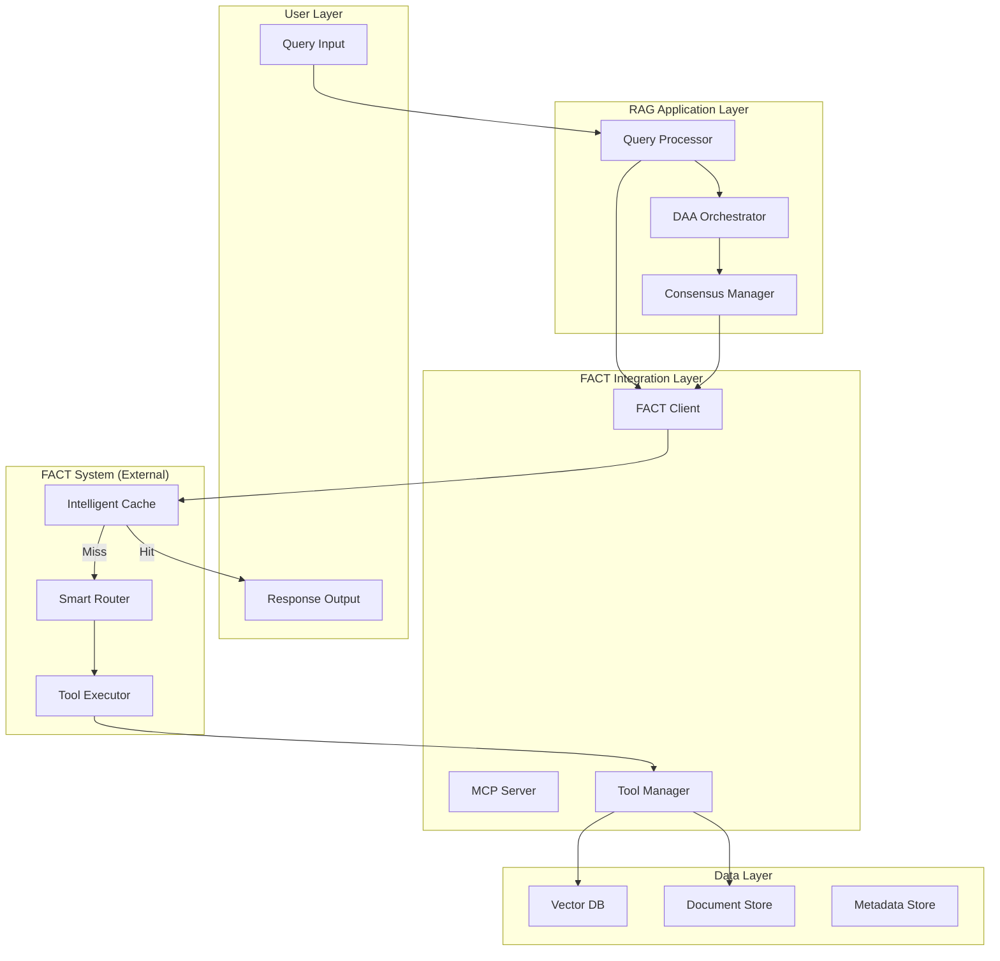

# SPARC Architecture: FACT System Design
## Phase 5 - System Architecture & Integration

**Document Version**: 1.0  
**Date**: January 8, 2025  
**Dependencies**: 01-Specification, 02-Pseudocode

---

## 1. System Overview



## 2. Component Architecture

### 2.1 FACT Client Component

```rust
pub struct FACTClientComponent {
    // Core dependencies
    http_client: Arc<reqwest::Client>,
    config: FACTConfig,
    
    // Connection management
    connection_pool: ConnectionPool,
    retry_policy: RetryPolicy,
    
    // Metrics & monitoring
    metrics_collector: MetricsCollector,
    health_checker: HealthChecker,
    
    // Cache management
    local_fallback: Option<LocalCache>,
    cache_stats: Arc<RwLock<CacheStatistics>>,
}

impl FACTClientComponent {
    pub async fn new(config: FACTConfig) -> Result<Self> {
        // Initialize with connection pooling
        // Setup retry mechanisms
        // Configure metrics collection
    }
}
```

### 2.2 MCP Integration Layer

```rust
pub struct MCPIntegrationLayer {
    // MCP Protocol Handler
    protocol_handler: MCPProtocolHandler,
    
    // Tool Registry
    tool_registry: HashMap<String, Box<dyn Tool>>,
    
    // Request Router
    request_router: RequestRouter,
    
    // Response Formatter
    response_formatter: ResponseFormatter,
}

pub trait Tool: Send + Sync {
    async fn execute(&self, params: Value) -> Result<Value>;
    fn schema(&self) -> JsonSchema;
    fn description(&self) -> &str;
}
```

### 2.3 Query Processor Integration

```rust
pub struct EnhancedQueryProcessor {
    // Original components
    analyzer: Arc<QueryAnalyzer>,
    entity_extractor: Arc<EntityExtractor>,
    
    // FACT integration
    fact_client: Arc<FACTClient>,
    cache_strategy: CacheStrategy,
    
    // Performance monitoring
    latency_tracker: LatencyTracker,
}

impl EnhancedQueryProcessor {
    pub async fn process(&self, query: Query) -> Result<ProcessedQuery> {
        // FACT-first processing
        if let Some(cached) = self.fact_client.get(&query).await? {
            return Ok(cached);
        }
        
        // Execute full pipeline on cache miss
        let result = self.process_with_tools(query).await?;
        
        // Cache result
        self.fact_client.set(&query, &result).await?;
        
        Ok(result)
    }
}
```

## 3. Data Flow Architecture

### 3.1 Cache Hit Flow (Target: <23ms)

```
1. Query arrives at Query Processor
2. Generate cache key from query
3. Check FACT cache via HTTP/gRPC
4. Deserialize cached response
5. Return to user
```

### 3.2 Cache Miss Flow (Target: <95ms)

```
1. Query arrives at Query Processor
2. Cache miss detected
3. MCP tool selection based on intent
4. Parallel tool execution
5. Result aggregation
6. Byzantine consensus validation
7. Cache storage with TTL
8. Return to user
```

## 4. Integration Points

### 4.1 Query Processor Integration

```rust
// Before (Placeholder)
let cache = FactCache::new(1000);
if let Ok(result) = cache.get(query) {
    return Ok(result);
}

// After (Real FACT)
let fact_client = FACTClient::new(config).await?;
if let Some(result) = fact_client.get(query).await? {
    metrics.record_cache_hit();
    return Ok(result);
}
```

### 4.2 DAA Orchestration Integration

```rust
pub struct DAAFACTIntegration {
    fact_client: Arc<FACTClient>,
    orchestrator: Arc<DAAOrchestrator>,
}

impl DAAFACTIntegration {
    pub async fn orchestrate_with_cache(&self, task: Task) -> Result<TaskResult> {
        // Check FACT cache for similar tasks
        let cache_key = task.to_cache_key();
        if let Some(cached) = self.fact_client.get(&cache_key).await? {
            return Ok(cached);
        }
        
        // Execute via DAA orchestration
        let result = self.orchestrator.execute(task).await?;
        
        // Cache successful results
        if result.success {
            self.fact_client.set(&cache_key, &result, Duration::from_secs(3600)).await?;
        }
        
        Ok(result)
    }
}
```

### 4.3 Consensus Manager Integration

```rust
pub struct ConsensusFACTBridge {
    consensus_manager: Arc<ConsensusManager>,
    fact_client: Arc<FACTClient>,
}

impl ConsensusFACTBridge {
    pub async fn validate_with_cache(&self, result: QueryResult) -> Result<ValidatedResult> {
        // Check if consensus already achieved for similar queries
        let consensus_key = format!("consensus_{}", result.hash());
        
        if let Some(cached_consensus) = self.fact_client.get(&consensus_key).await? {
            return Ok(cached_consensus);
        }
        
        // Perform Byzantine consensus
        let validated = self.consensus_manager.validate(result).await?;
        
        // Cache consensus results
        if validated.consensus_achieved {
            self.fact_client.set(&consensus_key, &validated, Duration::from_secs(7200)).await?;
        }
        
        Ok(validated)
    }
}
```

## 5. Deployment Architecture

### 5.1 Container Architecture

```yaml
version: '3.8'

services:
  rag-application:
    image: doc-rag:latest
    environment:
      FACT_ENDPOINT: ${FACT_ENDPOINT}
      FACT_API_KEY: ${FACT_API_KEY}
    depends_on:
      - fact-proxy
    
  fact-proxy:
    image: nginx:alpine
    volumes:
      - ./nginx.conf:/etc/nginx/nginx.conf
    ports:
      - "8080:8080"
    
  monitoring:
    image: prom/prometheus
    volumes:
      - ./prometheus.yml:/etc/prometheus/prometheus.yml
```

### 5.2 Network Architecture

```
┌─────────────────┐
│   Load Balancer │
└────────┬────────┘
         │
    ┌────▼────┐
    │  WAF    │
    └────┬────┘
         │
┌────────▼────────┐
│  API Gateway    │
└────────┬────────┘
         │
    ┌────▼────┐
    │  RAG    │◄──────┐
    │  Apps   │       │
    └────┬────┘       │
         │            │
    ┌────▼────┐  ┌────▼────┐
    │  FACT   │  │  Cache  │
    │  Client │  │  Layer  │
    └─────────┘  └─────────┘
```

## 6. Security Architecture

### 6.1 Authentication Flow

```rust
pub struct FACTAuthenticator {
    api_key: SecretString,
    oauth_client: Option<OAuthClient>,
    jwt_validator: JwtValidator,
}

impl FACTAuthenticator {
    pub async fn authenticate(&self) -> Result<AuthToken> {
        match &self.oauth_client {
            Some(client) => {
                // OAuth2 flow
                let token = client.get_token().await?;
                Ok(AuthToken::OAuth(token))
            }
            None => {
                // API key authentication
                Ok(AuthToken::ApiKey(self.api_key.clone()))
            }
        }
    }
}
```

### 6.2 Encryption Architecture

```rust
pub struct EncryptedFACTClient {
    inner: FACTClient,
    encryptor: AesGcm256,
}

impl EncryptedFACTClient {
    pub async fn get(&self, key: &str) -> Result<Option<Vec<u8>>> {
        let encrypted_key = self.encryptor.encrypt(key.as_bytes())?;
        
        if let Some(encrypted_value) = self.inner.get(&encrypted_key).await? {
            let decrypted = self.encryptor.decrypt(&encrypted_value)?;
            Ok(Some(decrypted))
        } else {
            Ok(None)
        }
    }
}
```

## 7. Monitoring Architecture

### 7.1 Metrics Collection

```rust
pub struct FACTMetrics {
    cache_hits: Counter,
    cache_misses: Counter,
    latency_histogram: Histogram,
    error_counter: Counter,
}

impl FACTMetrics {
    pub fn record_cache_hit(&self, latency: Duration) {
        self.cache_hits.inc();
        self.latency_histogram.observe(latency.as_millis() as f64);
    }
    
    pub fn record_cache_miss(&self, latency: Duration) {
        self.cache_misses.inc();
        self.latency_histogram.observe(latency.as_millis() as f64);
    }
}
```

### 7.2 Health Check Architecture

```rust
pub struct FACTHealthChecker {
    fact_client: Arc<FACTClient>,
    threshold: HealthThreshold,
}

impl FACTHealthChecker {
    pub async fn check(&self) -> HealthStatus {
        let start = Instant::now();
        
        // Test cache operation
        let test_key = "health_check_probe";
        match self.fact_client.get(test_key).await {
            Ok(_) => {
                let latency = start.elapsed();
                if latency < self.threshold.warning_latency {
                    HealthStatus::Healthy
                } else if latency < self.threshold.critical_latency {
                    HealthStatus::Degraded
                } else {
                    HealthStatus::Critical
                }
            }
            Err(_) => HealthStatus::Unavailable
        }
    }
}
```

## 8. Scalability Architecture

### 8.1 Horizontal Scaling

```rust
pub struct FACTConnectionPool {
    connections: Vec<FACTConnection>,
    load_balancer: LoadBalancer,
}

impl FACTConnectionPool {
    pub async fn get_connection(&self) -> Result<&FACTConnection> {
        self.load_balancer.select(&self.connections)
    }
}
```

### 8.2 Caching Layers

```
Level 1: Local In-Memory Cache (1ms)
    ↓ miss
Level 2: Redis Cache (5ms)
    ↓ miss
Level 3: FACT Cache (23ms)
    ↓ miss
Level 4: Tool Execution (95ms)
```

## 9. Error Handling Architecture

### 9.1 Circuit Breaker Pattern

```rust
pub struct FACTCircuitBreaker {
    state: Arc<RwLock<CircuitState>>,
    failure_threshold: u32,
    timeout: Duration,
}

impl FACTCircuitBreaker {
    pub async fn call<F, T>(&self, f: F) -> Result<T>
    where
        F: Future<Output = Result<T>>,
    {
        match *self.state.read().await {
            CircuitState::Open => Err(Error::CircuitOpen),
            CircuitState::HalfOpen | CircuitState::Closed => {
                match timeout(self.timeout, f).await {
                    Ok(Ok(result)) => {
                        self.record_success().await;
                        Ok(result)
                    }
                    Ok(Err(e)) | Err(_) => {
                        self.record_failure().await;
                        Err(e)
                    }
                }
            }
        }
    }
}
```

### 9.2 Fallback Strategy

```rust
pub struct FACTFallbackChain {
    strategies: Vec<Box<dyn FallbackStrategy>>,
}

impl FACTFallbackChain {
    pub async fn execute(&self, query: &Query) -> Result<Response> {
        for strategy in &self.strategies {
            if let Ok(response) = strategy.try_execute(query).await {
                return Ok(response);
            }
        }
        Err(Error::AllFallbacksFailed)
    }
}
```

## 10. Performance Optimization

### 10.1 Connection Pooling

```rust
pub struct OptimizedFACTClient {
    pool: bb8::Pool<FACTConnectionManager>,
    config: PoolConfig,
}

impl OptimizedFACTClient {
    pub async fn new(config: FACTConfig) -> Result<Self> {
        let manager = FACTConnectionManager::new(config);
        let pool = bb8::Pool::builder()
            .max_size(32)
            .min_idle(Some(4))
            .connection_timeout(Duration::from_secs(3))
            .build(manager)
            .await?;
        
        Ok(Self { pool, config: Default::default() })
    }
}
```

### 10.2 Batch Processing

```rust
pub struct FACTBatchProcessor {
    fact_client: Arc<FACTClient>,
    batch_size: usize,
}

impl FACTBatchProcessor {
    pub async fn process_batch(&self, queries: Vec<Query>) -> Vec<Result<Response>> {
        let chunks = queries.chunks(self.batch_size);
        let mut results = Vec::new();
        
        for chunk in chunks {
            let batch_results = futures::future::join_all(
                chunk.iter().map(|q| self.fact_client.get(q))
            ).await;
            
            results.extend(batch_results);
        }
        
        results
    }
}
```

---

## Summary

This architecture provides:

1. **Clean separation** between RAG application and FACT system
2. **Multiple integration points** for existing components
3. **Comprehensive monitoring** and health checking
4. **Robust error handling** with fallback strategies
5. **Security layers** with encryption and authentication
6. **Scalability patterns** for high load
7. **Performance optimizations** for sub-23ms cache hits

**Next Steps**: Proceed to SPARC Refinement for TDD approach and test scenarios.