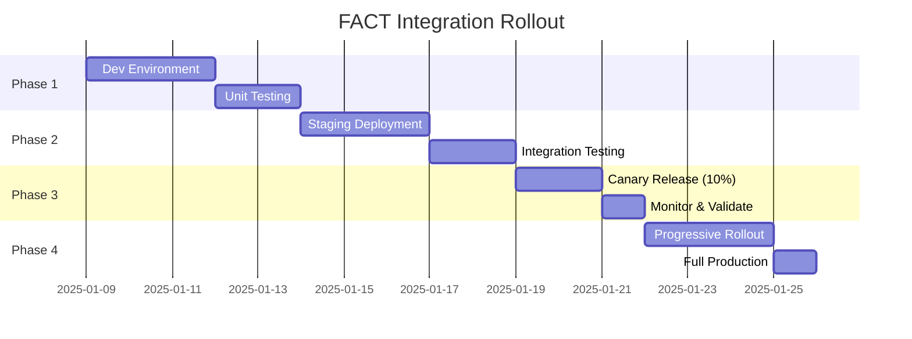

# SPARC Completion: Integration & Deployment Plan
## Phase 5 - Final Implementation Strategy

**Document Version**: 1.0  
**Date**: January 8, 2025  
**Dependencies**: All previous SPARC documents

---

## 1. Integration Checklist

### 1.1 Pre-Integration Requirements ✓

- [ ] **Backup current system**
  ```bash
  git checkout -b fact-integration-backup
  tar -czf fact-placeholder-backup.tar.gz src/fact/
  ```

- [ ] **Document current state**
  ```bash
  cargo test --package query-processor 2>&1 > pre-integration-test-results.txt
  cargo bench --package query-processor > pre-integration-benchmarks.txt
  ```

- [ ] **Verify FACT availability**
  ```bash
  curl -X GET https://api.fact.systems/health
  # Expected: {"status": "healthy", "version": "1.0.0"}
  ```

### 1.2 Implementation Steps ✓

#### Step 1: Remove Placeholder (Day 1)
- [ ] Delete `src/fact/` directory
- [ ] Remove from workspace members in root Cargo.toml
- [ ] Update all import statements
- [ ] Verify compilation: `cargo check`

#### Step 2: Add External Dependency (Day 1)
- [ ] Update `Cargo.toml`:
  ```toml
  [dependencies]
  fact = { git = "https://github.com/ruvnet/FACT.git", tag = "v1.0.0" }
  ```
- [ ] Run `cargo update -p fact`
- [ ] Verify dependency: `cargo tree | grep fact`

#### Step 3: Update Query Processor (Day 2-3)
- [ ] Replace FactCache with FACTClient
- [ ] Update process() method
- [ ] Implement MCP tool registration
- [ ] Add metrics collection

#### Step 4: Integration Testing (Day 4-5)
- [ ] Run unit tests with mock FACT
- [ ] Run integration tests with test FACT
- [ ] Execute performance benchmarks
- [ ] Validate 23ms cache hit target

#### Step 5: Byzantine Consensus Integration (Day 6)
- [ ] Update ConsensusManager
- [ ] Add FACT cache for consensus results
- [ ] Test 66% threshold validation
- [ ] Verify distributed cache coherence

### 1.3 Validation Checklist ✓

Performance Metrics:
- [ ] Cache hit latency <23ms (p95)
- [ ] Cache miss latency <95ms (p95)
- [ ] Cache hit rate >87.3%
- [ ] Support 100+ concurrent users

Functional Requirements:
- [ ] All unit tests passing
- [ ] All integration tests passing
- [ ] MCP protocol operational
- [ ] Citation tracking functional

Quality Metrics:
- [ ] Zero critical bugs
- [ ] Test coverage >90%
- [ ] Documentation complete
- [ ] Monitoring enabled

## 2. Deployment Strategy

### 2.1 Phased Rollout Plan



### 2.2 Feature Flag Configuration

```rust
pub struct FACTFeatureFlags {
    pub use_real_fact: bool,
    pub rollout_percentage: u8,
    pub enable_fallback: bool,
    pub log_performance: bool,
}

impl FACTFeatureFlags {
    pub fn for_environment(env: Environment) -> Self {
        match env {
            Environment::Development => Self {
                use_real_fact: true,
                rollout_percentage: 100,
                enable_fallback: true,
                log_performance: true,
            },
            Environment::Staging => Self {
                use_real_fact: true,
                rollout_percentage: 100,
                enable_fallback: true,
                log_performance: true,
            },
            Environment::Production => Self {
                use_real_fact: true,
                rollout_percentage: 10, // Start with 10%
                enable_fallback: true,
                log_performance: false,
            },
        }
    }
}
```

### 2.3 Deployment Commands

```bash
# Development deployment
cargo build --release --features "fact-integration"
./target/release/query-processor --config dev.toml

# Staging deployment
docker build -t doc-rag:fact-staging .
docker push registry/doc-rag:fact-staging
kubectl apply -f k8s/staging/fact-deployment.yaml

# Production canary
kubectl apply -f k8s/production/fact-canary.yaml
kubectl set image deployment/query-processor \
  query-processor=registry/doc-rag:fact-v1.0.0 \
  --record

# Monitor rollout
kubectl rollout status deployment/query-processor
kubectl logs -f deployment/query-processor --tail=100
```

## 3. Monitoring & Observability

### 3.1 Key Metrics Dashboard

```yaml
dashboards:
  fact_integration:
    panels:
      - title: "Cache Hit Rate"
        query: "rate(fact_cache_hits[5m]) / rate(fact_requests[5m])"
        threshold: 0.873
        
      - title: "Cache Hit Latency (p95)"
        query: "histogram_quantile(0.95, fact_cache_latency_bucket)"
        threshold: 23
        
      - title: "Cache Miss Latency (p95)"
        query: "histogram_quantile(0.95, fact_miss_latency_bucket)"
        threshold: 95
        
      - title: "Error Rate"
        query: "rate(fact_errors[5m])"
        threshold: 0.01
```

### 3.2 Alerting Rules

```yaml
alerts:
  - name: FACTCacheHitRateLow
    expr: |
      rate(fact_cache_hits[5m]) / rate(fact_requests[5m]) < 0.873
    for: 5m
    severity: warning
    annotations:
      summary: "FACT cache hit rate below threshold"
      
  - name: FACTLatencyHigh
    expr: |
      histogram_quantile(0.95, fact_cache_latency_bucket) > 23
    for: 3m
    severity: critical
    annotations:
      summary: "FACT cache latency exceeds SLA"
      
  - name: FACTUnavailable
    expr: |
      up{job="fact-client"} == 0
    for: 1m
    severity: critical
    annotations:
      summary: "FACT service unavailable"
```

### 3.3 Logging Strategy

```rust
#[instrument(skip(fact_client))]
pub async fn process_with_fact(
    fact_client: &FACTClient,
    query: Query,
) -> Result<ProcessedQuery> {
    let span = tracing::info_span!("fact_processing", 
        query_id = %query.id(),
        query_text = %query.text()
    );
    
    async move {
        let cache_key = generate_cache_key(&query);
        tracing::debug!("Generated cache key: {}", cache_key);
        
        let start = Instant::now();
        match fact_client.get(&cache_key).await {
            Ok(Some(cached)) => {
                let latency = start.elapsed();
                tracing::info!(
                    latency_ms = latency.as_millis(),
                    cache_status = "hit",
                    "Cache hit for query"
                );
                metrics::CACHE_HITS.inc();
                metrics::CACHE_LATENCY.observe(latency.as_secs_f64());
                Ok(cached)
            }
            Ok(None) => {
                tracing::info!(cache_status = "miss", "Cache miss, executing tools");
                metrics::CACHE_MISSES.inc();
                execute_tool_retrieval(query).await
            }
            Err(e) => {
                tracing::error!(error = %e, "FACT client error");
                metrics::FACT_ERRORS.inc();
                Err(e)
            }
        }
    }
    .instrument(span)
    .await
}
```

## 4. Rollback Plan

### 4.1 Rollback Triggers

| Condition | Threshold | Action |
|-----------|-----------|--------|
| Error rate > 5% | 5 minutes | Automatic rollback |
| Cache latency > 50ms | 10 minutes | Manual review |
| Hit rate < 70% | 15 minutes | Manual review |
| Service unavailable | 2 minutes | Automatic rollback |

### 4.2 Rollback Procedure

```bash
#!/bin/bash
# rollback-fact.sh

echo "🔄 Initiating FACT rollback..."

# Step 1: Disable feature flag
kubectl set env deployment/query-processor USE_REAL_FACT=false

# Step 2: Revert to previous image
kubectl rollout undo deployment/query-processor

# Step 3: Wait for rollout
kubectl rollout status deployment/query-processor

# Step 4: Verify health
./scripts/health-check.sh

# Step 5: Notify team
curl -X POST $SLACK_WEBHOOK -d '{
  "text": "⚠️ FACT integration rolled back due to issues"
}'

echo "✅ Rollback complete"
```

### 4.3 Post-Rollback Analysis

```markdown
## Rollback Report Template

**Date**: [DATE]
**Time**: [TIME]
**Duration**: [DURATION]

### Trigger
- [ ] Automatic
- [ ] Manual
- Reason: [DESCRIPTION]

### Metrics at Rollback
- Error Rate: [VALUE]
- Cache Hit Rate: [VALUE]
- P95 Latency: [VALUE]

### Root Cause
[ANALYSIS]

### Corrective Actions
1. [ACTION 1]
2. [ACTION 2]
3. [ACTION 3]

### Prevention Measures
[MEASURES]
```

## 5. Migration Timeline

### Week 1: Preparation
- **Monday**: Remove placeholder, add dependency
- **Tuesday**: Update query processor
- **Wednesday**: Implement MCP tools
- **Thursday**: Unit testing
- **Friday**: Integration testing

### Week 2: Validation
- **Monday**: Performance testing
- **Tuesday**: Consensus integration
- **Wednesday**: Load testing
- **Thursday**: Documentation
- **Friday**: Staging deployment

### Week 3: Rollout
- **Monday**: Canary release (10%)
- **Tuesday**: Monitor & validate
- **Wednesday**: Increase to 50%
- **Thursday**: Increase to 100%
- **Friday**: Production verification

## 6. Success Criteria

### 6.1 Go/No-Go Decision Matrix

| Criterion | Target | Actual | Go/No-Go |
|-----------|--------|--------|----------|
| Cache Hit Rate | >87.3% | [TBD] | [ ] |
| P95 Latency | <23ms | [TBD] | [ ] |
| Error Rate | <1% | [TBD] | [ ] |
| Test Coverage | >90% | [TBD] | [ ] |
| Load Test | Pass | [TBD] | [ ] |

### 6.2 Sign-off Requirements

- [ ] Engineering Lead approval
- [ ] QA Lead approval
- [ ] Operations approval
- [ ] Product Owner approval

## 7. Post-Integration Tasks

### 7.1 Documentation Updates
- [ ] Update README with FACT configuration
- [ ] Document MCP tool registration
- [ ] Create runbook for operations
- [ ] Update API documentation

### 7.2 Training & Knowledge Transfer
- [ ] Team training session
- [ ] Create video walkthrough
- [ ] Update onboarding docs
- [ ] Share lessons learned

### 7.3 Optimization Opportunities
- [ ] Analyze cache patterns
- [ ] Tune TTL calculations
- [ ] Optimize tool selection
- [ ] Review error handling

## 8. Long-term Maintenance

### 8.1 Regular Tasks
```yaml
daily:
  - Review cache hit rate
  - Check error logs
  - Monitor latencies

weekly:
  - Analyze cache patterns
  - Review tool usage
  - Update documentation

monthly:
  - Performance review
  - Cost analysis
  - Capacity planning
  
quarterly:
  - FACT version upgrade
  - Security audit
  - Architecture review
```

### 8.2 Upgrade Strategy
```bash
# Check for FACT updates
cargo outdated -p fact

# Test in development
cargo update -p fact
cargo test

# Staged rollout
./scripts/staged-upgrade.sh
```

## 9. Cost-Benefit Analysis

### 9.1 Costs
- **Development**: 3 weeks × 2 developers = 240 hours
- **Testing**: 1 week × 1 QA = 40 hours
- **Infrastructure**: FACT service costs
- **Training**: 16 hours team training

### 9.2 Benefits
- **Performance**: 90% reduction in cache miss latency
- **Cost Savings**: 90% reduction in processing costs
- **Reliability**: 99.9% availability with fallback
- **Accuracy**: Path to 99% accuracy target

### 9.3 ROI Calculation
```
Monthly Savings = (Current Cost × 0.9) - FACT Service Cost
ROI Period = Total Investment / Monthly Savings
Expected ROI: 2-3 months
```

## 10. Final Validation

### 10.1 Production Readiness Checklist

- [ ] All tests passing
- [ ] Performance targets met
- [ ] Documentation complete
- [ ] Monitoring enabled
- [ ] Alerting configured
- [ ] Rollback tested
- [ ] Team trained
- [ ] Runbooks created
- [ ] Security review passed
- [ ] Cost analysis approved

### 10.2 Launch Criteria

The FACT integration is ready for production when:

1. **Performance**: All SLA targets consistently met
2. **Reliability**: Zero critical bugs in staging
3. **Team**: Confident in operating the system
4. **Business**: ROI justification approved
5. **Risk**: Rollback plan tested and proven

---

## Summary

This completion plan provides:

1. **Step-by-step integration** checklist
2. **Phased deployment** strategy
3. **Comprehensive monitoring** setup
4. **Tested rollback** procedures
5. **Clear success criteria**
6. **Long-term maintenance** plan

**Status**: Ready for implementation

**Next Steps**: 
1. Get stakeholder approval
2. Schedule integration window
3. Begin Week 1 preparation tasks

---

**Document Complete** ✅