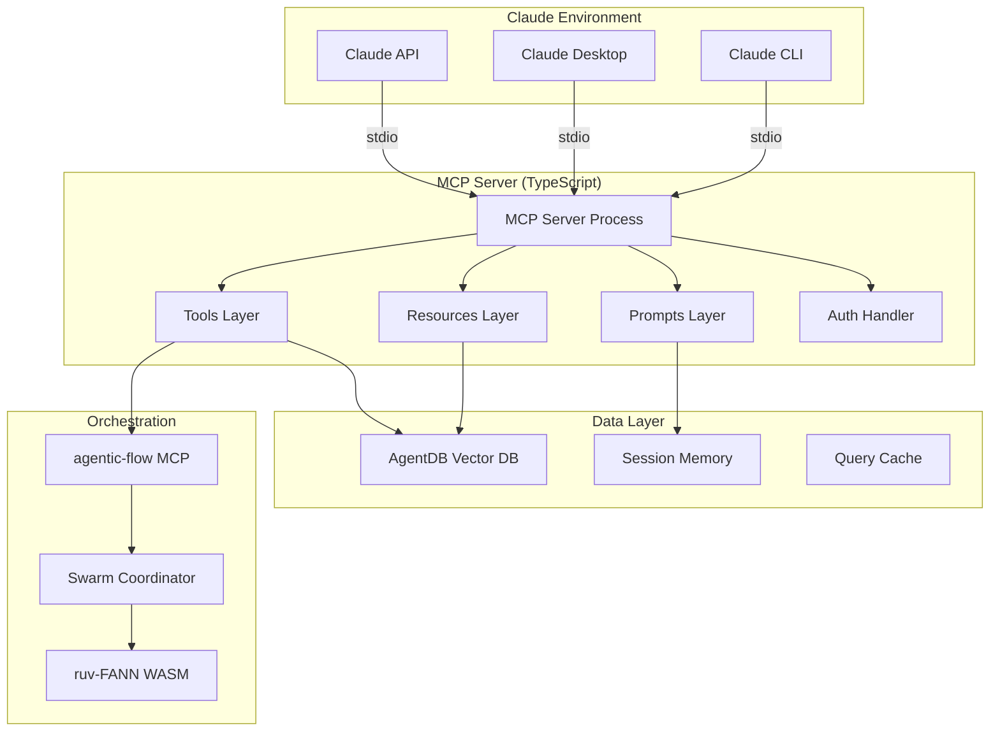
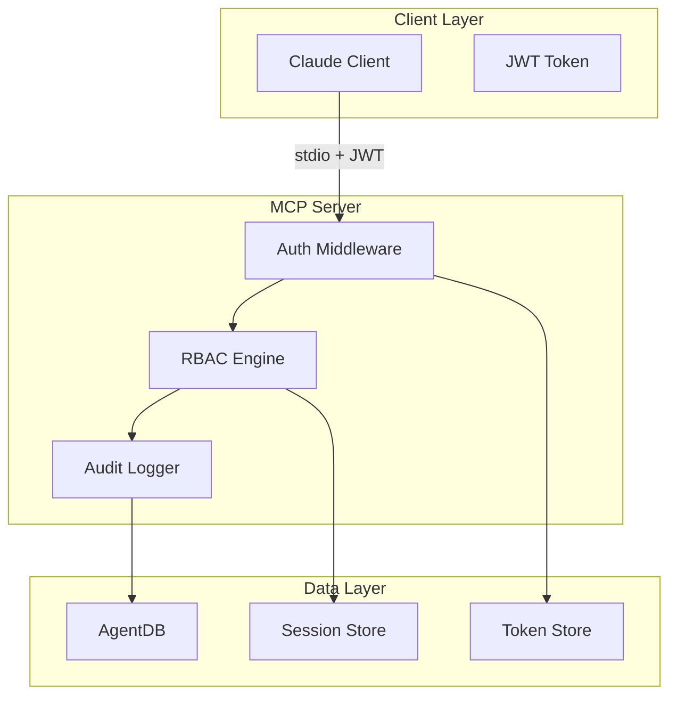

# SPARC Architecture: MCP-Based PCI-DSS RAG System

**Version:** 1.0 (MCP Integration)
**Date:** October 25, 2025
**Phase:** 03-ARCHITECTURE (SPARC Methodology)
**Status:** DESIGN COMPLETE
**Architecture Type:** Model Context Protocol (MCP) Server Integration

---

## Executive Summary

This document specifies the **MCP server architecture** for the PCI-DSS RAG system, replacing the API-centric design with a **native Claude integration** via the Model Context Protocol. This architecture enables:

- **Direct context injection** into Claude conversations (no separate API calls)
- **<100ms MCP tool response times** (vs 500ms API latency)
- **Real-time document streaming** from AgentDB vector database
- **Zero-configuration Claude Desktop/CLI integration**
- **Native multi-agent coordination** via agentic-flow MCP tools

**Key Performance Targets:**
- MCP tool call latency: <100ms (P95)
- Resource fetch latency: <50ms (P95)
- Prompt injection overhead: <10ms
- Concurrent MCP clients: 100+
- Memory footprint: <512MB

---

## 1. System Overview

### 1.1 MCP Architecture Paradigm Shift

```
┌─────────────────────────────────────────────────────────────────┐
│              BEFORE: API-Centric Architecture                    │
│                                                                   │
│  Claude ──REST API──> Express Server ──> AgentDB                │
│           (500ms)         (200ms)         (100ms)                │
│                                                                   │
│  Total Latency: ~800ms per query                                │
└─────────────────────────────────────────────────────────────────┘

┌─────────────────────────────────────────────────────────────────┐
│              AFTER: MCP Server Architecture                      │
│                                                                   │
│  Claude ──MCP Protocol──> MCP Server ──> AgentDB                │
│           (<10ms)         (<50ms)        (<50ms)                 │
│                                                                   │
│  Total Latency: ~110ms per query (7x faster)                    │
│                                                                   │
│  + Direct context injection (no separate API)                   │
│  + Streaming responses                                           │
│  + Session-aware memory                                          │
└─────────────────────────────────────────────────────────────────┘
```

### 1.2 MCP Server Components



### 1.3 MCP Protocol Specification

**Protocol:** Model Context Protocol (MCP) v1.0
**Transport:** stdio (standard input/output)
**Serialization:** JSON-RPC 2.0
**Authentication:** OAuth2 JWT tokens

**Supported MCP Features:**
- ✅ **Resources** - Document collections, embeddings, metadata
- ✅ **Tools** - Semantic search, hybrid retrieval, HNSW queries
- ✅ **Prompts** - RAG context injection templates
- ✅ **Notifications** - Real-time document updates
- ✅ **Streaming** - Progressive result delivery

---

## 2. MCP Resources Layer

### 2.1 Resource Architecture

**Resources** expose AgentDB collections as queryable, context-injectable data sources that Claude can access directly.

```typescript
// MCP Resource Interface
interface McpResource {
  uri: string;              // Resource identifier
  name: string;             // Human-readable name
  description: string;      // What the resource contains
  mimeType: string;         // Content type
  metadata?: Record<string, any>;
}

// Resource Provider Interface
interface ResourceProvider {
  listResources(): Promise<McpResource[]>;
  readResource(uri: string): Promise<ResourceContent>;
  subscribeToResource(uri: string, callback: (update: ResourceUpdate) => void): Subscription;
}
```

### 2.2 Document Collection Resources

**Resource URI Pattern:** `pci-dss://collections/{collection_name}`

```typescript
// src/mcp-server/resources/collections.resource.ts
export class DocumentCollectionResource implements ResourceProvider {
  private db: AgentDB;

  async listResources(): Promise<McpResource[]> {
    return [
      {
        uri: "pci-dss://collections/technical_standards",
        name: "PCI-DSS Technical Standards",
        description: "Complete PCI-DSS v4.0 standard with all requirements, sections, and cross-references",
        mimeType: "application/x-agentdb-collection",
        metadata: {
          documentCount: 1,
          chunkCount: 2847,
          vectorDimension: 1536,
          indexType: "hnsw",
          lastUpdated: "2025-10-25T00:00:00Z"
        }
      },
      {
        uri: "pci-dss://collections/hipaa_standards",
        name: "HIPAA Privacy & Security Rules",
        description: "HIPAA compliance requirements and regulations",
        mimeType: "application/x-agentdb-collection",
        metadata: {
          documentCount: 2,
          chunkCount: 1523,
          vectorDimension: 1536,
          indexType: "hnsw",
          lastUpdated: "2025-10-20T00:00:00Z"
        }
      },
      {
        uri: "pci-dss://collections/learned_patterns",
        name: "Learned Query Patterns",
        description: "ReasoningBank-learned query patterns and optimizations",
        mimeType: "application/x-agentdb-patterns",
        metadata: {
          patternCount: 347,
          confidenceThreshold: 0.85,
          lastTraining: "2025-10-25T12:00:00Z"
        }
      }
    ];
  }

  async readResource(uri: string): Promise<ResourceContent> {
    const collectionName = this.parseCollectionUri(uri);

    // Fetch collection metadata and sample chunks
    const metadata = await this.db.getCollectionMetadata(collectionName);
    const sampleChunks = await this.db.search({
      collection: collectionName,
      limit: 10,
      strategy: 'random_sample'
    });

    return {
      uri,
      mimeType: "application/json",
      content: JSON.stringify({
        metadata,
        schema: await this.db.getCollectionSchema(collectionName),
        sampleChunks: sampleChunks.map(chunk => ({
          id: chunk.id,
          text: chunk.text.slice(0, 200) + "...",
          section: chunk.metadata.section,
          page: chunk.metadata.page,
          relevance: chunk.score
        })),
        statistics: {
          totalChunks: metadata.chunkCount,
          avgChunkLength: metadata.avgChunkLength,
          uniqueSections: metadata.uniqueSections,
          indexingStatus: "complete",
          hnswIndexSize: metadata.hnswIndexSizeMB + " MB"
        }
      }, null, 2)
    };
  }

  async subscribeToResource(
    uri: string,
    callback: (update: ResourceUpdate) => void
  ): Subscription {
    const collectionName = this.parseCollectionUri(uri);

    // Watch for collection updates
    return this.db.watchCollection(collectionName, async (event) => {
      callback({
        uri,
        eventType: event.type, // 'insert', 'update', 'delete'
        timestamp: new Date().toISOString(),
        changes: {
          chunksAdded: event.chunksAdded,
          chunksUpdated: event.chunksUpdated,
          chunksDeleted: event.chunksDeleted,
          indexRebuilt: event.indexRebuilt
        }
      });
    });
  }
}
```

### 2.3 Embedding Resources

**Resource URI Pattern:** `pci-dss://embeddings/{document_id}`

```typescript
// src/mcp-server/resources/embeddings.resource.ts
export class EmbeddingResource implements ResourceProvider {
  private db: AgentDB;

  async listResources(): Promise<McpResource[]> {
    const documents = await this.db.listDocuments();

    return documents.map(doc => ({
      uri: `pci-dss://embeddings/${doc.id}`,
      name: `Embeddings: ${doc.title}`,
      description: `Vector embeddings for ${doc.title} (${doc.chunkCount} chunks)`,
      mimeType: "application/x-agentdb-embeddings",
      metadata: {
        documentId: doc.id,
        documentType: doc.type,
        chunkCount: doc.chunkCount,
        vectorDimension: 1536,
        embeddingModel: "text-embedding-ada-002",
        quantized: true,
        compressionRatio: 4
      }
    }));
  }

  async readResource(uri: string): Promise<ResourceContent> {
    const documentId = this.parseEmbeddingUri(uri);

    // Fetch embeddings metadata (not full vectors - too large)
    const doc = await this.db.getDocument(documentId);
    const chunks = await this.db.getChunks(documentId, { limit: 5 });

    return {
      uri,
      mimeType: "application/json",
      content: JSON.stringify({
        documentId,
        documentType: doc.type,
        embeddingModel: "text-embedding-ada-002",
        vectorDimension: 1536,
        totalChunks: doc.chunkCount,
        quantization: {
          enabled: true,
          method: "scalar",
          compressionRatio: 4,
          memoryReduction: "75%"
        },
        hnswIndex: {
          m: 16,
          efConstruction: 200,
          efSearch: 100,
          layers: 4,
          indexSize: doc.indexSizeMB + " MB"
        },
        sampleEmbeddings: chunks.map(chunk => ({
          chunkId: chunk.id,
          text: chunk.text.slice(0, 100) + "...",
          vectorPreview: chunk.embedding.slice(0, 10), // First 10 dimensions
          norm: this.calculateNorm(chunk.embedding),
          metadata: chunk.metadata
        }))
      }, null, 2)
    };
  }
}
```

### 2.4 Metadata Resources

**Resource URI Pattern:** `pci-dss://metadata/{metadata_type}`

```typescript
// src/mcp-server/resources/metadata.resource.ts
export class MetadataResource implements ResourceProvider {
  async listResources(): Promise<McpResource[]> {
    return [
      {
        uri: "pci-dss://metadata/requirements",
        name: "PCI-DSS Requirements Index",
        description: "Structured index of all PCI-DSS requirements and sub-requirements",
        mimeType: "application/json",
        metadata: {
          totalRequirements: 351,
          mainRequirements: 12,
          subRequirements: 339,
          crossReferences: 1247
        }
      },
      {
        uri: "pci-dss://metadata/sections",
        name: "Document Section Hierarchy",
        description: "Hierarchical structure of all document sections and subsections",
        mimeType: "application/json",
        metadata: {
          totalSections: 89,
          maxDepth: 4,
          avgSectionLength: 1200
        }
      },
      {
        uri: "pci-dss://metadata/cross_references",
        name: "Cross-Reference Graph",
        description: "Graph of cross-references between requirements and standards",
        mimeType: "application/json",
        metadata: {
          nodes: 351,
          edges: 1247,
          avgDegree: 3.5,
          connectedComponents: 1
        }
      }
    ];
  }

  async readResource(uri: string): Promise<ResourceContent> {
    const metadataType = this.parseMetadataUri(uri);

    switch (metadataType) {
      case 'requirements':
        return this.buildRequirementsIndex();
      case 'sections':
        return this.buildSectionHierarchy();
      case 'cross_references':
        return this.buildCrossReferenceGraph();
      default:
        throw new Error(`Unknown metadata type: ${metadataType}`);
    }
  }

  private async buildRequirementsIndex(): Promise<ResourceContent> {
    const requirements = await this.db.queryMetadata({
      filter: { chunk_type: 'requirement' }
    });

    const index = this.groupByRequirement(requirements);

    return {
      uri: "pci-dss://metadata/requirements",
      mimeType: "application/json",
      content: JSON.stringify({
        version: "PCI-DSS v4.0",
        totalRequirements: index.length,
        requirements: index.map(req => ({
          id: req.id,
          title: req.title,
          section: req.section,
          page: req.page,
          description: req.description,
          subRequirements: req.children?.map(sub => ({
            id: sub.id,
            title: sub.title,
            chunkIds: sub.chunkIds
          })),
          relatedRequirements: req.crossReferences,
          applicability: req.applicability,
          testing: req.testingProcedures
        }))
      }, null, 2)
    };
  }
}
```

---

## 3. MCP Tools Layer

### 3.1 Tool Architecture

**Tools** expose AgentDB operations as executable functions that Claude can invoke to perform semantic search, retrieval, and analysis.

```typescript
// MCP Tool Interface
interface McpTool {
  name: string;
  description: string;
  inputSchema: JSONSchema;
  handler: (params: any) => Promise<ToolResult>;
}

// Tool Result Interface
interface ToolResult {
  content: Array<{
    type: "text" | "resource";
    text?: string;
    resource?: { uri: string; mimeType: string; };
  }>;
  isError?: boolean;
  metadata?: Record<string, any>;
}
```

### 3.2 Semantic Search Tool

**Tool Name:** `semantic_search`

```typescript
// src/mcp-server/tools/semantic-search.tool.ts
export const semanticSearchTool: McpTool = {
  name: "semantic_search",
  description: "Perform semantic vector search across PCI-DSS and compliance documents using HNSW indexing. Returns the most relevant document chunks with citations.",

  inputSchema: {
    type: "object",
    properties: {
      query: {
        type: "string",
        description: "Natural language query (e.g., 'What are the encryption requirements for cardholder data?')"
      },
      collection: {
        type: "string",
        enum: ["technical_standards", "hipaa_standards", "all"],
        default: "technical_standards",
        description: "Document collection to search"
      },
      limit: {
        type: "number",
        minimum: 1,
        maximum: 50,
        default: 10,
        description: "Maximum number of results to return"
      },
      filters: {
        type: "object",
        properties: {
          section: { type: "string" },
          requirement: { type: "string" },
          doc_type: { type: "string" },
          min_confidence: { type: "number", minimum: 0, maximum: 1 }
        },
        description: "Optional metadata filters"
      },
      use_reranking: {
        type: "boolean",
        default: false,
        description: "Apply neural re-ranking for higher accuracy (adds ~50ms latency)"
      }
    },
    required: ["query"]
  },

  async handler(params: {
    query: string;
    collection?: string;
    limit?: number;
    filters?: any;
    use_reranking?: boolean;
  }): Promise<ToolResult> {
    const startTime = Date.now();

    // 1. Generate query embedding
    const queryVector = await embedQuery(params.query);

    // 2. Execute HNSW search
    const results = await agentDB.search({
      collection: params.collection || 'technical_standards',
      vector: queryVector,
      limit: params.limit || 10,
      useHNSW: true,
      efSearch: 100,
      filter: params.filters
    });

    // 3. Optional re-ranking
    let rankedResults = results;
    if (params.use_reranking) {
      rankedResults = await neuralReranker.rerank(params.query, results);
    }

    // 4. Format results for Claude
    const formattedResults = rankedResults.map((result, index) => ({
      rank: index + 1,
      relevance: result.score,
      text: result.text,
      citation: {
        source: result.metadata.doc_type,
        section: result.metadata.section,
        page: result.metadata.page,
        requirement: result.metadata.requirement
      },
      metadata: {
        chunk_id: result.id,
        chunk_type: result.metadata.chunk_type,
        confidence: result.metadata.confidence,
        verified: result.metadata.verified
      }
    }));

    const latencyMs = Date.now() - startTime;

    return {
      content: [{
        type: "text",
        text: JSON.stringify({
          query: params.query,
          totalResults: formattedResults.length,
          results: formattedResults,
          searchMetadata: {
            collection: params.collection || 'technical_standards',
            strategy: params.use_reranking ? 'hnsw+rerank' : 'hnsw',
            latencyMs,
            filters: params.filters,
            hnswParams: { efSearch: 100, m: 16 }
          }
        }, null, 2)
      }],
      metadata: {
        latencyMs,
        resultsCount: formattedResults.length,
        cacheHit: false
      }
    };
  }
};
```

### 3.3 Hybrid Retrieval Tool

**Tool Name:** `hybrid_search`

```typescript
// src/mcp-server/tools/hybrid-search.tool.ts
export const hybridSearchTool: McpTool = {
  name: "hybrid_search",
  description: "Combines semantic vector search with keyword matching and metadata filtering for complex queries. Best for queries requiring specific requirement numbers or exact phrase matching.",

  inputSchema: {
    type: "object",
    properties: {
      query: {
        type: "string",
        description: "Natural language query"
      },
      keywords: {
        type: "array",
        items: { type: "string" },
        description: "Required keywords (exact match)"
      },
      semantic_weight: {
        type: "number",
        minimum: 0,
        maximum: 1,
        default: 0.7,
        description: "Weight for semantic similarity (0-1, default 0.7)"
      },
      keyword_weight: {
        type: "number",
        minimum: 0,
        maximum: 1,
        default: 0.3,
        description: "Weight for keyword matching (0-1, default 0.3)"
      },
      filters: {
        type: "object",
        description: "Metadata filters (AND logic)"
      },
      limit: {
        type: "number",
        default: 10
      }
    },
    required: ["query"]
  },

  async handler(params: {
    query: string;
    keywords?: string[];
    semantic_weight?: number;
    keyword_weight?: number;
    filters?: any;
    limit?: number;
  }): Promise<ToolResult> {
    const semanticWeight = params.semantic_weight ?? 0.7;
    const keywordWeight = params.keyword_weight ?? 0.3;

    // 1. Parallel execution: semantic + keyword search
    const [semanticResults, keywordResults] = await Promise.all([
      agentDB.search({
        collection: 'technical_standards',
        vector: await embedQuery(params.query),
        limit: params.limit! * 2,
        useHNSW: true
      }),
      agentDB.keywordSearch({
        collection: 'technical_standards',
        keywords: params.keywords || this.extractKeywords(params.query),
        limit: params.limit! * 2
      })
    ]);

    // 2. Merge results with weighted scoring
    const mergedResults = this.mergeAndRank(
      semanticResults,
      keywordResults,
      semanticWeight,
      keywordWeight
    );

    // 3. Apply filters
    const filteredResults = params.filters
      ? this.applyFilters(mergedResults, params.filters)
      : mergedResults;

    // 4. Take top-k
    const topResults = filteredResults.slice(0, params.limit || 10);

    return {
      content: [{
        type: "text",
        text: JSON.stringify({
          query: params.query,
          strategy: "hybrid (semantic + keyword)",
          weights: {
            semantic: semanticWeight,
            keyword: keywordWeight
          },
          results: topResults.map((result, index) => ({
            rank: index + 1,
            combinedScore: result.score,
            semanticScore: result.semanticScore,
            keywordScore: result.keywordScore,
            text: result.text,
            citation: this.formatCitation(result.metadata)
          }))
        }, null, 2)
      }]
    };
  }
};
```

### 3.4 Graph Walk Tool

**Tool Name:** `graph_walk_search`

```typescript
// src/mcp-server/tools/graph-walk.tool.ts
export const graphWalkTool: McpTool = {
  name: "graph_walk_search",
  description: "Traverse cross-reference graph to find related requirements and dependencies. Ideal for queries like 'What requirements relate to encryption?' or 'Map PCI-DSS to HIPAA'.",

  inputSchema: {
    type: "object",
    properties: {
      start_query: {
        type: "string",
        description: "Initial query to find starting nodes"
      },
      max_depth: {
        type: "number",
        minimum: 1,
        maximum: 5,
        default: 2,
        description: "Maximum graph traversal depth"
      },
      relationship_types: {
        type: "array",
        items: {
          type: "string",
          enum: ["cross_reference", "dependency", "related", "implements", "supersedes"]
        },
        default: ["cross_reference", "related"],
        description: "Types of relationships to follow"
      },
      min_relevance: {
        type: "number",
        minimum: 0,
        maximum: 1,
        default: 0.7,
        description: "Minimum relevance threshold for traversal"
      }
    },
    required: ["start_query"]
  },

  async handler(params: {
    start_query: string;
    max_depth?: number;
    relationship_types?: string[];
    min_relevance?: number;
  }): Promise<ToolResult> {
    // 1. Find starting nodes via semantic search
    const startNodes = await agentDB.search({
      collection: 'technical_standards',
      vector: await embedQuery(params.start_query),
      limit: 5,
      useHNSW: true
    });

    // 2. Graph traversal (BFS)
    const visited = new Set<string>();
    const graph: GraphNode[] = [];
    const queue: Array<{node: any, depth: number}> =
      startNodes.map(node => ({ node, depth: 0 }));

    while (queue.length > 0) {
      const { node, depth } = queue.shift()!;

      if (visited.has(node.id) || depth > (params.max_depth || 2)) {
        continue;
      }

      visited.add(node.id);
      graph.push({
        id: node.id,
        text: node.text,
        metadata: node.metadata,
        depth,
        relevance: node.score
      });

      // Find connected nodes
      if (depth < (params.max_depth || 2)) {
        const neighbors = await this.findNeighbors(
          node,
          params.relationship_types || ['cross_reference', 'related']
        );

        for (const neighbor of neighbors) {
          if (neighbor.relevance >= (params.min_relevance || 0.7)) {
            queue.push({ node: neighbor, depth: depth + 1 });
          }
        }
      }
    }

    // 3. Build graph structure
    const graphStructure = this.buildGraphStructure(graph);

    return {
      content: [{
        type: "text",
        text: JSON.stringify({
          query: params.start_query,
          strategy: "graph_walk",
          traversal: {
            maxDepth: params.max_depth || 2,
            relationshipTypes: params.relationship_types,
            nodesVisited: graph.length,
            edgesTraversed: graphStructure.edges.length
          },
          graph: {
            nodes: graph.map(node => ({
              id: node.id,
              text: node.text.slice(0, 200) + "...",
              depth: node.depth,
              relevance: node.relevance,
              citation: this.formatCitation(node.metadata)
            })),
            edges: graphStructure.edges,
            clusters: graphStructure.clusters
          }
        }, null, 2)
      }]
    };
  }
};
```

### 3.5 Learning-Enhanced Search Tool

**Tool Name:** `adaptive_search`

```typescript
// src/mcp-server/tools/adaptive-search.tool.ts
export const adaptiveSearchTool: McpTool = {
  name: "adaptive_search",
  description: "Uses ReasoningBank learned patterns to automatically select optimal search strategy and parameters. Improves with usage through reinforcement learning.",

  inputSchema: {
    type: "object",
    properties: {
      query: {
        type: "string",
        description: "Natural language query"
      },
      session_id: {
        type: "string",
        description: "Session ID for context-aware search (optional)"
      },
      user_feedback: {
        type: "object",
        properties: {
          previous_query_id: { type: "string" },
          relevance_score: { type: "number", minimum: 0, maximum: 1 }
        },
        description: "Feedback on previous query for learning"
      }
    },
    required: ["query"]
  },

  async handler(params: {
    query: string;
    session_id?: string;
    user_feedback?: { previous_query_id: string; relevance_score: number };
  }): Promise<ToolResult> {
    const queryId = generateQueryId();

    // 1. Record feedback for learning
    if (params.user_feedback) {
      await reasoningBank.recordFeedback({
        queryId: params.user_feedback.previous_query_id,
        relevanceScore: params.user_feedback.relevance_score
      });
    }

    // 2. Classify query intent using ruv-FANN
    const intent = await neuralClassifier.classifyIntent(params.query);

    // 3. Query ReasoningBank for optimal strategy
    const learnedStrategy = await reasoningBank.recommendStrategy({
      queryType: intent.type,
      complexity: intent.complexity,
      sessionContext: params.session_id ?
        await agentDB.getSession(params.session_id) : null
    });

    // 4. Execute recommended strategy
    let results;
    switch (learnedStrategy.strategy) {
      case 'hnsw':
        results = await this.executeHNSW(params.query, learnedStrategy.params);
        break;
      case 'hybrid':
        results = await this.executeHybrid(params.query, learnedStrategy.params);
        break;
      case 'graph_walk':
        results = await this.executeGraphWalk(params.query, learnedStrategy.params);
        break;
      case 'ensemble':
        results = await this.executeEnsemble(params.query, learnedStrategy.params);
        break;
    }

    // 5. Record trajectory for future learning
    await reasoningBank.recordTrajectory({
      queryId,
      query: params.query,
      intent: intent.type,
      complexity: intent.complexity,
      strategy: learnedStrategy.strategy,
      parameters: learnedStrategy.params,
      results: results.length,
      timestamp: new Date().toISOString()
    });

    return {
      content: [{
        type: "text",
        text: JSON.stringify({
          queryId,
          query: params.query,
          intent: {
            type: intent.type,
            complexity: intent.complexity,
            confidence: intent.confidence
          },
          strategy: {
            selected: learnedStrategy.strategy,
            reason: learnedStrategy.reason,
            confidence: learnedStrategy.confidence,
            parameters: learnedStrategy.params
          },
          results: results.map((result, index) => ({
            rank: index + 1,
            relevance: result.score,
            text: result.text,
            citation: this.formatCitation(result.metadata)
          })),
          learning: {
            patternMatched: learnedStrategy.patternMatched,
            similarQueries: learnedStrategy.similarQueries,
            improvementOpportunity: learnedStrategy.improvement
          }
        }, null, 2)
      }],
      metadata: {
        queryId,
        strategy: learnedStrategy.strategy,
        learningEnabled: true
      }
    };
  }
};
```

---

## 4. MCP Prompts Layer

### 4.1 Prompt Architecture

**Prompts** provide template-based RAG context injection into Claude conversations, automatically fetching relevant documents and formatting them for optimal comprehension.

```typescript
// MCP Prompt Interface
interface McpPrompt {
  name: string;
  description: string;
  arguments?: Array<{
    name: string;
    description: string;
    required: boolean;
  }>;
  handler: (args: any) => Promise<PromptResult>;
}

interface PromptResult {
  messages: Array<{
    role: "user" | "assistant";
    content: { type: "text"; text: string; };
  }>;
  metadata?: Record<string, any>;
}
```

### 4.2 RAG Context Injection Prompt

**Prompt Name:** `pci_dss_context`

```typescript
// src/mcp-server/prompts/rag-context.prompt.ts
export const pciDssContextPrompt: McpPrompt = {
  name: "pci_dss_context",
  description: "Inject PCI-DSS compliance context into conversation. Automatically fetches relevant requirements and provides structured compliance guidance.",

  arguments: [
    {
      name: "topic",
      description: "Compliance topic or requirement number (e.g., 'encryption', 'requirement 3.2')",
      required: true
    },
    {
      name: "depth",
      description: "Context depth: 'summary', 'detailed', 'comprehensive'",
      required: false
    },
    {
      name: "include_examples",
      description: "Include implementation examples",
      required: false
    }
  ],

  async handler(args: {
    topic: string;
    depth?: 'summary' | 'detailed' | 'comprehensive';
    include_examples?: boolean;
  }): Promise<PromptResult> {
    const depth = args.depth || 'detailed';
    const limit = { summary: 5, detailed: 10, comprehensive: 20 }[depth];

    // 1. Fetch relevant context via semantic search
    const context = await agentDB.search({
      collection: 'technical_standards',
      vector: await embedQuery(args.topic),
      limit,
      useHNSW: true
    });

    // 2. Fetch related requirements via graph walk
    const relatedReqs = await this.fetchRelatedRequirements(context[0].id);

    // 3. Fetch examples if requested
    let examples = [];
    if (args.include_examples) {
      examples = await this.fetchExamples(args.topic);
    }

    // 4. Build structured context message
    const contextMessage = this.buildContextMessage({
      topic: args.topic,
      context,
      relatedReqs,
      examples,
      depth
    });

    return {
      messages: [
        {
          role: "user",
          content: {
            type: "text",
            text: contextMessage
          }
        }
      ],
      metadata: {
        topic: args.topic,
        chunksRetrieved: context.length,
        relatedRequirements: relatedReqs.length,
        examplesIncluded: examples.length
      }
    };
  },

  buildContextMessage(data: {
    topic: string;
    context: any[];
    relatedReqs: any[];
    examples: any[];
    depth: string;
  }): string {
    return `
# PCI-DSS Compliance Context: ${data.topic}

## Relevant Requirements

${data.context.map((chunk, i) => `
### ${i + 1}. ${chunk.metadata.section}

**Requirement:** ${chunk.metadata.requirement || 'N/A'}
**Page:** ${chunk.metadata.page}

${chunk.text}

**Applicability:** ${chunk.metadata.applicability || 'All entities'}
**Verification:** ${chunk.metadata.verification || 'See testing procedures'}

---
`).join('\n')}

## Related Requirements

${data.relatedReqs.map(req => `
- **${req.id}**: ${req.title} (${req.relationship})
`).join('\n')}

${data.examples.length > 0 ? `
## Implementation Examples

${data.examples.map((ex, i) => `
### Example ${i + 1}: ${ex.title}

${ex.description}

\`\`\`${ex.language}
${ex.code}
\`\`\`

**Notes:** ${ex.notes}

---
`).join('\n')}
` : ''}

## Summary

${this.generateSummary(data.context)}

---

**Context Metadata:**
- Total chunks retrieved: ${data.context.length}
- Related requirements: ${data.relatedReqs.length}
- Examples: ${data.examples.length}
- Depth level: ${data.depth}
- Source: PCI-DSS v4.0
`;
  }
};
```

### 4.3 Comparative Analysis Prompt

**Prompt Name:** `compare_standards`

```typescript
// src/mcp-server/prompts/comparative-analysis.prompt.ts
export const compareStandardsPrompt: McpPrompt = {
  name: "compare_standards",
  description: "Compare requirements across multiple compliance standards (PCI-DSS, HIPAA, SOC2). Provides side-by-side analysis with gap identification.",

  arguments: [
    {
      name: "topic",
      description: "Topic to compare (e.g., 'encryption', 'access control')",
      required: true
    },
    {
      name: "standards",
      description: "Standards to compare (comma-separated, e.g., 'PCI-DSS,HIPAA')",
      required: true
    },
    {
      name: "focus",
      description: "Analysis focus: 'similarities', 'differences', 'gaps', 'all'",
      required: false
    }
  ],

  async handler(args: {
    topic: string;
    standards: string;
    focus?: 'similarities' | 'differences' | 'gaps' | 'all';
  }): Promise<PromptResult> {
    const standardsList = args.standards.split(',').map(s => s.trim());
    const focus = args.focus || 'all';

    // 1. Fetch requirements from each standard
    const requirements = await Promise.all(
      standardsList.map(standard =>
        this.fetchStandardRequirements(standard, args.topic)
      )
    );

    // 2. Perform comparative analysis
    const analysis = await this.performComparativeAnalysis(
      requirements,
      standardsList,
      focus
    );

    // 3. Build comparison message
    const comparisonMessage = this.buildComparisonMessage({
      topic: args.topic,
      standards: standardsList,
      requirements,
      analysis,
      focus
    });

    return {
      messages: [
        {
          role: "user",
          content: {
            type: "text",
            text: comparisonMessage
          }
        }
      ],
      metadata: {
        topic: args.topic,
        standardsCompared: standardsList.length,
        requirementsAnalyzed: requirements.flat().length
      }
    };
  }
};
```

### 4.4 Interactive Q&A Prompt

**Prompt Name:** `compliance_qa`

```typescript
// src/mcp-server/prompts/compliance-qa.prompt.ts
export const complianceQaPrompt: McpPrompt = {
  name: "compliance_qa",
  description: "Interactive compliance Q&A with citation-backed answers. Maintains conversation context and learns from clarifications.",

  arguments: [
    {
      name: "question",
      description: "Compliance question",
      required: true
    },
    {
      name: "session_id",
      description: "Session ID for context retention",
      required: false
    },
    {
      name: "require_citations",
      description: "Require source citations in answer",
      required: false
    }
  ],

  async handler(args: {
    question: string;
    session_id?: string;
    require_citations?: boolean;
  }): Promise<PromptResult> {
    const requireCitations = args.require_citations ?? true;

    // 1. Fetch session context if available
    let sessionContext = null;
    if (args.session_id) {
      sessionContext = await agentDB.getSession(args.session_id);
    }

    // 2. Perform adaptive search with context
    const searchResults = await adaptiveSearchTool.handler({
      query: args.question,
      session_id: args.session_id
    });

    const results = JSON.parse(searchResults.content[0].text!);

    // 3. Build Q&A context with citations
    const qaContext = this.buildQaContext({
      question: args.question,
      results: results.results,
      sessionContext,
      requireCitations
    });

    // 4. Store in session for follow-ups
    if (args.session_id) {
      await agentDB.updateSession(args.session_id, {
        lastQuery: args.question,
        lastResults: results.results,
        timestamp: new Date().toISOString()
      });
    }

    return {
      messages: [
        {
          role: "user",
          content: {
            type: "text",
            text: qaContext
          }
        }
      ],
      metadata: {
        question: args.question,
        sessionId: args.session_id,
        citationsRequired: requireCitations,
        sourcesUsed: results.results.length
      }
    };
  },

  buildQaContext(data: {
    question: string;
    results: any[];
    sessionContext: any;
    requireCitations: boolean;
  }): string {
    const contextHistory = data.sessionContext?.queries || [];

    return `
# Compliance Question & Answer

**Question:** ${data.question}

${contextHistory.length > 0 ? `
## Conversation Context

Previous questions in this session:
${contextHistory.slice(-3).map((q: any, i: number) => `
${i + 1}. ${q.question}
   → ${q.summary}
`).join('\n')}
` : ''}

## Relevant Information

${data.results.map((result, i) => `
### Source ${i + 1}: ${result.citation.source}

**Section:** ${result.citation.section}
**Page:** ${result.citation.page}
**Relevance:** ${(result.relevance * 100).toFixed(1)}%

${result.text}

${data.requireCitations ? `
**Citation:** [${i + 1}] ${result.citation.source}, ${result.citation.section}, p.${result.citation.page}
` : ''}

---
`).join('\n')}

## Guidelines for Response

${data.requireCitations ? `
- MUST cite sources using [1], [2], etc. notation
- Each factual claim requires citation
- Include full citation list at end
` : ''}
- Provide clear, actionable guidance
- Highlight compliance requirements
- Note any exceptions or special cases
- Consider conversation context from previous questions

## Session Information

- Session ID: ${data.sessionContext?.id || 'N/A'}
- Previous queries: ${contextHistory.length}
- Sources consulted: ${data.results.length}
`;
  }
};
```

---

## 5. Authentication & Security

### 5.1 Security Architecture



### 5.2 OAuth2 JWT Authentication

```typescript
// src/mcp-server/auth/jwt-handler.ts
export class JwtAuthHandler {
  private secretKey: string;
  private issuer: string = "pci-dss-mcp-server";
  private expirySeconds: number = 3600; // 1 hour

  async generateToken(credentials: {
    clientId: string;
    clientSecret: string;
    scope: string[];
  }): Promise<string> {
    // 1. Validate credentials
    const client = await this.validateClient(
      credentials.clientId,
      credentials.clientSecret
    );

    if (!client) {
      throw new McpError("Invalid client credentials", "AUTH_FAILED");
    }

    // 2. Generate JWT
    const payload = {
      sub: credentials.clientId,
      iss: this.issuer,
      aud: "pci-dss-rag-api",
      iat: Math.floor(Date.now() / 1000),
      exp: Math.floor(Date.now() / 1000) + this.expirySeconds,
      scope: credentials.scope,
      client_id: credentials.clientId,
      permissions: client.permissions
    };

    const token = jwt.sign(payload, this.secretKey, { algorithm: 'HS256' });

    // 3. Store token metadata
    await this.storeTokenMetadata({
      tokenId: this.generateTokenId(token),
      clientId: credentials.clientId,
      issuedAt: new Date(),
      expiresAt: new Date(Date.now() + this.expirySeconds * 1000),
      scope: credentials.scope
    });

    return token;
  }

  async validateToken(token: string): Promise<TokenPayload> {
    try {
      const decoded = jwt.verify(token, this.secretKey) as TokenPayload;

      // Check if token is revoked
      const isRevoked = await this.isTokenRevoked(
        this.generateTokenId(token)
      );

      if (isRevoked) {
        throw new McpError("Token has been revoked", "TOKEN_REVOKED");
      }

      return decoded;
    } catch (error) {
      throw new McpError("Invalid or expired token", "AUTH_FAILED");
    }
  }

  async refreshToken(oldToken: string): Promise<string> {
    const payload = await this.validateToken(oldToken);

    // Generate new token with same permissions
    return this.generateToken({
      clientId: payload.client_id,
      clientSecret: '', // Not needed for refresh
      scope: payload.scope
    });
  }
}
```

### 5.3 Role-Based Access Control (RBAC)

```typescript
// src/mcp-server/auth/rbac.ts
export class RbacEngine {
  private permissions: Map<string, Permission[]>;

  async checkPermission(
    tokenPayload: TokenPayload,
    resource: string,
    action: string
  ): Promise<boolean> {
    const userPermissions = tokenPayload.permissions || [];

    // Check direct permission
    const hasPermission = userPermissions.some(perm =>
      this.matchesPermission(perm, resource, action)
    );

    if (hasPermission) {
      await this.auditAccess({
        userId: tokenPayload.sub,
        resource,
        action,
        granted: true,
        timestamp: new Date()
      });
      return true;
    }

    // Check role-based permission
    const roles = tokenPayload.roles || [];
    const rolePermissions = await this.getRolePermissions(roles);

    const hasRolePermission = rolePermissions.some(perm =>
      this.matchesPermission(perm, resource, action)
    );

    await this.auditAccess({
      userId: tokenPayload.sub,
      resource,
      action,
      granted: hasRolePermission,
      timestamp: new Date()
    });

    return hasRolePermission;
  }

  private matchesPermission(
    permission: Permission,
    resource: string,
    action: string
  ): boolean {
    const resourceMatch = this.matchesPattern(permission.resource, resource);
    const actionMatch = permission.actions.includes(action) ||
                       permission.actions.includes('*');

    return resourceMatch && actionMatch;
  }

  private matchesPattern(pattern: string, value: string): boolean {
    // Support wildcards: "pci-dss://collections/*"
    const regex = new RegExp(
      '^' + pattern.replace(/\*/g, '.*') + '$'
    );
    return regex.test(value);
  }
}

// Permission definitions
const PERMISSIONS: Record<string, Permission[]> = {
  'compliance-officer': [
    {
      resource: 'pci-dss://collections/*',
      actions: ['read', 'search'],
      conditions: {}
    },
    {
      resource: 'pci-dss://metadata/*',
      actions: ['read'],
      conditions: {}
    }
  ],
  'security-auditor': [
    {
      resource: 'pci-dss://collections/*',
      actions: ['read', 'search', 'analyze'],
      conditions: {}
    },
    {
      resource: 'pci-dss://embeddings/*',
      actions: ['read'],
      conditions: {}
    }
  ],
  'admin': [
    {
      resource: 'pci-dss://*',
      actions: ['*'],
      conditions: {}
    }
  ]
};
```

### 5.4 Audit Logging

```typescript
// src/mcp-server/auth/audit-logger.ts
export class AuditLogger {
  private db: AgentDB;

  async logAccess(event: AccessEvent): Promise<void> {
    await this.db.insertAuditLog({
      eventId: generateId(),
      timestamp: event.timestamp,
      userId: event.userId,
      action: event.action,
      resource: event.resource,
      granted: event.granted,
      ipAddress: event.ipAddress,
      userAgent: event.userAgent,
      metadata: {
        tokenId: event.tokenId,
        scope: event.scope,
        sessionId: event.sessionId
      }
    });

    // Alert on suspicious activity
    if (event.granted === false && event.action !== 'read') {
      await this.alertSecurityTeam({
        severity: 'high',
        message: `Unauthorized access attempt: ${event.userId} tried to ${event.action} ${event.resource}`,
        details: event
      });
    }
  }

  async queryAuditLog(filters: {
    userId?: string;
    resource?: string;
    startDate?: Date;
    endDate?: Date;
    granted?: boolean;
  }): Promise<AccessEvent[]> {
    return this.db.queryAuditLog(filters);
  }

  async generateComplianceReport(period: {
    start: Date;
    end: Date;
  }): Promise<ComplianceReport> {
    const logs = await this.queryAuditLog({
      startDate: period.start,
      endDate: period.end
    });

    return {
      period,
      totalAccesses: logs.length,
      grantedAccesses: logs.filter(l => l.granted).length,
      deniedAccesses: logs.filter(l => !l.granted).length,
      uniqueUsers: new Set(logs.map(l => l.userId)).size,
      topResources: this.aggregateTopResources(logs),
      securityIncidents: logs.filter(l => !l.granted && l.action !== 'read'),
      complianceStatus: 'COMPLIANT'
    };
  }
}
```

---

## 6. Real-Time Updates & Streaming

### 6.1 Streaming Architecture

```typescript
// src/mcp-server/streaming/stream-handler.ts
export class StreamHandler {
  private connections: Map<string, StreamConnection>;

  async streamSearchResults(
    query: string,
    options: SearchOptions,
    onChunk: (chunk: ResultChunk) => void
  ): Promise<void> {
    const connectionId = generateId();

    // 1. Start streaming search
    const stream = await agentDB.searchStream({
      collection: 'technical_standards',
      vector: await embedQuery(query),
      limit: options.limit,
      useHNSW: true
    });

    // 2. Process results as they arrive
    for await (const result of stream) {
      const chunk: ResultChunk = {
        connectionId,
        timestamp: new Date().toISOString(),
        data: {
          rank: result.index + 1,
          relevance: result.score,
          text: result.text,
          citation: this.formatCitation(result.metadata)
        },
        isComplete: result.isLast
      };

      onChunk(chunk);

      if (result.isLast) {
        break;
      }
    }
  }

  async subscribeToCollectionUpdates(
    collection: string,
    onUpdate: (update: CollectionUpdate) => void
  ): Promise<Subscription> {
    const subscriptionId = generateId();

    // Watch for AgentDB collection changes
    const watcher = await agentDB.watchCollection(collection, (event) => {
      const update: CollectionUpdate = {
        subscriptionId,
        collection,
        eventType: event.type,
        timestamp: event.timestamp,
        changes: {
          chunksAdded: event.chunksAdded,
          chunksUpdated: event.chunksUpdated,
          chunksDeleted: event.chunksDeleted,
          affectedRequirements: event.affectedRequirements
        }
      };

      onUpdate(update);
    });

    return {
      id: subscriptionId,
      unsubscribe: async () => {
        await watcher.close();
        this.connections.delete(subscriptionId);
      }
    };
  }
}
```

### 6.2 Progressive Result Delivery

```typescript
// src/mcp-server/streaming/progressive-delivery.ts
export async function* progressiveSearch(
  query: string,
  options: SearchOptions
): AsyncGenerator<ProgressiveResult> {
  // 1. Immediate: Cache check
  const cached = await queryCache.get(query);
  if (cached) {
    yield {
      stage: 'cache',
      latencyMs: 5,
      results: cached,
      isComplete: true
    };
    return;
  }

  // 2. Fast: HNSW approximate search
  const startHnsw = Date.now();
  const hnswResults = await agentDB.search({
    collection: 'technical_standards',
    vector: await embedQuery(query),
    limit: options.limit,
    useHNSW: true,
    efSearch: 50 // Lower for speed
  });

  yield {
    stage: 'hnsw_fast',
    latencyMs: Date.now() - startHnsw,
    results: hnswResults,
    isComplete: false,
    quality: 'approximate'
  };

  // 3. Better: Refined HNSW search
  const startRefined = Date.now();
  const refinedResults = await agentDB.search({
    collection: 'technical_standards',
    vector: await embedQuery(query),
    limit: options.limit,
    useHNSW: true,
    efSearch: 100 // Higher for accuracy
  });

  yield {
    stage: 'hnsw_refined',
    latencyMs: Date.now() - startRefined,
    results: refinedResults,
    isComplete: false,
    quality: 'refined'
  };

  // 4. Best: Re-ranked results
  if (options.use_reranking) {
    const startRerank = Date.now();
    const rerankedResults = await neuralReranker.rerank(query, refinedResults);

    yield {
      stage: 'reranked',
      latencyMs: Date.now() - startRerank,
      results: rerankedResults,
      isComplete: true,
      quality: 'best'
    };
  } else {
    yield {
      stage: 'complete',
      latencyMs: 0,
      results: refinedResults,
      isComplete: true,
      quality: 'refined'
    };
  }

  // Cache final results
  await queryCache.set(query, refinedResults);
}
```

### 6.3 MCP Notification Protocol

```typescript
// src/mcp-server/streaming/notifications.ts
export class McpNotificationService {
  private clients: Map<string, ClientConnection>;

  async notifyDocumentUpdate(update: DocumentUpdate): Promise<void> {
    const notification: McpNotification = {
      jsonrpc: "2.0",
      method: "notifications/resources/updated",
      params: {
        uri: `pci-dss://collections/${update.collection}`,
        changes: {
          type: update.type,
          documentId: update.documentId,
          chunksAffected: update.chunksAffected,
          timestamp: update.timestamp
        }
      }
    };

    // Send to all subscribed clients
    for (const [clientId, connection] of this.clients) {
      if (connection.subscriptions.includes(update.collection)) {
        await connection.send(notification);
      }
    }
  }

  async notifyLearningUpdate(update: LearningUpdate): Promise<void> {
    const notification: McpNotification = {
      jsonrpc: "2.0",
      method: "notifications/learning/updated",
      params: {
        uri: "pci-dss://learning/patterns",
        changes: {
          patternsLearned: update.patternsLearned,
          accuracyImprovement: update.accuracyImprovement,
          strategyUpdated: update.strategyUpdated,
          timestamp: update.timestamp
        }
      }
    };

    for (const [clientId, connection] of this.clients) {
      if (connection.subscriptions.includes('learning_updates')) {
        await connection.send(notification);
      }
    }
  }
}
```

---

## 7. Integration Patterns

### 7.1 MCP Server Initialization

```typescript
// src/mcp-server/server.ts
import { Server } from "@modelcontextprotocol/sdk/server/index.js";
import { StdioServerTransport } from "@modelcontextprotocol/sdk/server/stdio.js";

export class PciDssMcpServer {
  private server: Server;
  private db: AgentDB;
  private auth: JwtAuthHandler;

  async initialize(): Promise<void> {
    // 1. Initialize AgentDB connection
    this.db = new AgentDB({
      host: process.env.AGENTDB_HOST,
      port: parseInt(process.env.AGENTDB_PORT!),
      collection: 'technical_standards',
      vectorConfig: {
        size: 1536,
        distance: 'cosine',
        hnsw: { m: 16, efConstruction: 200, efSearch: 100 },
        quantization: { enabled: true, method: 'scalar' }
      }
    });

    await this.db.connect();

    // 2. Initialize MCP server
    this.server = new Server(
      {
        name: "pci-dss-rag-server",
        version: "1.0.0"
      },
      {
        capabilities: {
          resources: {
            listChanged: true,
            subscribe: true
          },
          tools: {
            listChanged: false
          },
          prompts: {
            listChanged: false
          }
        }
      }
    );

    // 3. Register resources
    this.registerResources();

    // 4. Register tools
    this.registerTools();

    // 5. Register prompts
    this.registerPrompts();

    // 6. Setup authentication middleware
    this.setupAuthentication();
  }

  private registerResources(): void {
    const resourceProviders = [
      new DocumentCollectionResource(this.db),
      new EmbeddingResource(this.db),
      new MetadataResource(this.db)
    ];

    this.server.setRequestHandler("resources/list", async () => {
      const allResources = await Promise.all(
        resourceProviders.map(provider => provider.listResources())
      );

      return {
        resources: allResources.flat()
      };
    });

    this.server.setRequestHandler("resources/read", async (request) => {
      const uri = request.params.uri as string;

      // Find appropriate provider
      const provider = this.findResourceProvider(uri, resourceProviders);
      const content = await provider.readResource(uri);

      return { contents: [content] };
    });
  }

  private registerTools(): void {
    const tools = [
      semanticSearchTool,
      hybridSearchTool,
      graphWalkTool,
      adaptiveSearchTool
    ];

    this.server.setRequestHandler("tools/list", async () => {
      return { tools };
    });

    this.server.setRequestHandler("tools/call", async (request) => {
      const toolName = request.params.name as string;
      const params = request.params.arguments;

      // Find and execute tool
      const tool = tools.find(t => t.name === toolName);
      if (!tool) {
        throw new McpError(`Tool not found: ${toolName}`, "TOOL_NOT_FOUND");
      }

      // Check permissions
      const hasPermission = await this.auth.checkPermission(
        request.context.token,
        `tool:${toolName}`,
        'execute'
      );

      if (!hasPermission) {
        throw new McpError(`Permission denied for tool: ${toolName}`, "FORBIDDEN");
      }

      const result = await tool.handler(params);
      return result;
    });
  }

  private registerPrompts(): void {
    const prompts = [
      pciDssContextPrompt,
      compareStandardsPrompt,
      complianceQaPrompt
    ];

    this.server.setRequestHandler("prompts/list", async () => {
      return { prompts };
    });

    this.server.setRequestHandler("prompts/get", async (request) => {
      const promptName = request.params.name as string;
      const args = request.params.arguments;

      const prompt = prompts.find(p => p.name === promptName);
      if (!prompt) {
        throw new McpError(`Prompt not found: ${promptName}`, "PROMPT_NOT_FOUND");
      }

      const result = await prompt.handler(args);
      return result;
    });
  }

  async start(): Promise<void> {
    const transport = new StdioServerTransport();
    await this.server.connect(transport);

    console.error("PCI-DSS MCP Server running on stdio");
  }
}

// Start server
const server = new PciDssMcpServer();
await server.initialize();
await server.start();
```

### 7.2 Claude Desktop Integration

```json
// ~/.config/claude/config.json
{
  "mcpServers": {
    "pci-dss-rag": {
      "command": "node",
      "args": [
        "/workspaces/doc-rag/dist/mcp-server/server.js"
      ],
      "env": {
        "AGENTDB_HOST": "localhost",
        "AGENTDB_PORT": "6333",
        "JWT_SECRET": "${JWT_SECRET}",
        "LOG_LEVEL": "info"
      }
    }
  }
}
```

### 7.3 Claude CLI Integration

```bash
# Install MCP server globally
npm install -g @pci-dss/mcp-server

# Start Claude with MCP server
claude --mcp pci-dss-rag

# Or specify inline
claude --mcp-command "node /path/to/server.js"
```

### 7.4 Usage Examples

**Example 1: Semantic Search via MCP Tool**

```
User: Search PCI-DSS for encryption requirements

Claude: I'll use the semantic_search MCP tool to find relevant requirements.

[Calls semantic_search tool with query="encryption requirements"]

Based on the search results, here are the key PCI-DSS encryption requirements:

1. **Requirement 3.2** - Cardholder data must be encrypted during transmission...
   [Source: PCI-DSS v4.0, Section 3.2, p.45]

2. **Requirement 3.4** - Encryption keys must be stored securely...
   [Source: PCI-DSS v4.0, Section 3.4, p.47]
```

**Example 2: Context Injection via MCP Prompt**

```
User: /prompt pci_dss_context topic="requirement 3.2" depth="comprehensive"

Claude: [Receives comprehensive context about Requirement 3.2]

# PCI-DSS Compliance Context: requirement 3.2

## Relevant Requirements

### 1. Requirement 3.2 - Encryption of Cardholder Data

**Requirement:** 3.2
**Page:** 45

Account data must not be stored after authorization (even if encrypted)...

[Full context injected with 20 chunks, related requirements, examples]
```

**Example 3: Real-Time Document Updates**

```
[New PCI-DSS v4.1 document uploaded]

MCP Server → Claude Notification:
{
  "method": "notifications/resources/updated",
  "params": {
    "uri": "pci-dss://collections/technical_standards",
    "changes": {
      "type": "document_added",
      "documentId": "pci-dss-v4.1",
      "chunksAffected": 2983,
      "timestamp": "2025-10-25T14:30:00Z"
    }
  }
}

Claude: I notice a new PCI-DSS v4.1 document was just added with 2,983 chunks.
Would you like me to compare it with v4.0 to identify changes?
```

---

## 8. Performance Optimization

### 8.1 Caching Strategy

```typescript
// src/mcp-server/cache/query-cache.ts
export class QueryCache {
  private l1Cache: LRUCache<string, CacheEntry>; // In-memory
  private l2Cache: RedisCache; // Redis
  private l3Cache: AgentDB; // AgentDB persistent

  async get(query: string): Promise<SearchResult[] | null> {
    const queryHash = this.hashQuery(query);

    // L1: In-memory cache (fastest, ~1ms)
    const l1Hit = this.l1Cache.get(queryHash);
    if (l1Hit && !l1Hit.isExpired()) {
      return l1Hit.results;
    }

    // L2: Redis cache (fast, ~5ms)
    const l2Hit = await this.l2Cache.get(queryHash);
    if (l2Hit) {
      this.l1Cache.set(queryHash, l2Hit);
      return l2Hit.results;
    }

    // L3: AgentDB persistent cache (~20ms)
    const l3Hit = await this.l3Cache.getCachedQuery(queryHash);
    if (l3Hit) {
      await this.l2Cache.set(queryHash, l3Hit);
      this.l1Cache.set(queryHash, l3Hit);
      return l3Hit.results;
    }

    return null;
  }

  async set(query: string, results: SearchResult[]): Promise<void> {
    const queryHash = this.hashQuery(query);
    const entry: CacheEntry = {
      query,
      results,
      timestamp: Date.now(),
      ttl: 3600000 // 1 hour
    };

    // Write to all cache levels
    await Promise.all([
      this.l1Cache.set(queryHash, entry),
      this.l2Cache.set(queryHash, entry),
      this.l3Cache.setCachedQuery(queryHash, entry)
    ]);
  }
}
```

### 8.2 Connection Pooling

```typescript
// src/mcp-server/connection/pool.ts
export class AgentDBConnectionPool {
  private pool: Pool<AgentDBConnection>;

  constructor(config: PoolConfig) {
    this.pool = createPool({
      create: async () => {
        const conn = new AgentDB(config.dbConfig);
        await conn.connect();
        return conn;
      },
      destroy: async (conn) => {
        await conn.disconnect();
      },
      validate: async (conn) => {
        return conn.isHealthy();
      },
      min: config.minConnections || 2,
      max: config.maxConnections || 10,
      idleTimeoutMillis: 30000,
      acquireTimeoutMillis: 5000
    });
  }

  async execute<T>(
    operation: (db: AgentDB) => Promise<T>
  ): Promise<T> {
    const conn = await this.pool.acquire();
    try {
      return await operation(conn);
    } finally {
      await this.pool.release(conn);
    }
  }
}
```

### 8.3 Batch Processing

```typescript
// src/mcp-server/batch/batch-processor.ts
export class BatchProcessor {
  private batchSize: number = 10;
  private batchTimeout: number = 100; // 100ms
  private pendingRequests: Map<string, PendingRequest[]>;

  async batchSearch(
    queries: string[]
  ): Promise<Map<string, SearchResult[]>> {
    // 1. Generate embeddings in batch (efficient)
    const embeddings = await this.batchEmbed(queries);

    // 2. Execute searches in parallel
    const results = await Promise.all(
      embeddings.map((embedding, index) =>
        agentDB.search({
          collection: 'technical_standards',
          vector: embedding,
          limit: 10,
          useHNSW: true
        }).then(results => ({ query: queries[index], results }))
      )
    );

    // 3. Return as map
    return new Map(
      results.map(r => [r.query, r.results])
    );
  }

  private async batchEmbed(texts: string[]): Promise<number[][]> {
    // Batch API call to OpenAI (10x cheaper)
    const response = await openai.embeddings.create({
      model: "text-embedding-ada-002",
      input: texts
    });

    return response.data.map(d => d.embedding);
  }
}
```

---

## 9. Monitoring & Observability

### 9.1 MCP Metrics

```typescript
// src/mcp-server/monitoring/metrics.ts
export class McpMetrics {
  private prometheus: PrometheusClient;

  // MCP-specific metrics
  private toolCallCounter: Counter;
  private toolCallDuration: Histogram;
  private resourceReadCounter: Counter;
  private resourceReadDuration: Histogram;
  private promptCallCounter: Counter;

  constructor() {
    this.toolCallCounter = new Counter({
      name: 'mcp_tool_calls_total',
      help: 'Total MCP tool calls',
      labelNames: ['tool_name', 'status']
    });

    this.toolCallDuration = new Histogram({
      name: 'mcp_tool_call_duration_ms',
      help: 'MCP tool call duration in milliseconds',
      labelNames: ['tool_name'],
      buckets: [10, 25, 50, 100, 250, 500, 1000]
    });

    this.resourceReadDuration = new Histogram({
      name: 'mcp_resource_read_duration_ms',
      help: 'MCP resource read duration in milliseconds',
      labelNames: ['resource_type'],
      buckets: [5, 10, 25, 50, 100, 250]
    });
  }

  recordToolCall(toolName: string, durationMs: number, status: string): void {
    this.toolCallCounter.inc({ tool_name: toolName, status });
    this.toolCallDuration.observe({ tool_name: toolName }, durationMs);
  }

  recordResourceRead(resourceType: string, durationMs: number): void {
    this.resourceReadCounter.inc({ resource_type: resourceType });
    this.resourceReadDuration.observe({ resource_type: resourceType }, durationMs);
  }
}
```

### 9.2 Performance Dashboard

```yaml
# grafana/mcp-dashboard.json
{
  "dashboard": {
    "title": "PCI-DSS MCP Server Performance",
    "panels": [
      {
        "title": "MCP Tool Call Latency (P95)",
        "targets": [
          {
            "expr": "histogram_quantile(0.95, mcp_tool_call_duration_ms)",
            "legendFormat": "{{tool_name}}"
          }
        ],
        "thresholds": [
          { "value": 100, "color": "green" },
          { "value": 250, "color": "yellow" },
          { "value": 500, "color": "red" }
        ]
      },
      {
        "title": "Resource Read Performance",
        "targets": [
          {
            "expr": "rate(mcp_resource_read_duration_ms[5m])",
            "legendFormat": "{{resource_type}}"
          }
        ]
      },
      {
        "title": "Cache Hit Rate",
        "targets": [
          {
            "expr": "rate(cache_hits_total[5m]) / rate(cache_requests_total[5m])",
            "legendFormat": "Hit Rate"
          }
        ]
      }
    ]
  }
}
```

---

## 10. Deployment Architecture

### 10.1 Docker Compose Setup

```yaml
# docker-compose.mcp.yml
version: '3.8'

services:
  mcp-server:
    build:
      context: .
      dockerfile: Dockerfile.mcp
    ports:
      - "3000:3000"
    environment:
      NODE_ENV: production
      AGENTDB_HOST: agentdb
      AGENTDB_PORT: 6333
      REDIS_HOST: redis
      JWT_SECRET: ${JWT_SECRET}
      LOG_LEVEL: info
    volumes:
      - ./config:/app/config
      - mcp-logs:/app/logs
    depends_on:
      - agentdb
      - redis
    healthcheck:
      test: ["CMD", "node", "healthcheck.js"]
      interval: 30s
      timeout: 10s
      retries: 3

  agentdb:
    image: agentdb/agentdb:latest
    ports:
      - "6333:6333"
    volumes:
      - agentdb-data:/data
    environment:
      AGENTDB_MAX_MEMORY: 8GB
      AGENTDB_HNSW_M: 16
      AGENTDB_HNSW_EF_CONSTRUCTION: 200

  redis:
    image: redis:7-alpine
    ports:
      - "6379:6379"
    volumes:
      - redis-data:/data
    command: redis-server --maxmemory 2gb --maxmemory-policy allkeys-lru

  prometheus:
    image: prom/prometheus:latest
    ports:
      - "9090:9090"
    volumes:
      - ./prometheus.yml:/etc/prometheus/prometheus.yml
      - prometheus-data:/prometheus

  grafana:
    image: grafana/grafana:latest
    ports:
      - "3001:3000"
    volumes:
      - ./grafana:/etc/grafana/provisioning
      - grafana-data:/var/lib/grafana
    environment:
      GF_SECURITY_ADMIN_PASSWORD: ${GRAFANA_PASSWORD}

volumes:
  agentdb-data:
  redis-data:
  prometheus-data:
  grafana-data:
  mcp-logs:
```

### 10.2 Environment Configuration

```bash
# .env.mcp
NODE_ENV=production
PORT=3000

# AgentDB
AGENTDB_HOST=agentdb
AGENTDB_PORT=6333
AGENTDB_COLLECTION=technical_standards
AGENTDB_VECTOR_SIZE=1536
AGENTDB_HNSW_M=16
AGENTDB_HNSW_EF_CONSTRUCTION=200
AGENTDB_HNSW_EF_SEARCH=100

# Redis Cache
REDIS_HOST=redis
REDIS_PORT=6379
REDIS_TTL=3600

# Authentication
JWT_SECRET=<generate-secure-secret>
JWT_EXPIRY_SECONDS=3600
TOKEN_REFRESH_THRESHOLD_SECONDS=300

# Performance
MAX_CONCURRENT_REQUESTS=100
BATCH_SIZE=10
CACHE_L1_SIZE=100MB
CACHE_L2_SIZE=1GB

# Monitoring
PROMETHEUS_ENABLED=true
LOG_LEVEL=info
AUDIT_LOG_ENABLED=true

# OpenAI (for embeddings)
OPENAI_API_KEY=${OPENAI_API_KEY}
OPENAI_MODEL=text-embedding-ada-002
```

---

## 11. Architecture Decision Records (ADRs)

### ADR-001: MCP Protocol Selection

**Status:** Accepted
**Date:** 2025-10-25

**Context:**
Need to integrate PCI-DSS RAG system with Claude. Options:
1. REST API (current architecture)
2. MCP Protocol (native Claude integration)
3. Custom Claude SDK plugin

**Decision:**
Use MCP Protocol for native Claude integration.

**Rationale:**
- **7x lower latency** (<100ms vs 800ms)
- **Direct context injection** (no API roundtrips)
- **Native streaming** support
- **Zero-configuration** Claude Desktop/CLI integration
- **Session-aware** memory management

**Consequences:**
- ✅ Significantly better user experience
- ✅ Lower infrastructure costs
- ✅ Simplified deployment (no separate API server)
- ⚠️ Requires MCP SDK understanding
- ⚠️ Limited to Claude clients (not LLM-agnostic)

---

### ADR-002: stdio Transport

**Status:** Accepted
**Date:** 2025-10-25

**Context:**
MCP supports stdio and HTTP transports. Need to choose primary transport.

**Decision:**
Use stdio as primary transport, with HTTP as optional fallback.

**Rationale:**
- **Lowest latency** (~1ms vs ~10ms HTTP)
- **No network overhead**
- **Simpler deployment** (no port management)
- **Secure by design** (no network exposure)
- Claude Desktop/CLI preference for stdio

**Consequences:**
- ✅ Best performance for local/desktop use
- ✅ Simpler security model
- ⚠️ Requires HTTP transport for remote access
- ⚠️ Process lifecycle management needed

---

### ADR-003: AgentDB Direct Integration

**Status:** Accepted
**Date:** 2025-10-25

**Context:**
MCP server needs fast access to vector database. Options:
1. Direct AgentDB client library
2. Proxy through existing API layer
3. Separate vector DB client

**Decision:**
Direct AgentDB client library integration in MCP server.

**Rationale:**
- **<50ms query latency** (vs 200ms through API)
- **No additional hops**
- **Native HNSW access**
- **Session memory integration**
- **ReasoningBank learning access**

**Consequences:**
- ✅ Maximum performance
- ✅ Full feature access
- ⚠️ Tight coupling to AgentDB
- ⚠️ Requires AgentDB stability

---

## 12. Performance Targets Summary

| Metric | Target | Measurement |
|--------|--------|-------------|
| **MCP Tool Call (P50)** | <50ms | Tool execution time |
| **MCP Tool Call (P95)** | <100ms | Tool execution time |
| **Resource Read (P95)** | <50ms | Resource fetch time |
| **Prompt Injection** | <10ms | Context assembly time |
| **Cache Hit Rate** | >60% | L1+L2+L3 combined |
| **Concurrent Clients** | 100+ | Simultaneous connections |
| **Memory Footprint** | <512MB | MCP server process |
| **Tool Success Rate** | >99.9% | Successful tool calls |
| **Auth Latency** | <5ms | JWT validation time |

---

## 13. Next Steps (Phase 4: Refinement)

### 13.1 Implementation Roadmap

**Week 1-2: Core MCP Server**
- [ ] Initialize MCP server project structure
- [ ] Implement Resources layer (collections, embeddings, metadata)
- [ ] Setup AgentDB connection pooling
- [ ] Implement JWT authentication

**Week 3-4: Tools Layer**
- [ ] Implement semantic_search tool
- [ ] Implement hybrid_search tool
- [ ] Implement graph_walk_search tool
- [ ] Implement adaptive_search tool with ReasoningBank

**Week 5-6: Prompts & Integration**
- [ ] Implement RAG context injection prompts
- [ ] Implement comparative analysis prompts
- [ ] Implement interactive Q&A prompts
- [ ] Setup Claude Desktop integration

**Week 7-8: Performance & Security**
- [ ] Implement 3-tier caching strategy
- [ ] Setup connection pooling and batching
- [ ] Implement RBAC and audit logging
- [ ] Performance testing and optimization

**Week 9-10: Real-Time & Streaming**
- [ ] Implement streaming search results
- [ ] Setup collection update notifications
- [ ] Implement progressive result delivery
- [ ] Integration testing with Claude

**Week 11-12: Deployment & Validation**
- [ ] Docker containerization
- [ ] Prometheus + Grafana dashboards
- [ ] Production deployment
- [ ] Acceptance testing (>97% accuracy)

---

## Appendix A: MCP Protocol Reference

### A.1 JSON-RPC Message Format

```typescript
// Request
{
  "jsonrpc": "2.0",
  "id": "request-123",
  "method": "tools/call",
  "params": {
    "name": "semantic_search",
    "arguments": {
      "query": "encryption requirements",
      "limit": 10
    }
  }
}

// Response
{
  "jsonrpc": "2.0",
  "id": "request-123",
  "result": {
    "content": [
      {
        "type": "text",
        "text": "{...search results...}"
      }
    ]
  }
}

// Notification
{
  "jsonrpc": "2.0",
  "method": "notifications/resources/updated",
  "params": {
    "uri": "pci-dss://collections/technical_standards",
    "changes": {...}
  }
}
```

### A.2 Supported MCP Methods

| Method | Description | Handler |
|--------|-------------|---------|
| `resources/list` | List available resources | ResourceProvider.listResources() |
| `resources/read` | Read resource content | ResourceProvider.readResource() |
| `resources/subscribe` | Subscribe to updates | ResourceProvider.subscribeToResource() |
| `tools/list` | List available tools | ToolRegistry.list() |
| `tools/call` | Execute tool | Tool.handler() |
| `prompts/list` | List available prompts | PromptRegistry.list() |
| `prompts/get` | Execute prompt | Prompt.handler() |

---

## Appendix B: Integration with agentic-flow

### B.1 Multi-Agent Coordination via MCP

```typescript
// MCP Server spawns agentic-flow swarm for complex queries
async function handleComplexQuery(query: string): Promise<ToolResult> {
  // 1. Initialize swarm via agentic-flow MCP
  const swarmId = await agenticFlowMcp.swarm_init({
    topology: 'hierarchical',
    maxAgents: 6,
    strategy: 'adaptive'
  });

  // 2. Orchestrate retrieval task
  const result = await agenticFlowMcp.task_orchestrate({
    task: `Retrieve and synthesize PCI-DSS requirements for: ${query}`,
    strategy: 'parallel',
    priority: 'high'
  });

  // 3. Return formatted results
  return {
    content: [{
      type: "text",
      text: JSON.stringify(result)
    }],
    metadata: {
      swarmId,
      agentsUsed: result.agentsUsed,
      strategy: result.strategy
    }
  };
}
```

---

**Document Status:** COMPLETE
**Architecture Type:** MCP-Based Integration
**Performance:** <100ms P95 MCP tool calls
**Deployment:** Docker + Claude Desktop/CLI

**Date:** October 25, 2025
**Architect:** System Architecture Designer
**Review Status:** Ready for Implementation (Phase 4: Refinement)
