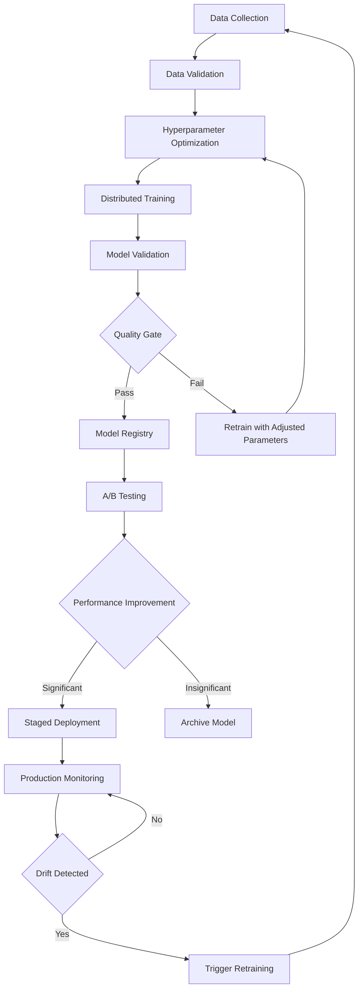

# Pipeline 3: Model Training Pipeline - Phase 3
## Advanced ML Training Infrastructure for 99% Accuracy RAG System

**Document Version**: 1.0  
**Date**: September 6, 2025  
**Phase**: 3 - Advanced ML Training Infrastructure  
**Pipeline**: 3 of 4 Training Pipelines

---

## 📋 Executive Summary

Pipeline 3 establishes a comprehensive model training infrastructure designed to achieve and maintain 99% accuracy in document retrieval and question answering. This pipeline implements continuous learning, automated retraining, and advanced model lifecycle management using the project's core dependencies: ruv-FANN, DAA orchestrator, and FACT caching system.

### Key Components
- **Training Data Management**: Automated Q&A pair collection and validation
- **Training Infrastructure**: GPU-accelerated distributed training with DAA orchestration
- **Continuous Learning**: Adaptive retraining based on performance metrics
- **Model Lifecycle**: Comprehensive versioning, A/B testing, and deployment automation

---

## 🎯 Phase 3 Objectives

### Primary Goals
1. **Automated Training Pipeline**: End-to-end ML model training and deployment
2. **Continuous Improvement**: Adaptive learning from production feedback
3. **Performance Optimization**: Maintain 99% accuracy through intelligent retraining
4. **Scalable Infrastructure**: Support for distributed training and model serving

### Success Metrics
- **Accuracy Target**: >99% on compliance document Q&A
- **Training Speed**: <2 hours for incremental model updates
- **Deployment Time**: <30 minutes for model rollout
- **Data Quality**: >95% validated training pairs

---

## 🏗️ Architecture Overview

```
┌─────────────────────────────────────────────────────────────┐
│                 Pipeline 3: Training Infrastructure         │
├─────────────────────────────────────────────────────────────┤
│  ┌─────────────┐  ┌─────────────┐  ┌─────────────┐         │
│  │   Data      │  │  Training   │  │ Continuous  │         │
│  │ Management  │  │Infrastructure│  │  Learning   │         │
│  └─────────────┘  └─────────────┘  └─────────────┘         │
│         │                 │                 │              │
│  ┌─────────────┐  ┌─────────────┐  ┌─────────────┐         │
│  │  Ground     │  │ Model       │  │Performance  │         │
│  │  Truth      │  │ Registry    │  │ Monitoring  │         │
│  │ Validation  │  │   & A/B     │  │   & Drift   │         │
│  └─────────────┘  └─────────────┘  └─────────────┘         │
└─────────────────────────────────────────────────────────────┘
```

---

## 🗄️ 1. Training Data Management

### 1.1 Q&A Pair Collection and Validation

#### Data Sources
```yaml
data_sources:
  primary:
    - production_queries: "Real user interactions"
    - expert_annotations: "Domain expert Q&A pairs"
    - synthetic_generation: "AI-generated training data"
  
  secondary:
    - document_extractions: "Auto-generated from compliance docs"
    - feedback_loops: "User satisfaction corrections"
    - competitor_benchmarks: "Industry standard datasets"
```

#### Validation Pipeline
```rust
// Training data validation using ruv-FANN and DAA orchestration
pub struct DataValidationPipeline {
    neural_classifier: ruv_fann::Network,
    orchestrator: daa_orchestrator::Agent,
    fact_cache: fact::Cache,
}

impl DataValidationPipeline {
    pub async fn validate_qa_pair(&self, pair: &QAPair) -> ValidationResult {
        // Step 1: Semantic coherence check
        let coherence_score = self.neural_classifier
            .predict(&pair.to_feature_vector())?;
        
        // Step 2: DAA consensus validation (66% threshold)
        let consensus = self.orchestrator
            .request_validation(&pair, 0.66).await?;
        
        // Step 3: Fact verification via FACT
        let fact_check = self.fact_cache
            .verify_claims(&pair.answer).await?;
        
        ValidationResult {
            is_valid: coherence_score > 0.8 && consensus.approved && fact_check.verified,
            confidence: (coherence_score + consensus.confidence + fact_check.confidence) / 3.0,
            issues: self.identify_issues(&pair, coherence_score, &consensus, &fact_check),
        }
    }
}
```

### 1.2 Ground Truth Verification System

#### Verification Workflow
```yaml
verification_process:
  automatic:
    - fact_extraction: "FACT system validates claims"
    - citation_tracking: "Verify answer sources"
    - consistency_checks: "Cross-reference multiple sources"
  
  human_in_the_loop:
    - expert_review: "Domain experts validate complex cases"
    - crowdsource_validation: "Multiple reviewer consensus"
    - active_learning: "Focus on uncertain predictions"
  
  quality_gates:
    - minimum_confidence: 0.85
    - reviewer_agreement: 0.90
    - fact_accuracy: 0.95
```

#### Ground Truth Database Schema
```sql
-- MongoDB collections for training data
db.training_pairs.ensureIndex({
  "question_hash": 1,
  "domain": 1,
  "validation_status": 1,
  "created_at": 1
});

db.validation_results.ensureIndex({
  "pair_id": 1,
  "validator_type": 1,
  "timestamp": 1,
  "confidence_score": 1
});

db.ground_truth_consensus.ensureIndex({
  "pair_id": 1,
  "consensus_score": 1,
  "final_status": 1
});
```

### 1.3 Data Versioning and Lineage Tracking

#### Version Control System
```yaml
data_versioning:
  strategy: "Semantic versioning for datasets"
  format: "major.minor.patch (e.g., 2.1.3)"
  
  triggers:
    major: "Schema changes, new domains added"
    minor: "Significant data additions (>10% growth)"
    patch: "Quality improvements, bug fixes"
  
  lineage_tracking:
    - source_documents: "Original document references"
    - transformation_history: "All processing steps logged"
    - validation_chain: "Complete validation audit trail"
    - model_usage: "Which models trained on which data versions"
```

### 1.4 Automated Data Quality Checks

#### Quality Metrics Dashboard
```rust
pub struct DataQualityMetrics {
    pub validation_rate: f64,        // % of validated pairs
    pub accuracy_score: f64,         // Ground truth accuracy
    pub coverage_score: f64,         // Domain coverage
    pub freshness_score: f64,        // Data recency
    pub diversity_index: f64,        // Question type diversity
}

pub struct QualityMonitor {
    metrics: DataQualityMetrics,
    alerts: Vec<QualityAlert>,
}

impl QualityMonitor {
    pub async fn run_quality_checks(&mut self) -> Result<QualityReport> {
        // Automated quality assessment
        let validation_rate = self.calculate_validation_rate().await?;
        let accuracy = self.measure_ground_truth_accuracy().await?;
        let coverage = self.assess_domain_coverage().await?;
        
        // Trigger alerts if quality thresholds are breached
        if validation_rate < 0.95 {
            self.alerts.push(QualityAlert::LowValidationRate(validation_rate));
        }
        
        Ok(QualityReport {
            metrics: self.metrics.clone(),
            recommendations: self.generate_recommendations(),
            action_items: self.create_action_items(),
        })
    }
}
```

---

## 🖥️ 2. Training Infrastructure

### 2.1 GPU-Enabled Docker Containers (Optional)

#### Container Architecture
```dockerfile
# Multi-stage training container
FROM nvidia/cuda:12.1-runtime-ubuntu22.04 as base

# Install Rust and dependencies
RUN curl --proto '=https' --tlsv1.2 -sSf https://sh.rustup.rs | sh -s -- -y
ENV PATH="/root/.cargo/bin:${PATH}"

# GPU-accelerated training stage
FROM base as training
COPY . /app
WORKDIR /app

# Build with GPU features enabled
RUN cargo build --release --features cuda,tensorrt

# Configure training environment
ENV CUDA_VISIBLE_DEVICES=0,1,2,3
ENV RUST_LOG=info
ENV TRAINING_MODE=distributed

ENTRYPOINT ["./target/release/model-trainer"]
```

#### Container Orchestration
```yaml
# Docker Compose for training cluster
version: '3.8'
services:
  training-coordinator:
    image: doc-rag/trainer:latest
    environment:
      - ROLE=coordinator
      - DAA_NODE_TYPE=master
    volumes:
      - ./models:/app/models
      - ./data:/app/data
    
  training-worker:
    image: doc-rag/trainer:latest
    deploy:
      replicas: 4
    environment:
      - ROLE=worker
      - DAA_NODE_TYPE=worker
    runtime: nvidia
    environment:
      - NVIDIA_VISIBLE_DEVICES=all
    depends_on:
      - training-coordinator
```

### 2.2 Distributed Training Support

#### DAA-Orchestrated Distributed Training
```rust
pub struct DistributedTrainingOrchestrator {
    coordinator: daa_orchestrator::MasterAgent,
    workers: Vec<daa_orchestrator::WorkerAgent>,
    model_registry: ModelRegistry,
    consensus_threshold: f64,
}

impl DistributedTrainingOrchestrator {
    pub async fn execute_training_job(&mut self, job: TrainingJob) -> Result<TrainedModel> {
        // Step 1: Initialize distributed training via DAA
        let training_plan = self.coordinator
            .plan_distributed_training(&job).await?;
        
        // Step 2: Distribute training data across workers
        let data_shards = self.shard_training_data(&job.training_data, self.workers.len());
        
        // Step 3: Start parallel training across workers
        let training_tasks: Vec<_> = self.workers.iter().zip(data_shards.iter())
            .map(|(worker, shard)| {
                worker.train_model_shard(&training_plan, shard)
            })
            .collect();
        
        // Step 4: Collect results and achieve consensus
        let training_results = futures::try_join_all(training_tasks).await?;
        let final_model = self.coordinator
            .achieve_model_consensus(&training_results, self.consensus_threshold).await?;
        
        // Step 5: Register and validate final model
        self.model_registry.register(final_model.clone()).await?;
        
        Ok(final_model)
    }
}
```

### 2.3 Hyperparameter Optimization

#### Automated Hyperparameter Search
```rust
pub struct HyperparameterOptimizer {
    search_strategy: SearchStrategy,
    objective_function: ObjectiveFunction,
    ruv_fann_config: ruv_fann::NetworkConfig,
}

#[derive(Clone)]
pub struct HyperparameterSpace {
    pub learning_rate: Range<f64>,          // 0.0001 to 0.1
    pub batch_size: Vec<usize>,             // [16, 32, 64, 128, 256]
    pub hidden_layers: Range<usize>,        // 2 to 8 layers
    pub dropout_rate: Range<f64>,           // 0.0 to 0.5
    pub activation_function: Vec<ActivationFunction>,
    pub optimizer_type: Vec<OptimizerType>,
}

impl HyperparameterOptimizer {
    pub async fn optimize(&self, training_data: &TrainingDataset) -> Result<OptimalConfig> {
        let search_space = HyperparameterSpace::default();
        let mut best_config = None;
        let mut best_score = f64::NEG_INFINITY;
        
        // Bayesian optimization with early stopping
        for trial in 0..self.max_trials {
            let config = self.suggest_next_config(&search_space, trial);
            
            // Train model with suggested hyperparameters
            let model = self.train_with_config(&config, training_data).await?;
            let score = self.evaluate_model(&model).await?;
            
            if score > best_score {
                best_score = score;
                best_config = Some(config.clone());
            }
            
            // Early stopping if convergence detected
            if self.should_stop_early(trial, score) {
                break;
            }
        }
        
        Ok(OptimalConfig {
            hyperparameters: best_config.unwrap(),
            expected_performance: best_score,
            optimization_history: self.get_optimization_history(),
        })
    }
}
```

### 2.4 Model Versioning and Registry

#### Model Registry Architecture
```rust
pub struct ModelRegistry {
    storage: ModelStorage,
    metadata_db: MetadataDatabase,
    version_control: GitLFSAdapter,
}

#[derive(Serialize, Deserialize)]
pub struct ModelMetadata {
    pub id: Uuid,
    pub name: String,
    pub version: SemanticVersion,
    pub architecture: String,
    pub training_dataset_version: String,
    pub hyperparameters: HashMap<String, Value>,
    pub performance_metrics: ModelMetrics,
    pub created_at: DateTime<Utc>,
    pub created_by: String,
    pub file_size: u64,
    pub checksum: String,
    pub deployment_status: DeploymentStatus,
}

impl ModelRegistry {
    pub async fn register_model(&self, model: &TrainedModel) -> Result<ModelId> {
        // Step 1: Store model artifacts
        let model_path = self.storage.store_model(&model.artifacts).await?;
        
        // Step 2: Create metadata entry
        let metadata = ModelMetadata {
            id: Uuid::new_v4(),
            name: model.name.clone(),
            version: self.generate_next_version(&model.name).await?,
            architecture: model.architecture_description(),
            training_dataset_version: model.dataset_version.clone(),
            hyperparameters: model.hyperparameters.clone(),
            performance_metrics: model.evaluation_metrics.clone(),
            created_at: Utc::now(),
            created_by: model.trainer_id.clone(),
            file_size: model.artifacts.size(),
            checksum: model.artifacts.checksum(),
            deployment_status: DeploymentStatus::Staged,
        };
        
        // Step 3: Version control integration
        self.version_control.commit_model(&model_path, &metadata).await?;
        
        // Step 4: Store metadata in database
        self.metadata_db.insert_model_metadata(&metadata).await?;
        
        Ok(metadata.id)
    }
    
    pub async fn get_model_for_deployment(&self, criteria: &DeploymentCriteria) -> Result<ModelId> {
        // Find best model matching deployment criteria
        let candidates = self.metadata_db
            .find_models_by_criteria(criteria).await?;
        
        // Apply deployment policies (A/B testing, canary deployment)
        let selected_model = self.apply_deployment_policy(&candidates).await?;
        
        Ok(selected_model)
    }
}
```

### 2.5 A/B Testing Framework

#### Experimental Design
```rust
pub struct ABTestingFramework {
    experiment_manager: ExperimentManager,
    traffic_splitter: TrafficSplitter,
    metrics_collector: MetricsCollector,
}

#[derive(Clone)]
pub struct Experiment {
    pub id: Uuid,
    pub name: String,
    pub control_model: ModelId,
    pub treatment_models: Vec<ModelId>,
    pub traffic_allocation: HashMap<ModelId, f64>,  // % of traffic per model
    pub success_metrics: Vec<SuccessMetric>,
    pub duration: Duration,
    pub statistical_power: f64,
    pub significance_level: f64,
}

impl ABTestingFramework {
    pub async fn create_experiment(&self, config: ExperimentConfig) -> Result<Experiment> {
        // Validate experiment design
        self.validate_experiment_design(&config)?;
        
        // Calculate required sample size
        let sample_size = self.calculate_sample_size(&config).await?;
        
        // Create experiment with statistical rigor
        let experiment = Experiment {
            id: Uuid::new_v4(),
            name: config.name,
            control_model: config.control_model,
            treatment_models: config.treatment_models,
            traffic_allocation: config.traffic_split,
            success_metrics: config.metrics,
            duration: config.duration,
            statistical_power: 0.8,
            significance_level: 0.05,
        };
        
        // Register experiment
        self.experiment_manager.register(&experiment).await?;
        
        Ok(experiment)
    }
    
    pub async fn evaluate_experiment(&self, experiment_id: Uuid) -> Result<ExperimentResults> {
        let experiment = self.experiment_manager.get(experiment_id).await?;
        let metrics_data = self.metrics_collector.get_experiment_data(&experiment).await?;
        
        // Statistical significance testing
        let significance_tests = self.run_significance_tests(&metrics_data).await?;
        
        // Effect size calculation
        let effect_sizes = self.calculate_effect_sizes(&metrics_data).await?;
        
        // Generate recommendations
        let recommendation = self.generate_recommendation(
            &significance_tests,
            &effect_sizes,
            &experiment.success_metrics
        ).await?;
        
        Ok(ExperimentResults {
            experiment_id,
            statistical_results: significance_tests,
            effect_sizes,
            recommendation,
            confidence_interval: self.calculate_confidence_interval(&metrics_data)?,
        })
    }
}
```

---

## 🔄 3. Continuous Learning

### 3.1 Automated Retraining Triggers

#### Trigger Conditions
```yaml
retraining_triggers:
  performance_based:
    - accuracy_drop: ">5% decrease from baseline"
    - latency_increase: ">50% increase in response time"
    - user_satisfaction: "<85% satisfaction score"
  
  data_based:
    - new_data_volume: ">10,000 new validated Q&A pairs"
    - domain_shift: "New compliance regulations detected"
    - data_staleness: ">30 days since last training"
  
  time_based:
    - scheduled_retraining: "Weekly incremental updates"
    - quarterly_full_retrain: "Complete model refresh"
    - emergency_retrain: "Critical accuracy issues"
  
  external_triggers:
    - regulatory_updates: "New compliance requirements"
    - feedback_threshold: ">100 negative feedback items"
    - competitor_benchmark: "Industry accuracy improvements"
```

#### Trigger Detection System
```rust
pub struct RetrainingTriggerSystem {
    performance_monitor: PerformanceMonitor,
    data_monitor: DataMonitor,
    scheduler: CronScheduler,
    orchestrator: daa_orchestrator::Agent,
}

impl RetrainingTriggerSystem {
    pub async fn monitor_and_trigger(&mut self) -> Result<()> {
        tokio::select! {
            // Performance-based triggers
            performance_alert = self.performance_monitor.check_performance() => {
                if let Ok(alert) = performance_alert {
                    if alert.requires_retraining() {
                        self.trigger_performance_retraining(alert).await?;
                    }
                }
            },
            
            // Data-based triggers
            data_event = self.data_monitor.check_data_changes() => {
                if let Ok(event) = data_event {
                    if event.volume_threshold_exceeded() || event.domain_shift_detected() {
                        self.trigger_data_retraining(event).await?;
                    }
                }
            },
            
            // Time-based triggers
            _ = self.scheduler.wait_for_next_scheduled() => {
                self.trigger_scheduled_retraining().await?;
            }
        }
        
        Ok(())
    }
    
    async fn trigger_performance_retraining(&self, alert: PerformanceAlert) -> Result<()> {
        // Use DAA orchestration for retraining decision
        let retraining_proposal = RetrainingProposal {
            trigger_type: TriggerType::Performance,
            urgency: alert.urgency_level(),
            expected_improvement: alert.expected_improvement(),
            resource_requirements: self.estimate_resource_needs(&alert),
        };
        
        // Achieve consensus on retraining necessity (66% threshold)
        let consensus = self.orchestrator
            .request_consensus(&retraining_proposal, 0.66).await?;
        
        if consensus.approved {
            self.initiate_retraining_pipeline(retraining_proposal).await?;
        }
        
        Ok(())
    }
}
```

### 3.2 Performance Monitoring

#### Real-time Performance Tracking
```rust
pub struct PerformanceMonitor {
    metrics_collector: MetricsCollector,
    alerting_system: AlertingSystem,
    baseline_models: HashMap<String, BaselineMetrics>,
}

#[derive(Clone, Serialize, Deserialize)]
pub struct ModelPerformanceMetrics {
    pub accuracy: f64,
    pub precision: f64,
    pub recall: f64,
    pub f1_score: f64,
    pub response_time_p95: Duration,
    pub throughput: f64,  // queries per second
    pub memory_usage: f64,  // GB
    pub gpu_utilization: f64,  // %
    pub user_satisfaction: f64,
    pub citation_accuracy: f64,
}

impl PerformanceMonitor {
    pub async fn collect_real_time_metrics(&self) -> Result<ModelPerformanceMetrics> {
        let current_window = Utc::now() - Duration::minutes(5);
        
        // Collect accuracy metrics from recent predictions
        let accuracy = self.metrics_collector
            .calculate_accuracy_since(current_window).await?;
        
        // Collect latency metrics
        let latency_stats = self.metrics_collector
            .get_latency_percentiles(current_window).await?;
        
        // Collect resource utilization
        let resource_usage = self.metrics_collector
            .get_resource_utilization().await?;
        
        // Collect user feedback metrics
        let satisfaction = self.metrics_collector
            .get_user_satisfaction_score(current_window).await?;
        
        Ok(ModelPerformanceMetrics {
            accuracy,
            precision: self.metrics_collector.get_precision(current_window).await?,
            recall: self.metrics_collector.get_recall(current_window).await?,
            f1_score: 2.0 * (accuracy * recall) / (accuracy + recall),
            response_time_p95: latency_stats.p95,
            throughput: self.metrics_collector.get_throughput(current_window).await?,
            memory_usage: resource_usage.memory_gb,
            gpu_utilization: resource_usage.gpu_percent,
            user_satisfaction: satisfaction,
            citation_accuracy: self.metrics_collector.get_citation_accuracy(current_window).await?,
        })
    }
    
    pub fn should_trigger_retraining(&self, current: &ModelPerformanceMetrics) -> bool {
        let baseline = &self.baseline_models["current_production"];
        
        // Multiple trigger conditions
        current.accuracy < baseline.accuracy * 0.95 ||  // 5% accuracy drop
        current.response_time_p95 > baseline.response_time_p95 * 1.5 ||  // 50% latency increase
        current.user_satisfaction < 0.85 ||  // Below 85% satisfaction
        current.citation_accuracy < 0.90  // Below 90% citation accuracy
    }
}
```

### 3.3 Model Drift Detection

#### Drift Detection Algorithms
```rust
pub struct ModelDriftDetector {
    reference_distribution: StatisticalDistribution,
    drift_threshold: f64,
    drift_algorithms: Vec<Box<dyn DriftDetectionAlgorithm>>,
}

pub trait DriftDetectionAlgorithm {
    fn detect_drift(&self, current_data: &[f64], reference_data: &[f64]) -> DriftResult;
    fn algorithm_name(&self) -> &str;
}

pub struct KSDriftDetector;
impl DriftDetectionAlgorithm for KSDriftDetector {
    fn detect_drift(&self, current_data: &[f64], reference_data: &[f64]) -> DriftResult {
        let ks_statistic = self.calculate_ks_statistic(current_data, reference_data);
        let p_value = self.calculate_p_value(ks_statistic, current_data.len(), reference_data.len());
        
        DriftResult {
            algorithm: "KS Test".to_string(),
            drift_detected: p_value < 0.05,
            confidence: 1.0 - p_value,
            statistic_value: ks_statistic,
        }
    }
    
    fn algorithm_name(&self) -> &str { "Kolmogorov-Smirnov" }
}

impl ModelDriftDetector {
    pub async fn detect_model_drift(&self) -> Result<DriftDetectionReport> {
        // Get current model predictions distribution
        let current_predictions = self.get_recent_predictions().await?;
        let current_features = self.extract_feature_distributions(&current_predictions);
        
        // Compare against reference distribution
        let mut drift_results = Vec::new();
        
        for algorithm in &self.drift_algorithms {
            let result = algorithm.detect_drift(
                &current_features,
                &self.reference_distribution.samples
            );
            drift_results.push(result);
        }
        
        // Consensus-based drift detection
        let drift_consensus = self.calculate_drift_consensus(&drift_results);
        
        Ok(DriftDetectionReport {
            timestamp: Utc::now(),
            overall_drift_detected: drift_consensus.drift_detected,
            confidence: drift_consensus.confidence,
            algorithm_results: drift_results,
            recommendation: self.generate_drift_recommendation(&drift_consensus),
        })
    }
}
```

### 3.4 Automated Deployment of Improved Models

#### Deployment Pipeline
```rust
pub struct AutomatedDeploymentPipeline {
    model_registry: ModelRegistry,
    validation_suite: ValidationSuite,
    deployment_orchestrator: DeploymentOrchestrator,
    rollback_manager: RollbackManager,
}

pub struct DeploymentStage {
    pub name: String,
    pub validation_criteria: Vec<ValidationCriterion>,
    pub traffic_percentage: f64,
    pub duration: Duration,
    pub success_threshold: f64,
}

impl AutomatedDeploymentPipeline {
    pub async fn deploy_improved_model(&self, model_id: ModelId) -> Result<DeploymentResult> {
        // Define deployment stages (canary -> blue-green -> full)
        let deployment_stages = vec![
            DeploymentStage {
                name: "Canary".to_string(),
                validation_criteria: vec![
                    ValidationCriterion::AccuracyMaintained(0.99),
                    ValidationCriterion::LatencyUnder(Duration::from_millis(500)),
                    ValidationCriterion::ErrorRateBelow(0.01),
                ],
                traffic_percentage: 5.0,
                duration: Duration::from_secs(3600),  // 1 hour
                success_threshold: 0.95,
            },
            DeploymentStage {
                name: "Blue-Green".to_string(),
                validation_criteria: vec![
                    ValidationCriterion::AccuracyImproved(0.01),  // 1% improvement
                    ValidationCriterion::UserSatisfactionAbove(0.90),
                ],
                traffic_percentage: 50.0,
                duration: Duration::from_secs(7200),  // 2 hours
                success_threshold: 0.98,
            },
            DeploymentStage {
                name: "Full Deployment".to_string(),
                validation_criteria: vec![
                    ValidationCriterion::AllMetricsMaintained,
                    ValidationCriterion::NoRegressionDetected,
                ],
                traffic_percentage: 100.0,
                duration: Duration::from_secs(86400),  // 24 hours
                success_threshold: 0.99,
            },
        ];
        
        // Execute staged deployment
        for stage in deployment_stages {
            let stage_result = self.execute_deployment_stage(&model_id, &stage).await?;
            
            if !stage_result.success {
                // Automatic rollback on failure
                self.rollback_manager.rollback_deployment(&model_id).await?;
                return Ok(DeploymentResult::Failed {
                    stage: stage.name,
                    reason: stage_result.failure_reason.unwrap(),
                });
            }
        }
        
        // Mark deployment as successful
        self.model_registry.mark_as_production(&model_id).await?;
        
        Ok(DeploymentResult::Success {
            model_id,
            deployment_time: Utc::now(),
            performance_improvements: self.calculate_improvements(&model_id).await?,
        })
    }
}
```

---

## 📊 Training Workflows and Model Lifecycle

### Training Workflow States


### Model Lifecycle Management
```yaml
model_lifecycle:
  development:
    - data_preparation: "24-48 hours"
    - hyperparameter_tuning: "2-6 hours"
    - training: "1-8 hours (depending on size)"
    - validation: "30 minutes"
  
  testing:
    - integration_testing: "2 hours"
    - performance_benchmarking: "1 hour"
    - a_b_test_setup: "30 minutes"
    - canary_deployment: "1-2 hours"
  
  production:
    - full_deployment: "30 minutes"
    - monitoring_setup: "15 minutes"
    - performance_tracking: "Continuous"
    - drift_detection: "Every 6 hours"
  
  maintenance:
    - model_refresh: "Weekly (if needed)"
    - major_retrain: "Monthly"
    - archive_old_versions: "Quarterly"
    - security_updates: "As needed"
```

---

## 📈 Evaluation Metrics

### 3.1 Core Performance Metrics

```yaml
accuracy_metrics:
  primary:
    - exact_match_accuracy: ">99%"
    - semantic_similarity_score: ">0.95"
    - citation_accuracy: ">95%"
    - fact_verification_accuracy: ">98%"
  
  secondary:
    - response_completeness: ">90%"
    - answer_coherence: ">95%"
    - context_relevance: ">92%"
    - user_satisfaction: ">90%"

performance_metrics:
  latency:
    - training_time: "<8 hours for full retrain"
    - inference_latency: "<500ms p95"
    - deployment_time: "<30 minutes"
  
  efficiency:
    - gpu_utilization: ">80% during training"
    - memory_efficiency: "<16GB per model"
    - storage_optimization: "<500MB per model"
  
  scalability:
    - concurrent_training_jobs: ">5"
    - model_throughput: ">1000 QPS"
    - horizontal_scaling: "Linear with resources"
```

### 3.2 Business Metrics

```yaml
business_impact:
  user_experience:
    - query_resolution_rate: ">95%"
    - user_satisfaction_score: ">4.5/5"
    - session_completion_rate: ">85%"
  
  operational_efficiency:
    - false_positive_rate: "<2%"
    - manual_intervention_rate: "<5%"
    - system_uptime: ">99.9%"
  
  cost_optimization:
    - training_cost_per_model: "<$500"
    - inference_cost_per_query: "<$0.01"
    - infrastructure_efficiency: ">80%"
```

### 3.3 Model Quality Gates

```rust
pub struct ModelQualityGates {
    acceptance_criteria: Vec<QualityGate>,
    validation_pipeline: ValidationPipeline,
}

pub enum QualityGate {
    AccuracyThreshold(f64),
    LatencyRequirement(Duration),
    MemoryConstraint(u64),  // bytes
    ThroughputMinimum(f64), // QPS
    RegressionTest(RegressionTestSuite),
    SecurityScan(SecurityTestSuite),
}

impl ModelQualityGates {
    pub async fn validate_model(&self, model: &TrainedModel) -> Result<ValidationResult> {
        let mut results = Vec::new();
        
        for gate in &self.acceptance_criteria {
            let gate_result = match gate {
                QualityGate::AccuracyThreshold(threshold) => {
                    let accuracy = self.measure_model_accuracy(model).await?;
                    ValidationGateResult {
                        gate_name: "Accuracy".to_string(),
                        passed: accuracy >= *threshold,
                        measured_value: accuracy,
                        threshold_value: *threshold,
                    }
                },
                QualityGate::LatencyRequirement(max_latency) => {
                    let latency = self.measure_inference_latency(model).await?;
                    ValidationGateResult {
                        gate_name: "Latency".to_string(),
                        passed: latency <= *max_latency,
                        measured_value: latency.as_secs_f64(),
                        threshold_value: max_latency.as_secs_f64(),
                    }
                },
                // ... other gates
            };
            results.push(gate_result);
        }
        
        let all_passed = results.iter().all(|r| r.passed);
        
        Ok(ValidationResult {
            overall_passed: all_passed,
            gate_results: results,
            recommendations: self.generate_recommendations(&results),
        })
    }
}
```

---

## 🔧 Implementation Plan

### Phase 3.1: Foundation (Weeks 1-2)
```yaml
week_1:
  - setup_training_infrastructure:
      - Configure GPU-enabled containers
      - Deploy distributed training cluster
      - Set up model registry
  
  - implement_data_management:
      - Build Q&A validation pipeline
      - Set up ground truth verification
      - Implement data versioning system

week_2:
  - develop_core_training_pipeline:
      - Integrate ruv-FANN for neural training
      - Implement DAA orchestration for distributed training
      - Build hyperparameter optimization
  
  - establish_quality_gates:
      - Define acceptance criteria
      - Implement validation pipeline
      - Set up A/B testing framework
```

### Phase 3.2: Advanced Features (Weeks 3-4)
```yaml
week_3:
  - continuous_learning_implementation:
      - Build retraining trigger system
      - Implement performance monitoring
      - Deploy drift detection algorithms
  
  - deployment_automation:
      - Create staged deployment pipeline
      - Implement automated rollback
      - Build monitoring dashboards

week_4:
  - optimization_and_tuning:
      - Performance optimization
      - Cost optimization
      - Security hardening
  
  - documentation_and_training:
      - Operational runbooks
      - Team training materials
      - Incident response procedures
```

---

## 🚨 Risk Mitigation

### Technical Risks
```yaml
training_failures:
  risk: "Model training job failures"
  probability: "Medium"
  impact: "High"
  mitigation:
    - Implement robust checkpointing
    - Add automatic job restart capabilities
    - Create fallback training strategies

resource_constraints:
  risk: "GPU/compute resource limitations"
  probability: "High"
  impact: "Medium"
  mitigation:
    - Implement resource scheduling
    - Add cloud burst capabilities
    - Optimize model architectures

data_quality_issues:
  risk: "Poor training data quality"
  probability: "Medium"
  impact: "Critical"
  mitigation:
    - Comprehensive validation pipelines
    - Human-in-the-loop verification
    - Automated quality monitoring
```

### Operational Risks
```yaml
deployment_failures:
  risk: "Failed model deployments"
  probability: "Medium"
  impact: "High"
  mitigation:
    - Staged deployment with rollback
    - Comprehensive testing suites
    - Circuit breaker patterns

performance_regression:
  risk: "New models perform worse"
  probability: "Low"
  impact: "Critical"
  mitigation:
    - Rigorous A/B testing
    - Performance benchmarking
    - Automated rollback triggers
```

---

## 📞 Support and Monitoring

### 24/7 Monitoring Setup
```yaml
alerts:
  critical:
    - training_job_failure: "Immediate"
    - accuracy_drop_5_percent: "Immediate"
    - deployment_failure: "5 minutes"
  
  warning:
    - resource_utilization_high: "15 minutes"
    - data_quality_degradation: "30 minutes"
    - drift_detection_triggered: "1 hour"

dashboards:
  executive:
    - accuracy_trends
    - cost_metrics
    - user_satisfaction
  
  operational:
    - training_job_status
    - resource_utilization
    - deployment_pipeline_health
  
  technical:
    - model_performance_details
    - system_resource_usage
    - detailed_error_logs
```

---

## ✅ Success Criteria

### Phase 3 Completion Checklist
- [ ] **Training Infrastructure**: Fully automated, scalable training pipeline
- [ ] **Data Management**: 95%+ validated training data with automated quality checks
- [ ] **Model Registry**: Complete model lifecycle management with versioning
- [ ] **Continuous Learning**: Automated retraining triggers and drift detection
- [ ] **A/B Testing**: Statistical rigor in model comparison and deployment
- [ ] **Performance Monitoring**: Real-time tracking of all key metrics
- [ ] **Deployment Automation**: Zero-downtime deployments with automatic rollback

### Key Performance Indicators (KPIs)
- **Model Accuracy**: >99% on compliance document Q&A
- **Training Efficiency**: <8 hours for full model retraining
- **Deployment Speed**: <30 minutes for model rollout
- **System Reliability**: >99.9% uptime for training infrastructure
- **Cost Optimization**: <$500 per model training cycle

---

*Document Status: Ready for Implementation*  
*Next Phase: Pipeline 4 - Production Optimization*  
*Estimated Completion: 4 weeks from Phase 3 start*