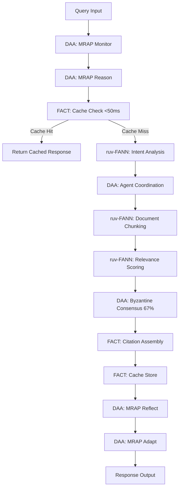

# SPARC Phase 1: Specification
## Exact Integration Requirements for Mandatory Dependencies

**Document Version**: 1.0  
**Date**: January 6, 2025  
**Status**: ACTIVE DEVELOPMENT

---

## 1. ruv-FANN v0.1.6 Integration Specification

### Required Imports
```rust
use ruv_fann::{
    Network,
    Layer,
    ActivationFunction,
    ChunkingConfig,
    IntentAnalyzer,
    RelevanceScorer
};
```

### Document Chunking API
```rust
// Initialize network for document chunking
let network = Network::new()
    .with_layers(vec![
        Layer::input(384),  // Embedding dimension
        Layer::hidden(256, ActivationFunction::ReLU),
        Layer::hidden(128, ActivationFunction::ReLU),
        Layer::output(64)
    ])
    .build()?;

// Chunk document with semantic boundary detection
let chunks = network.chunk_document(
    &document_bytes,
    ChunkingConfig {
        max_chunk_size: 512,
        overlap: 50,
        semantic_threshold: 0.85,
    }
)?;
```

### Query Intent Analysis API
```rust
// Analyze query intent
let intent_analyzer = IntentAnalyzer::from_network(&network);
let intent = intent_analyzer.analyze(&query_text)?;

match intent {
    Intent::Factual => { /* Direct fact retrieval */ },
    Intent::Analytical => { /* Multi-step reasoning */ },
    Intent::Comparative => { /* Compare multiple sources */ },
}
```

### Relevance Scoring and Reranking API
```rust
// Score and rerank results
let scorer = RelevanceScorer::new(&network);
let scored_results = scorer.score_batch(&results, &query)?;
let reranked = scorer.rerank(scored_results, top_k: 10)?;
```

---

## 2. DAA-Orchestrator Integration Specification

### Required Imports
```rust
use daa_orchestrator::{
    MRAPLoop,
    Consensus,
    ByzantineConfig,
    Agent,
    AgentPool,
    Task,
    Message
};
```

### MRAP Loop Orchestration API
```rust
// Initialize MRAP loop
let mrap = MRAPLoop::new()
    .with_monitor(|state| {
        // Monitor current system state
        state.check_health()
    })
    .with_reasoner(|observation| {
        // Reason about observations
        Decision::new(observation)
    })
    .with_actor(|decision| {
        // Execute decision
        Action::execute(decision)
    })
    .with_reflector(|result| {
        // Reflect on results
        Insight::derive(result)
    })
    .with_adapter(|insight| {
        // Adapt system based on insights
        SystemUpdate::apply(insight)
    });

// Execute query through MRAP loop
let result = mrap.execute(query).await?;
```

### Byzantine Consensus API
```rust
// Configure Byzantine consensus with 67% threshold
let consensus = Consensus::byzantine(ByzantineConfig {
    threshold: 0.67,
    timeout_ms: 500,
    min_validators: 3,
});

// Collect votes from agents
let votes: Vec<Vote> = agents
    .iter()
    .map(|agent| agent.validate(&result))
    .collect().await?;

// Evaluate consensus
let consensus_result = consensus.evaluate(votes)?;
if consensus_result.agreement < 0.67 {
    return Err("Consensus not reached");
}
```

### Multi-Agent Coordination API
```rust
// Create agent pool
let agent_pool = AgentPool::new()
    .add_agent(Agent::new("retriever", AgentType::Retriever))
    .add_agent(Agent::new("analyzer", AgentType::Analyzer))
    .add_agent(Agent::new("validator", AgentType::Validator))
    .build();

// Coordinate task execution
let task = Task::new("process_query", query);
let results = agent_pool.execute_coordinated(task).await?;
```

---

## 3. FACT Integration Specification

### Required Imports
```rust
use fact::{
    Cache,
    CacheConfig,
    CitationTracker,
    FactExtractor,
    CacheKey,
    CachedResponse
};
```

### Intelligent Caching API (Replaces Redis)
```rust
// Initialize FACT cache (NO Redis needed)
let cache = Cache::new(CacheConfig {
    max_size_mb: 1024,
    ttl_seconds: 3600,
    eviction_policy: EvictionPolicy::LRU,
    persistence_path: Some("/data/fact_cache"),
});

// Check cache (<50ms requirement)
let key = CacheKey::from_query(&query);
let start = Instant::now();
if let Some(cached) = cache.get(&key).await? {
    assert!(start.elapsed().as_millis() < 50);
    return Ok(cached);
}

// Store in cache
cache.put(&key, &response).await?;
```

### Citation Tracking API
```rust
// Initialize citation tracker
let citation_tracker = CitationTracker::new();

// Extract and track citations
for chunk in chunks {
    let citations = citation_tracker.extract_from_chunk(&chunk)?;
    citation_tracker.add_citations(doc_id, citations);
}

// Assemble citations for response
let final_citations = citation_tracker.assemble_for_query(&query, &results)?;
```

### Fact Extraction API
```rust
// Extract facts from documents
let extractor = FactExtractor::new();
let facts = extractor.extract_facts(&document)?;

// Verify facts against knowledge base
let verified_facts = facts
    .iter()
    .filter(|fact| extractor.verify(fact))
    .collect();
```

---

## 4. Components to REMOVE

### Redis - COMPLETELY REMOVED
- **Reason**: FACT provides intelligent caching with <50ms retrieval
- **Migration**: All cache operations move to `fact::Cache`
- **Data**: FACT handles persistence internally

### MongoDB - EVALUATE FOR REMOVAL
- **Keep if**: FACT requires document storage backend
- **Remove if**: FACT handles all storage internally
- **Decision**: Check FACT documentation for storage requirements

---

## 5. Exact Data Flow Pipeline



---

## 6. Performance Requirements

| Component | Operation | Maximum Time | Notes |
|-----------|-----------|--------------|-------|
| FACT | Cache Retrieval | <50ms | HARD REQUIREMENT |
| ruv-FANN | Neural Processing | <200ms | For all neural ops combined |
| DAA | Byzantine Consensus | <500ms | With 67% threshold |
| DAA | MRAP Loop | <100ms | Per phase |
| FACT | Citation Assembly | <100ms | Including verification |
| **TOTAL** | End-to-End | <2000ms | Complete pipeline |

---

## 7. API Integration Points

### Upload Endpoint (`/upload`)
```rust
pub async fn handle_upload(file: Bytes) -> Result<UploadResponse> {
    // 1. Use ruv-FANN for chunking
    let network = ruv_fann::Network::load_pretrained()?;
    let chunks = network.chunk_document(&file)?;
    
    // 2. Use FACT for fact extraction
    let extractor = fact::FactExtractor::new();
    let facts = extractor.extract_facts(&file)?;
    
    // 3. Store in FACT (no MongoDB needed)
    let doc_id = Uuid::new_v4();
    fact::Storage::store_document(doc_id, chunks, facts)?;
    
    Ok(UploadResponse { doc_id, chunks: chunks.len() })
}
```

### Query Endpoint (`/query`)
```rust
pub async fn handle_query(query: QueryRequest) -> Result<QueryResponse> {
    // 1. DAA MRAP Loop starts
    let mrap = daa_orchestrator::MRAPLoop::new();
    
    // 2. FACT cache check
    let cache = fact::Cache::global();
    if let Some(cached) = cache.get(&query).await? {
        return Ok(cached);
    }
    
    // 3. ruv-FANN intent analysis
    let intent = ruv_fann::IntentAnalyzer::analyze(&query.text)?;
    
    // 4. DAA agent coordination
    let agents = daa_orchestrator::AgentPool::default();
    let results = agents.process(query, intent).await?;
    
    // 5. ruv-FANN reranking
    let reranked = ruv_fann::RelevanceScorer::rerank(results)?;
    
    // 6. DAA Byzantine consensus
    let consensus = daa_orchestrator::Consensus::byzantine(0.67);
    let validated = consensus.validate(reranked)?;
    
    // 7. FACT citation assembly
    let citations = fact::CitationTracker::assemble(validated)?;
    
    // 8. Cache and return
    cache.put(&query, &response).await?;
    Ok(response)
}
```

---

## 8. Migration Strategy

### Phase 1: Add Real Dependencies
```toml
[dependencies]
ruv-fann = "0.1.6"
daa-orchestrator = { git = "https://github.com/ruvnet/daa.git" }
fact = { git = "https://github.com/ruvnet/FACT.git" }
# REMOVE: redis = "..."
# EVALUATE: mongodb = "..."
```

### Phase 2: Implement London TDD Tests
- Test ruv-FANN chunking behavior
- Test DAA orchestration flow
- Test FACT caching performance
- Test Byzantine consensus threshold

### Phase 3: Replace Implementations
- Replace Redis calls with FACT cache
- Replace custom neural code with ruv-FANN
- Replace orchestration with DAA MRAP

### Phase 4: Remove Obsolete Components
- Delete Redis connection code
- Delete Redis from docker-compose
- Evaluate MongoDB removal
- Clean up unused imports

---

## Success Criteria

1. ✅ ALL neural operations use ruv-FANN exclusively
2. ✅ ALL orchestration uses DAA-Orchestrator exclusively
3. ✅ ALL caching uses FACT exclusively (NO Redis)
4. ✅ Cache retrieval <50ms verified
5. ✅ Byzantine consensus at 67% threshold verified
6. ✅ Total response time <2s verified
7. ✅ Zero custom implementations of provided capabilities

---

*This specification is the authoritative guide for Phase 3 SPARC integration.*