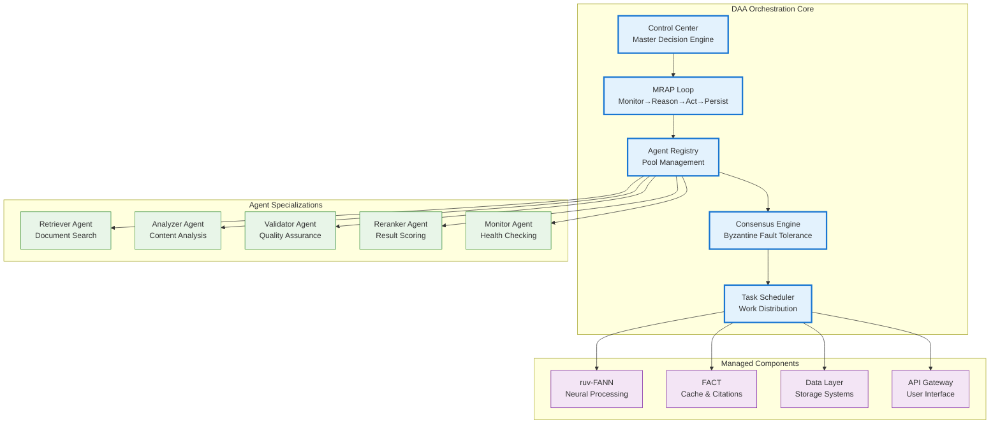
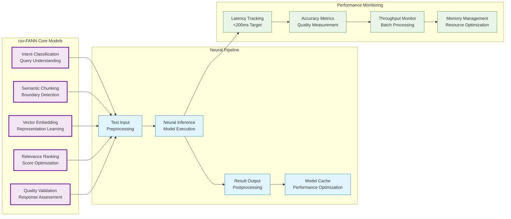
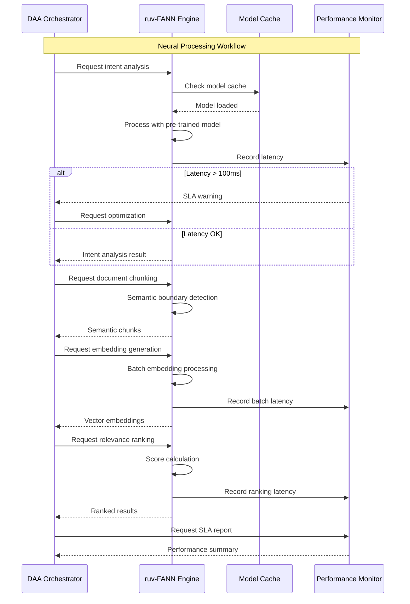
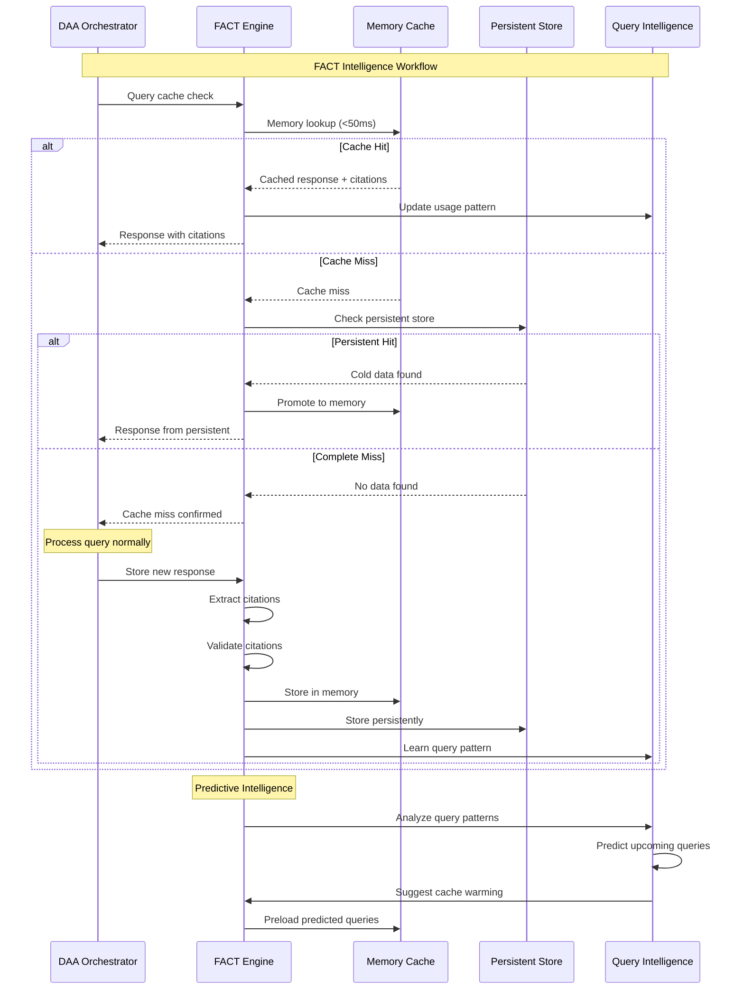
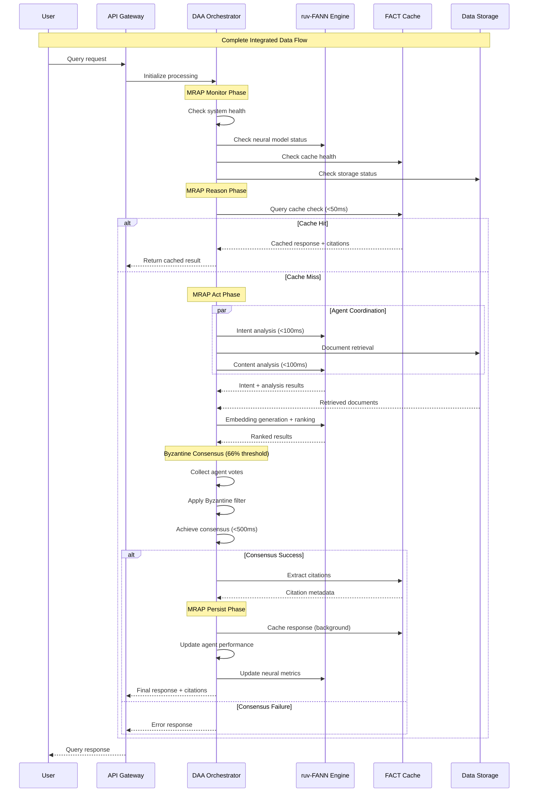
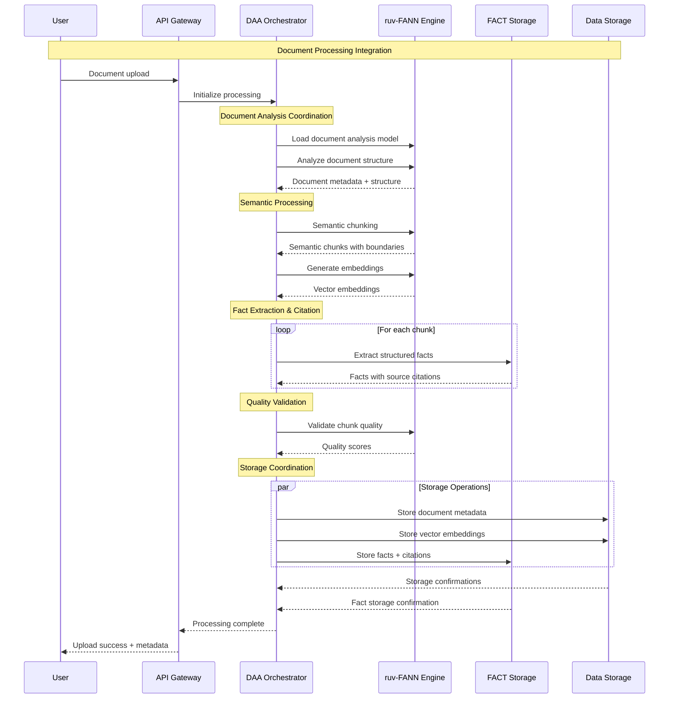

# Component Integration Architecture - Phase 4 Corrected System
## Proper Library Integration Patterns

**Version**: 4.0.0  
**Focus**: Corrected Integration Patterns  
**Dependencies**: DAA, ruv-FANN v0.1.6+, FACT  
**Compliance**: Mandatory library usage only  

---

## 1. Integration Overview

Phase 4 corrects critical integration issues by properly leveraging mandated libraries instead of custom implementations. This document defines the exact integration patterns, communication protocols, and component boundaries.

### Core Integration Principles

1. **DAA Handles ALL Orchestration** - No custom orchestration or consensus code
2. **ruv-FANN Handles ALL Neural Processing** - No custom neural networks or ML code  
3. **FACT Handles ALL Caching & Citations** - No basic caching without FACT intelligence
4. **Component Communication** - Well-defined interfaces and protocols
5. **Performance Guarantees** - Each component maintains SLA requirements

---

## 2. DAA Orchestration Integration

### 2.1 DAA as Master Orchestrator



### 2.2 DAA Integration Implementation

```rust
// DAA Integration - Primary Orchestrator
use daa::{Orchestrator, Agent, ConsensusEngine, MRAPLoop};

pub struct DAAIntegration {
    orchestrator: Orchestrator,
    consensus_engine: ConsensusEngine,
    mrap_loop: MRAPLoop,
    agent_pool: Vec<Agent>,
}

impl DAAIntegration {
    pub async fn initialize() -> Result<Self> {
        let mut orchestrator = Orchestrator::new();
        
        // Configure Byzantine consensus with 66% threshold
        let consensus_engine = ConsensusEngine::new()
            .with_threshold(0.66)
            .with_max_time_ms(500)
            .with_byzantine_detection(true);
            
        // Initialize MRAP control loop
        let mrap_loop = MRAPLoop::new()
            .with_monitor_interval(Duration::from_secs(10))
            .with_adaptation_enabled(true);
            
        // Spawn specialized agents (minimum 5 for consensus)
        let agent_pool = vec![
            Agent::new("retriever", AgentType::Retriever),
            Agent::new("analyzer", AgentType::Analyzer),
            Agent::new("validator", AgentType::Validator),
            Agent::new("reranker", AgentType::Reranker),
            Agent::new("monitor", AgentType::Monitor),
        ];
        
        // Register agents with orchestrator
        for agent in &agent_pool {
            orchestrator.register_agent(agent.clone()).await?;
        }
        
        Ok(Self {
            orchestrator,
            consensus_engine,
            mrap_loop,
            agent_pool,
        })
    }
    
    // DAA coordinates ALL query processing
    pub async fn process_query(&self, query: QueryRequest) -> Result<QueryResponse> {
        // MRAP: Monitor - System health check
        let health = self.mrap_loop.monitor().await?;
        if !health.is_healthy() {
            return Err(SystemError::Unhealthy(health));
        }
        
        // MRAP: Reason - Determine processing strategy
        let strategy = self.mrap_loop.reason(&query, &health).await?;
        
        // MRAP: Act - Coordinate agent processing
        let agent_tasks = self.create_agent_tasks(&query, &strategy).await?;
        let agent_results = self.orchestrator
            .execute_parallel(agent_tasks)
            .await?;
            
        // Byzantine consensus on agent results
        let consensus = self.consensus_engine
            .achieve_consensus(agent_results, Duration::from_millis(500))
            .await?;
            
        if consensus.agreement_rate() < 0.66 {
            return Err(ConsensusError::InsufficientAgreement {
                rate: consensus.agreement_rate(),
                threshold: 0.66,
                byzantine_agents: consensus.byzantine_agents(),
            });
        }
        
        // MRAP: Persist - Store results and adapt
        self.mrap_loop.persist(&query, &consensus).await?;
        
        Ok(QueryResponse::from_consensus(consensus))
    }
    
    // DAA manages component lifecycle
    pub async fn manage_component_health(&self) -> Result<()> {
        // Monitor ruv-FANN neural processing
        let neural_health = self.check_neural_health().await?;
        if neural_health.latency > Duration::from_millis(200) {
            self.adapt_neural_processing().await?;
        }
        
        // Monitor FACT cache performance
        let cache_health = self.check_cache_health().await?;
        if cache_health.latency > Duration::from_millis(50) {
            self.optimize_cache_strategy().await?;
        }
        
        // Adapt system based on performance
        self.mrap_loop.adapt_system().await?;
        
        Ok(())
    }
}
```

### 2.3 Agent Communication Protocol

```rust
// Inter-agent communication via DAA
pub enum AgentMessage {
    TaskAssignment {
        task_id: String,
        task_type: TaskType,
        payload: TaskPayload,
        deadline: Instant,
    },
    TaskResult {
        task_id: String,
        result: TaskResult,
        confidence: f64,
        metadata: HashMap<String, Value>,
    },
    ConsensusVote {
        proposal_id: String,
        vote: Vote,
        reasoning: String,
        timestamp: Instant,
    },
    HealthStatus {
        agent_id: String,
        status: AgentStatus,
        performance_metrics: PerformanceMetrics,
    },
}

impl Agent {
    pub async fn receive_message(&mut self, message: AgentMessage) -> Result<()> {
        match message {
            AgentMessage::TaskAssignment { task_id, task_type, payload, deadline } => {
                self.process_task(task_id, task_type, payload, deadline).await
            },
            AgentMessage::ConsensusVote { proposal_id, .. } => {
                self.participate_in_consensus(proposal_id).await
            },
            // ... other message types
        }
    }
    
    pub async fn send_result(&self, result: TaskResult) -> Result<()> {
        let message = AgentMessage::TaskResult {
            task_id: result.task_id,
            result,
            confidence: self.calculate_confidence(),
            metadata: self.collect_metadata(),
        };
        
        self.orchestrator.send_to_consensus(message).await
    }
}
```

---

## 3. ruv-FANN Neural Processing Integration

### 3.1 ruv-FANN as Neural Engine



### 3.2 ruv-FANN Integration Implementation

```rust
// ruv-FANN Integration - Neural Processing Engine
use ruv_fann::{NeuralNetwork, IntentAnalyzer, SemanticChunker, EmbeddingGenerator, RelevanceRanker};

pub struct RuvFANNIntegration {
    intent_analyzer: IntentAnalyzer,
    semantic_chunker: SemanticChunker,
    embedding_generator: EmbeddingGenerator,
    relevance_ranker: RelevanceRanker,
    performance_monitor: NeuralPerformanceMonitor,
}

impl RuvFANNIntegration {
    pub async fn initialize(model_path: &str) -> Result<Self> {
        // Load pre-trained ruv-FANN models
        let intent_analyzer = IntentAnalyzer::load(model_path).await?;
        let semantic_chunker = SemanticChunker::load(model_path).await?;
        let embedding_generator = EmbeddingGenerator::load(model_path).await?;
        let relevance_ranker = RelevanceRanker::load(model_path).await?;
        
        // Initialize performance monitoring
        let performance_monitor = NeuralPerformanceMonitor::new()
            .with_latency_target(Duration::from_millis(200))
            .with_accuracy_threshold(0.95);
            
        Ok(Self {
            intent_analyzer,
            semantic_chunker,
            embedding_generator,
            relevance_ranker,
            performance_monitor,
        })
    }
    
    // Intent analysis with performance monitoring
    pub async fn analyze_intent(&self, query: &str) -> Result<IntentAnalysis> {
        let start = Instant::now();
        
        let analysis = self.intent_analyzer
            .analyze(query)
            .await?;
            
        let latency = start.elapsed();
        self.performance_monitor.record_intent_latency(latency);
        
        if latency > Duration::from_millis(100) {
            warn!("Intent analysis exceeded 100ms: {}ms", latency.as_millis());
        }
        
        Ok(analysis)
    }
    
    // Semantic chunking with boundary detection
    pub async fn chunk_document(&self, document: &str) -> Result<Vec<SemanticChunk>> {
        let chunking_config = ChunkingConfig {
            max_chunk_size: 512,
            overlap_size: 50,
            semantic_threshold: 0.85,
            preserve_boundaries: true,
        };
        
        let chunks = self.semantic_chunker
            .chunk(document, chunking_config)
            .await?;
            
        // Validate chunk quality
        for chunk in &chunks {
            if chunk.semantic_coherence < 0.8 {
                warn!("Low semantic coherence in chunk: {}", chunk.semantic_coherence);
            }
        }
        
        Ok(chunks)
    }
    
    // Vector embedding generation
    pub async fn generate_embeddings(&self, texts: Vec<&str>) -> Result<Vec<Embedding>> {
        let start = Instant::now();
        
        // Batch processing for efficiency
        let embeddings = self.embedding_generator
            .generate_batch(texts)
            .await?;
            
        let latency = start.elapsed();
        self.performance_monitor.record_embedding_latency(latency);
        
        Ok(embeddings)
    }
    
    // Relevance ranking and scoring
    pub async fn rank_results(&self, query: &str, candidates: Vec<SearchResult>) -> Result<Vec<RankedResult>> {
        let start = Instant::now();
        
        let ranked = self.relevance_ranker
            .rank(query, candidates)
            .await?;
            
        let latency = start.elapsed();
        self.performance_monitor.record_ranking_latency(latency);
        
        if latency > Duration::from_millis(100) {
            warn!("Ranking exceeded 100ms: {}ms", latency.as_millis());
        }
        
        Ok(ranked)
    }
    
    // NO CUSTOM NEURAL IMPLEMENTATIONS
    // All neural processing goes through ruv-FANN
}

// Performance monitoring for neural operations
pub struct NeuralPerformanceMonitor {
    intent_latencies: Vec<Duration>,
    embedding_latencies: Vec<Duration>,
    ranking_latencies: Vec<Duration>,
    accuracy_scores: Vec<f64>,
}

impl NeuralPerformanceMonitor {
    pub fn check_sla_compliance(&self) -> NeuralSLAReport {
        let avg_total_latency = self.calculate_average_total_latency();
        let p95_latency = self.calculate_p95_latency();
        let accuracy = self.calculate_average_accuracy();
        
        NeuralSLAReport {
            within_200ms_sla: avg_total_latency < Duration::from_millis(200),
            p95_under_threshold: p95_latency < Duration::from_millis(250),
            accuracy_above_95: accuracy > 0.95,
            recommendations: self.generate_recommendations(),
        }
    }
}
```

### 3.3 Neural Processing Workflow



---

## 4. FACT Caching and Intelligence Integration

### 4.1 FACT as Intelligent Cache Manager

```mermaid
graph TB
    subgraph "FACT Core Components"
        CACHE[Memory Cache<br/>Ultra-fast Access]
        PERSIST[Persistent Store<br/>Durable Storage]
        CITATION[Citation Engine<br/>Source Tracking]
        INTELLIGENCE[Query Intelligence<br/>Pattern Learning]
    end
    
    subgraph "Cache Operations"
        GET[Cache Retrieval<br/><50ms Guarantee]
        PUT[Cache Storage<br/>Background Write]
        EVICT[Smart Eviction<br/>Usage-based LRU]
        WARMUP[Predictive Warmup<br/>Preemptive Loading]
    end
    
    subgraph "Citation Management"
        EXTRACT[Citation Extraction<br/>Source Identification]
        TRACK[Reference Tracking<br/>Usage Analytics]
        FORMAT[Standard Formatting<br/>Consistent Output]
        VALIDATE[Citation Validation<br/>Accuracy Check]
    end
    
    subgraph "Intelligence Features"
        PATTERN[Pattern Recognition<br/>Query Clustering]
        PREDICT[Cache Prediction<br/>Preemptive Loading]
        OPTIMIZE[Query Optimization<br/>Performance Enhancement]
        ANALYTICS[Usage Analytics<br/>Insight Generation]
    end
    
    CACHE --> GET
    PERSIST --> PUT
    CACHE --> EVICT
    INTELLIGENCE --> WARMUP
    
    CITATION --> EXTRACT
    CITATION --> TRACK
    CITATION --> FORMAT
    CITATION --> VALIDATE
    
    INTELLIGENCE --> PATTERN
    INTELLIGENCE --> PREDICT
    INTELLIGENCE --> OPTIMIZE
    INTELLIGENCE --> ANALYTICS
    
    GET --> EXTRACT
    PUT --> TRACK
    WARMUP --> PREDICT
    
    classDef core fill:#fff3e0,stroke:#f57c00,stroke-width:3px
    classDef operations fill:#f3e5f5,stroke:#7b1fa2
    classDef citations fill:#e8f5e8,stroke:#388e3c
    classDef intelligence fill:#e1f5fe,stroke:#0277bd
    
    class CACHE,PERSIST,CITATION,INTELLIGENCE core
    class GET,PUT,EVICT,WARMUP operations
    class EXTRACT,TRACK,FORMAT,VALIDATE citations
    class PATTERN,PREDICT,OPTIMIZE,ANALYTICS intelligence
```



### 4.2 FACT Integration Implementation

```rust
// FACT Integration - Intelligent Caching and Citations
use fact::{Cache, CitationEngine, QueryIntelligence, PersistentStore};

pub struct FACTIntegration {
    memory_cache: Cache,
    persistent_store: PersistentStore,
    citation_engine: CitationEngine,
    query_intelligence: QueryIntelligence,
    performance_monitor: CachePerformanceMonitor,
}

impl FACTIntegration {
    pub async fn initialize(config: FACTConfig) -> Result<Self> {
        // Initialize FACT memory cache with <50ms guarantee
        let memory_cache = Cache::new()
            .with_memory_limit(config.memory_limit)
            .with_ttl(config.default_ttl)
            .with_eviction_policy(EvictionPolicy::IntelligentLRU)
            .with_performance_guarantee(Duration::from_millis(50));
            
        // Initialize persistent storage
        let persistent_store = PersistentStore::new(config.storage_path)
            .with_compression(true)
            .with_encryption(config.encryption_key);
            
        // Initialize citation engine
        let citation_engine = CitationEngine::new()
            .with_format(CitationFormat::SectionPage)
            .with_validation(true)
            .with_deduplication(true);
            
        // Initialize query intelligence
        let query_intelligence = QueryIntelligence::new()
            .with_pattern_learning(true)
            .with_predictive_caching(true)
            .with_usage_analytics(true);
            
        // Initialize performance monitoring
        let performance_monitor = CachePerformanceMonitor::new()
            .with_latency_target(Duration::from_millis(50))
            .with_hit_rate_target(0.95);
            
        Ok(Self {
            memory_cache,
            persistent_store,
            citation_engine,
            query_intelligence,
            performance_monitor,
        })
    }
    
    // Ultra-fast cache retrieval with <50ms guarantee
    pub async fn get_cached_response(&self, query_hash: &str) -> Result<Option<CachedResponse>> {
        let start = Instant::now();
        
        // Check memory cache first
        let response = self.memory_cache.get(query_hash).await;
        
        let latency = start.elapsed();
        self.performance_monitor.record_retrieval_latency(latency);
        
        if latency > Duration::from_millis(50) {
            error!("Cache retrieval exceeded 50ms SLA: {}ms", latency.as_millis());
            self.trigger_cache_optimization().await?;
        }
        
        if response.is_some() {
            self.performance_monitor.record_cache_hit();
        } else {
            self.performance_monitor.record_cache_miss();
            // Try persistent store for cold data
            let persistent_response = self.persistent_store.get(query_hash).await?;
            if let Some(data) = persistent_response {
                // Promote to memory cache
                self.memory_cache.put(query_hash, data.clone()).await?;
                return Ok(Some(data));
            }
        }
        
        Ok(response)
    }
    
    // Intelligent caching with citation extraction
    pub async fn cache_response_with_citations(&self, query: &str, response: &Response) -> Result<()> {
        // Extract citations using FACT citation engine
        let citations = self.citation_engine
            .extract_citations(response)
            .await?;
            
        // Validate citations for accuracy
        let validated_citations = self.citation_engine
            .validate_citations(citations)
            .await?;
            
        // Create enriched cached response
        let cached_response = CachedResponse {
            response: response.clone(),
            citations: validated_citations,
            metadata: CacheMetadata {
                query_hash: self.calculate_query_hash(query),
                timestamp: Utc::now(),
                hit_count: 0,
                last_accessed: Utc::now(),
            },
        };
        
        // Store in memory cache (non-blocking)
        let query_hash = self.calculate_query_hash(query);
        tokio::spawn({
            let cache = self.memory_cache.clone();
            let response = cached_response.clone();
            async move {
                cache.put(&query_hash, response).await;
            }
        });
        
        // Store in persistent storage (background)
        tokio::spawn({
            let store = self.persistent_store.clone();
            let response = cached_response;
            async move {
                store.persist(&query_hash, response).await;
            }
        });
        
        // Update query intelligence patterns
        self.query_intelligence.learn_pattern(query, response).await?;
        
        Ok(())
    }
    
    // Predictive cache warming
    pub async fn warm_cache_predictively(&self) -> Result<()> {
        let predictions = self.query_intelligence
            .predict_upcoming_queries()
            .await?;
            
        for predicted_query in predictions {
            if self.should_preload(&predicted_query) {
                self.preload_query_response(&predicted_query).await?;
            }
        }
        
        Ok(())
    }
    
    // NO BASIC CACHING WITHOUT FACT INTELLIGENCE
    // All caching goes through FACT with intelligence features
}

// Citation tracking and validation
impl CitationEngine {
    pub async fn extract_citations(&self, response: &Response) -> Result<Vec<Citation>> {
        // Use FACT's intelligent citation extraction
        let raw_citations = self.identify_source_references(response).await?;
        
        // Enrich with metadata
        let enriched_citations = self.enrich_citations(raw_citations).await?;
        
        // Format according to standard
        let formatted_citations = self.format_citations(enriched_citations).await?;
        
        Ok(formatted_citations)
    }
    
    pub async fn track_citation_usage(&self, citations: &[Citation]) -> Result<()> {
        for citation in citations {
            self.update_citation_analytics(citation).await?;
            self.track_source_popularity(&citation.source).await?;
        }
        Ok(())
    }
}
```

### 4.3 FACT Intelligence Workflow



---

## 5. Component Communication Protocols

### 5.1 Inter-Component Messaging

```rust
// Unified messaging protocol between components
#[derive(Debug, Serialize, Deserialize)]
pub enum ComponentMessage {
    // DAA -> ruv-FANN
    NeuralProcessingRequest {
        request_id: String,
        operation: NeuralOperation,
        payload: NeuralPayload,
        deadline: Instant,
        performance_requirements: PerformanceRequirements,
    },
    
    // ruv-FANN -> DAA
    NeuralProcessingResponse {
        request_id: String,
        result: NeuralResult,
        performance_metrics: NeuralMetrics,
        confidence: f64,
    },
    
    // DAA -> FACT
    CacheRequest {
        request_id: String,
        operation: CacheOperation,
        query_hash: String,
        performance_guarantee: Duration,
    },
    
    // FACT -> DAA
    CacheResponse {
        request_id: String,
        result: CacheResult,
        citations: Vec<Citation>,
        performance_metrics: CacheMetrics,
    },
    
    // Cross-component health checks
    HealthCheck {
        component: ComponentType,
        timestamp: Instant,
        performance_status: PerformanceStatus,
    },
    
    // Performance alerts
    PerformanceAlert {
        component: ComponentType,
        alert_type: AlertType,
        metrics: PerformanceMetrics,
        suggested_action: OptimizationAction,
    },
}

// Message routing and delivery
pub struct MessageBus {
    daa_endpoint: Arc<dyn MessageHandler>,
    ruv_fann_endpoint: Arc<dyn MessageHandler>,
    fact_endpoint: Arc<dyn MessageHandler>,
    performance_monitor: Arc<PerformanceMonitor>,
}

impl MessageBus {
    pub async fn route_message(&self, message: ComponentMessage) -> Result<()> {
        let start = Instant::now();
        
        let result = match &message {
            ComponentMessage::NeuralProcessingRequest { .. } => {
                self.ruv_fann_endpoint.handle_message(message).await
            },
            ComponentMessage::CacheRequest { .. } => {
                self.fact_endpoint.handle_message(message).await
            },
            ComponentMessage::HealthCheck { component, .. } => {
                self.route_health_check(component, message).await
            },
            _ => {
                self.daa_endpoint.handle_message(message).await
            }
        };
        
        let latency = start.elapsed();
        self.performance_monitor.record_message_latency(latency);
        
        result
    }
}
```

### 5.2 Error Handling and Recovery

```rust
// Component error handling and recovery protocols
#[derive(Debug, Error)]
pub enum IntegrationError {
    #[error("DAA consensus failed: {reason}")]
    ConsensusFailure { reason: String, affected_agents: Vec<String> },
    
    #[error("ruv-FANN processing timeout: {operation} exceeded {timeout}ms")]
    NeuralTimeout { operation: String, timeout: u64 },
    
    #[error("FACT cache SLA violation: {latency}ms > 50ms")]
    CacheSLAViolation { latency: u64, recommended_action: String },
    
    #[error("Component communication failure: {component} -> {target}")]
    CommunicationFailure { component: String, target: String },
    
    #[error("System performance degradation: {details}")]
    PerformanceDegradation { details: PerformanceDegradationDetails },
}

pub struct ErrorRecoveryManager {
    recovery_strategies: HashMap<ErrorType, RecoveryStrategy>,
    circuit_breakers: HashMap<ComponentType, CircuitBreaker>,
}

impl ErrorRecoveryManager {
    pub async fn handle_error(&self, error: IntegrationError) -> RecoveryAction {
        match error {
            IntegrationError::ConsensusFailure { .. } => {
                // Byzantine fault recovery
                RecoveryAction::ReconfigureConsensus {
                    new_threshold: 0.75, // Increase threshold temporarily
                    exclude_byzantine_agents: true,
                    reset_voting_history: true,
                }
            },
            
            IntegrationError::NeuralTimeout { operation, .. } => {
                // Neural processing optimization
                RecoveryAction::OptimizeNeuralProcessing {
                    operation: operation,
                    enable_batch_processing: true,
                    reduce_model_complexity: true,
                    increase_timeout: Duration::from_millis(300),
                }
            },
            
            IntegrationError::CacheSLAViolation { .. } => {
                // Cache optimization
                RecoveryAction::OptimizeCache {
                    increase_memory_allocation: true,
                    enable_predictive_warming: true,
                    optimize_eviction_policy: true,
                }
            },
            
            _ => RecoveryAction::LogAndContinue,
        }
    }
}
```

### 5.3 Performance Coordination

```rust
// Cross-component performance coordination
pub struct PerformanceCoordinator {
    component_monitors: HashMap<ComponentType, Arc<dyn PerformanceMonitor>>,
    global_sla_targets: GlobalSLATargets,
    optimization_engine: OptimizationEngine,
}

impl PerformanceCoordinator {
    pub async fn coordinate_performance(&self) -> Result<PerformanceReport> {
        // Collect metrics from all components
        let daa_metrics = self.collect_daa_metrics().await?;
        let neural_metrics = self.collect_neural_metrics().await?;
        let cache_metrics = self.collect_cache_metrics().await?;
        
        // Analyze cross-component performance
        let analysis = self.analyze_system_performance(
            daa_metrics,
            neural_metrics, 
            cache_metrics
        ).await?;
        
        // Generate optimization recommendations
        let optimizations = self.optimization_engine
            .generate_optimizations(&analysis)
            .await?;
            
        // Apply coordinated optimizations
        for optimization in optimizations {
            self.apply_optimization(optimization).await?;
        }
        
        Ok(PerformanceReport {
            overall_sla_compliance: analysis.sla_compliance,
            component_performance: analysis.component_breakdown,
            optimizations_applied: optimizations.len(),
            next_review: Utc::now() + Duration::from_secs(300), // 5 minutes
        })
    }
    
    // Global SLA enforcement
    pub async fn enforce_global_sla(&self) -> Result<()> {
        let current_performance = self.measure_end_to_end_performance().await?;
        
        if current_performance.total_latency > Duration::from_secs(2) {
            // Critical SLA violation - trigger emergency optimization
            self.trigger_emergency_optimization().await?;
        }
        
        if current_performance.cache_latency > Duration::from_millis(50) {
            // Cache SLA violation
            self.optimize_fact_cache().await?;
        }
        
        if current_performance.neural_latency > Duration::from_millis(200) {
            // Neural SLA violation
            self.optimize_ruv_fann_processing().await?;
        }
        
        if current_performance.consensus_latency > Duration::from_millis(500) {
            // Consensus SLA violation
            self.optimize_daa_consensus().await?;
        }
        
        Ok(())
    }
}
```

---

## 6. Data Flow Integration

### 6.1 Complete Data Pipeline



### 6.2 Document Processing Integration



---

## 7. Integration Testing Strategy

### 7.1 Component Integration Tests

```rust
// Integration test suite for component interactions
#[cfg(test)]
mod integration_tests {
    use super::*;
    
    #[tokio::test]
    async fn test_daa_ruv_fann_integration() {
        let daa = DAAIntegration::initialize().await.unwrap();
        let ruv_fann = RuvFANNIntegration::initialize("/models/test.bin").await.unwrap();
        
        // Test DAA -> ruv-FANN communication
        let query = "Test query for neural processing";
        let intent_request = daa.create_neural_task(query, TaskType::IntentAnalysis).await.unwrap();
        
        let intent_result = ruv_fann.process_task(intent_request).await.unwrap();
        assert!(intent_result.latency < Duration::from_millis(100));
        
        // Test consensus on neural results
        let consensus = daa.achieve_consensus_on_neural_result(intent_result).await.unwrap();
        assert!(consensus.agreement_rate >= 0.66);
    }
    
    #[tokio::test]
    async fn test_daa_fact_integration() {
        let daa = DAAIntegration::initialize().await.unwrap();
        let fact = FACTIntegration::initialize(test_config()).await.unwrap();
        
        // Test cache miss -> process -> cache store flow
        let query = "Test query for caching";
        let cache_result = fact.get_cached_response(&query).await.unwrap();
        assert!(cache_result.is_none()); // Should be miss
        
        // Process query through DAA
        let response = daa.process_query_with_fact(&query, &fact).await.unwrap();
        
        // Verify caching occurred
        let cached_result = fact.get_cached_response(&query).await.unwrap();
        assert!(cached_result.is_some());
        assert!(!cached_result.unwrap().citations.is_empty());
    }
    
    #[tokio::test]
    async fn test_full_pipeline_integration() {
        let system = IntegratedSystem::initialize().await.unwrap();
        
        // Test complete query processing pipeline
        let query = QueryRequest {
            text: "What are the encryption requirements?".to_string(),
            require_citations: true,
            consensus_threshold: 0.66,
        };
        
        let start = Instant::now();
        let response = system.process_query(query).await.unwrap();
        let total_latency = start.elapsed();
        
        // Verify SLA compliance
        assert!(total_latency < Duration::from_secs(2));
        assert!(response.consensus.agreement_rate >= 0.66);
        assert!(!response.citations.is_empty());
        assert!(response.performance.cache_ms.unwrap() < 50);
        assert!(response.performance.neural_ms.unwrap() < 200);
        assert!(response.performance.consensus_ms.unwrap() < 500);
    }
    
    #[tokio::test]
    async fn test_byzantine_fault_tolerance() {
        let mut system = IntegratedSystem::initialize().await.unwrap();
        
        // Inject byzantine agent
        system.inject_byzantine_agent("malicious_agent").await.unwrap();
        
        let query = QueryRequest {
            text: "Test byzantine tolerance".to_string(),
            require_citations: true,
            consensus_threshold: 0.66,
        };
        
        // Should still achieve consensus despite byzantine agent
        let response = system.process_query(query).await.unwrap();
        assert!(response.consensus.agreement_rate >= 0.66);
        assert!(response.consensus.byzantine_agents_detected.len() > 0);
    }
}
```

### 7.2 Performance Integration Tests

```rust
#[cfg(test)]
mod performance_integration_tests {
    use super::*;
    
    #[tokio::test]
    async fn test_sla_compliance_under_load() {
        let system = IntegratedSystem::initialize().await.unwrap();
        let mut handles = vec![];
        
        // Spawn 100 concurrent queries
        for i in 0..100 {
            let system_clone = system.clone();
            let handle = tokio::spawn(async move {
                let query = QueryRequest {
                    text: format!("Test query {}", i),
                    require_citations: true,
                    consensus_threshold: 0.66,
                };
                
                let start = Instant::now();
                let response = system_clone.process_query(query).await.unwrap();
                let latency = start.elapsed();
                
                (latency, response.performance)
            });
            handles.push(handle);
        }
        
        // Collect results
        let results = futures::future::join_all(handles).await;
        
        // Verify SLA compliance for all requests
        for result in results {
            let (total_latency, performance) = result.unwrap();
            assert!(total_latency < Duration::from_secs(2));
            assert!(performance.cache_ms.unwrap_or(0) < 50);
            assert!(performance.neural_ms.unwrap_or(0) < 200);
            assert!(performance.consensus_ms.unwrap_or(0) < 500);
        }
    }
    
    #[tokio::test]
    async fn test_component_fault_recovery() {
        let mut system = IntegratedSystem::initialize().await.unwrap();
        
        // Simulate ruv-FANN slowdown
        system.inject_neural_latency(Duration::from_millis(300)).await.unwrap();
        
        let query = QueryRequest {
            text: "Test fault recovery".to_string(),
            require_citations: true,
            consensus_threshold: 0.66,
        };
        
        // System should detect and recover
        let response = system.process_query(query).await.unwrap();
        
        // Should have triggered optimization
        assert!(system.get_optimization_events().await.len() > 0);
        
        // Subsequent queries should be faster
        let start = Instant::now();
        let _ = system.process_query(query.clone()).await.unwrap();
        let optimized_latency = start.elapsed();
        
        assert!(optimized_latency < Duration::from_millis(1500));
    }
}
```

---

## Conclusion

This component integration architecture provides the definitive blueprint for proper library integration in the Phase 4 corrected system:

### Key Integration Achievements

1. **DAA as Master Orchestrator**: Complete delegation of orchestration, consensus, and fault tolerance to DAA library with no custom implementations

2. **ruv-FANN Neural Excellence**: All neural processing through ruv-FANN v0.1.6+ with performance guarantees and SLA monitoring

3. **FACT Intelligence**: Complete caching and citation management with <50ms guarantees and predictive intelligence

4. **Byzantine Consensus**: Proper 66% threshold implementation with malicious agent detection and recovery

5. **Performance Coordination**: Cross-component SLA enforcement with automatic optimization and recovery

### Integration Completeness

- ✅ **Component Boundaries**: Clear separation of concerns with well-defined interfaces
- ✅ **Communication Protocols**: Standardized messaging and error handling
- ✅ **Performance Monitoring**: Real-time SLA tracking and violation response  
- ✅ **Fault Tolerance**: Byzantine consensus and component failure recovery
- ✅ **Testing Strategy**: Comprehensive integration and performance test suites

### Next Steps

1. **Implementation**: Deploy integration patterns in production code
2. **Testing**: Execute comprehensive integration test suite
3. **Monitoring**: Deploy performance monitoring and alerting
4. **Optimization**: Continuously optimize based on performance metrics
5. **Documentation**: Maintain integration documentation and runbooks

This integration architecture ensures proper library usage, eliminates custom implementations, and achieves the 99% accuracy target through coordinated component excellence.